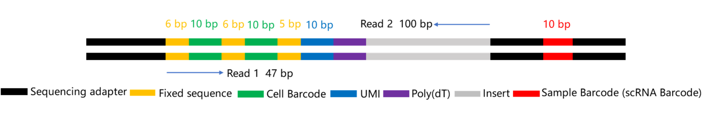

<div align="right" markdown="block">

[Home](../index.md)

</div>


# JSON Configuration Guide

This document explains the JSON configuration used to define the library structure for `dnbc4tools`.

---

## Library Structures

The configuration accommodates the specific structures of the `scRNAv2HT` reagent libraries.

<div style="display: flex; justify-content: space-around; align-items: center; flex-wrap: wrap; margin: 1.5em 0;" markdown="block">
  <div style="text-align: center; margin: 1em;" markdown="block">
<h4>cDNA Library Structure</h4>

  </div>
  <div style="text-align: center; margin: 1em;" markdown="block">
<h4>Oligo Library Structure</h4>

  </div>
</div>

---

## JSON Configuration Explained

The JSON configuration file defines how to parse barcodes, UMIs, and effective read sequences from FASTQ files. The key concepts are:

- **Required Fields**: The `"cell barcode tag"`, `"cell barcode"`, and `"read 1"` fields are mandatory.
- **Tags**: In the `value` field, `CB` is the suggested tag name for the corrected cell barcode, and `UR` is for the UMI.
- **Location**: The `location` field specifies the read (`R1` or `R2`) and the base pair coordinates. For example, `"R1:1-10"` refers to bases 1-10 of Read 1.
- **Barcode Segments**: A cell barcode can be composed of multiple segments from different locations (e.g., `"R1:1-10"` and `"R1:17-26"`).
- **Output**: The program will write the parsed barcodes and UMIs to the read name field of the output FASTQ. The sequence specified by `"read 1"` (e.g., `"R2:1-100"`) is retained in the sequence field.
- **Whitelist Correction**: A predefined `"white list"` can be provided to correct barcode sequences. Barcodes not found in the whitelist are compared against it, and if the Hamming `"distance"` is within the specified cutoff, the barcode is corrected.

### Example JSON Configuration

```json
{
    "cell barcode tag":"CB",
    "cell barcode":[
	{
	    "location":"R1:1-10",
            "distance":"1",
            "white list":[
                "TAACAGCCAA",
                "CTAAGAGTCC",
                "..."
            ]
	},
	{
	    "location":"R1:11-20",
            "distance":"1",
            "white list":[
                "TAACAGCCAA",
                "CTAAGAGTCC",
                "..."
            ]
	}
    ],
    "UMI tag":"UR",
    "UMI":{
	"location":"R1:21-30"
    },
    "read 1":{
	"location":"R2:1-100"
    }
}
```

---

## Supported Keys

Here is a list of all supported keys in the configuration file.

<table style="width:100%; border-collapse: collapse; margin: 1.5em 0; box-shadow: 0 2px 3px rgba(0,0,0,0.1);">
  <thead style="background-color: #f2f2f2; border-bottom: 2px solid #ddd;">
    <tr>
      <th style="padding: 12px 15px; border: 1px solid #ddd; text-align: left;">Key</th>
      <th style="padding: 12px 15px; border: 1px solid #ddd; text-align: left;">Comment</th>
    </tr>
  </thead>
  <tbody>
    <tr><td style="padding: 12px 15px; border: 1px solid #ddd;"><code>cell barcode tag</code></td><td style="padding: 12px 15px; border: 1px solid #ddd;">SAM tag for the corrected cell barcode. "CB" is suggested.</td></tr>
    <tr><td style="padding: 12px 15px; border: 1px solid #ddd;"><code>cell barcode</code></td><td style="padding: 12px 15px; border: 1px solid #ddd;">A JSON array defining the segments of the cell barcode.</td></tr>
    <tr><td style="padding: 12px 15px; border: 1px solid #ddd;"><code>cell barcode raw tag</code></td><td style="padding: 12px 15px; border: 1px solid #ddd;">SAM tag for the raw cell barcode sequence. "CR" is suggested.</td></tr>
    <tr><td style="padding: 12px 15px; border: 1px solid #ddd;"><code>cell barcode raw qual tag</code></td><td style="padding: 12px 15px; border: 1px solid #ddd;">SAM tag for the quality score of the raw cell barcode. "CY" is suggested.</td></tr>
    <tr><td style="padding: 12px 15px; border: 1px solid #ddd;"><code>distance</code></td><td style="padding: 12px 15px; border: 1px solid #ddd;">The minimum Hamming distance for barcode correction.</td></tr>
    <tr><td style="padding: 12px 15px; border: 1px solid #ddd;"><code>white list</code></td><td style="padding: 12px 15px; border: 1px solid #ddd;">A list of valid barcode sequences for correction.</td></tr>
    <tr><td style="padding: 12px 15px; border: 1px solid #ddd;"><code>location</code></td><td style="padding: 12px 15px; border: 1px solid #ddd;">The sequence location in read 1 or read 2 (e.g., "R1:1-10").</td></tr>
    <tr><td style="padding: 12px 15px; border: 1px solid #ddd;"><code>sample barcode tag</code></td><td style="padding: 12px 15px; border: 1px solid #ddd;">SAM tag for the sample barcode.</td></tr>
    <tr><td style="padding: 12px 15px; border: 1px solid #ddd;"><code>sample barcode</code></td><td style="padding: 12px 15px; border: 1px solid #ddd;">Defines the sample barcode segments.</td></tr>
    <tr><td style="padding: 12px 15px; border: 1px solid #ddd;"><code>UMI tag</code></td><td style="padding: 12px 15px; border: 1px solid #ddd;">SAM tag for the UMI. "UR" is suggested for raw UMI, "UB" for corrected.</td></tr>
    <tr><td style="padding: 12px 15px; border: 1px solid #ddd;"><code>UMI qual tag</code></td><td style="padding: 12px 15px; border: 1px solid #ddd;">SAM tag for the UMI sequence quality.</td></tr>
    <tr><td style="padding: 12px 15px; border: 1px solid #ddd;"><code>UMI</code></td><td style="padding: 12px 15px; border: 1px solid #ddd;">Defines the location of the UMI.</td></tr>
    <tr><td style="padding: 12px 15px; border: 1px solid #ddd;"><code>read 1</code></td><td style="padding: 12px 15px; border: 1px solid #ddd;">Defines the location of read 1 sequence to keep.</td></tr>
    <tr><td style="padding: 12px 15px; border: 1px solid #ddd;"><code>read 2</code></td><td style="padding: 12px 15px; border: 1px solid #ddd;">Defines the location of read 2 sequence to keep.</td></tr>
  </tbody>
</table>

---

## Positional Information Examples

<div style="background-color: #f8f9fa; border: 1px solid #dee2e6; padding: 1px 20px; margin: 20px 0; border-radius: 8px;" markdown="block">

<h4>Scenario 1: Dark reaction on cDNA R1 and Oligo R1/R2</h4>

<ul>
  <li><b>cDNA - Cell Barcode:</b> <code>R1:1-10,R1:11-20</code></li>
  <li><b>cDNA - UMI:</b> <code>R1:21-30</code></li>
  <li><b>cDNA - Read 1:</b> <code>R2:1-100</code></li>
  <li><b>Oligo - Cell Barcode:</b> <code>R1:1-10,R1:11-20</code></li>
  <li><b>Oligo - Read 1:</b> <code>R2:1-30</code></li>
</ul>

</div>

<div style="background-color: #f8f9fa; border: 1px solid #dee2e6; padding: 1px 20px; margin: 20px 0; border-radius: 8px;" markdown="block">

<h4>Scenario 2: Dark reaction on cDNA R1 and Oligo R1 (Oligo R2 is normal)</h4>

<ul>
  <li><b>cDNA - Cell Barcode:</b> <code>R1:1-10,R1:11-20</code></li>
  <li><b>cDNA - UMI:</b> <code>R1:21-30</code></li>
  <li><b>cDNA - Read 1:</b> <code>R2:1-100</code></li>
  <li><b>Oligo - Cell Barcode:</b> <code>R1:1-10,R1:11-20</code></li>
  <li><b>Oligo - Read 1:</b> <code>R2:1-10,R2:17-26,R2:33-42</code></li>
</ul>

</div>
