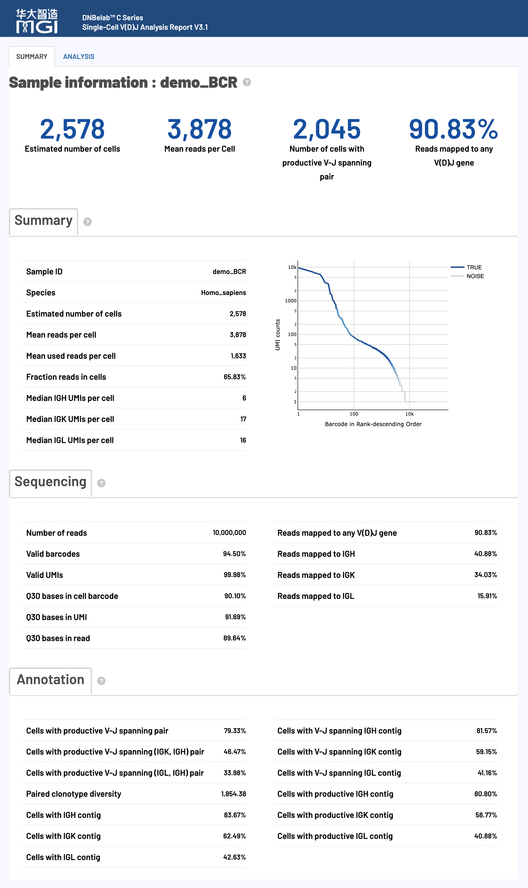
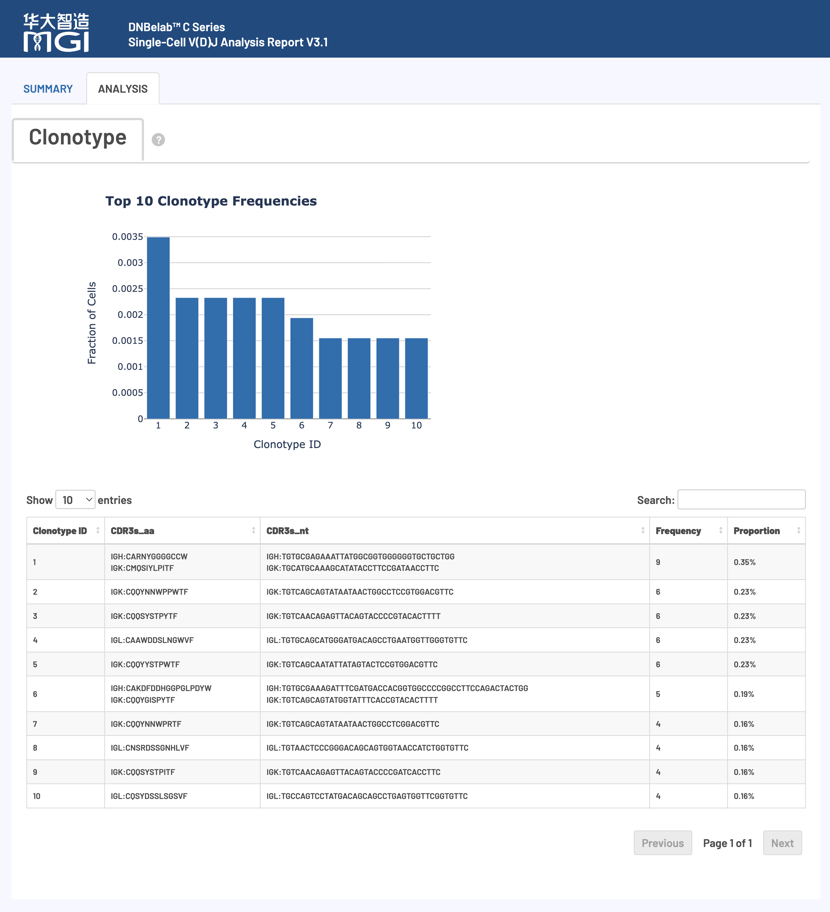

<div align="right" style="margin-bottom: 20px; max-width: 1200px; margin-left: auto; margin-right: auto;" markdown="block">

[首页](../../index.md)

</div>

<div align="center" style="padding: 40px 20px; background: linear-gradient(135deg, #f5f5f7 0%, #ffffff 100%); border-radius: 12px; margin-bottom: 30px; max-width: 1200px; margin-left: auto; margin-right: auto;" markdown="block">

<h1 style="font-size: 48px; font-weight: 600; color: #1d1d1f; margin: 0 0 16px 0; letter-spacing: -0.02em;"> scVDJ 分析输出</h1>

<p style="font-size: 21px; color: #86868b; margin: 0; font-weight: 400;">单细胞 V(D)J 测序分析输出文件说明</p>

<div style="margin-top: 24px;" markdown="block">

[ 目录结构](#输出目录结构) • [文件详情](#详细文件说明) • [分析结果](#分析指标汇总) • [报告解读](#网页报告释义)

</div>

</div>

<div style="max-width: 1200px; margin: 0 auto;" markdown="block"><hr style="border: none; border-top: 1px solid #d2d2d7; margin: 24px 0;"></div>

<div style="background: #f5f5f7; border-radius: 12px; padding: 24px; margin: 24px auto; max-width: 1200px;" markdown="block">

## 概述 <a id="概述"></a>

<div align="center" markdown="block">

单细胞 V(D)J 分析完成后，会在指定的输出目录中生成标准化的文件和子目录结构，用于免疫受体库谱分析。

</div>

> **提示**：V(D)J 分析需基于 5' 端 RNA 测序数据。所有输出文件遵循 AIRR 标准，并兼容主流免疫组学分析工具。

> **前提条件**：需先完成 5' 端单细胞 RNA 测序分析。

</div>

<div style="max-width: 1200px; margin: 0 auto;" markdown="block"><hr style="border: none; border-top: 1px solid #d2d2d7; margin: 24px 0;"></div>

<div style="background: #f5f5f7; border-radius: 12px; padding: 24px; margin: 24px auto; max-width: 1200px;" markdown="block">

## 输出目录结构 <a id="输出目录结构"></a>

</div>

<div style="background: #ffffff; border-radius: 12px; padding: 20px; margin: 20px auto; max-width: 1200px; overflow-x: auto; border: 1px solid #e5e5e5; box-shadow: 0 1px 3px rgba(0,0,0,0.1);" markdown="block">

```
.
├── airr_annotations.tsv                    # AIRR标准格式的注释文件
├── all_contig_annotations.csv              # 所有组装序列的注释信息
├── all_contig.fasta                        # 所有组装序列的FASTA 文件
├── all_contig.fasta.fai                    # 所有组装序列的索引文件
├── clonotypes.csv                          # 克隆型分析结果
├── consensus_annotations.csv               # 一致性序列注释信息
├── consensus.fasta                         # 一致性序列FASTA 文件
├── consensus.fasta.fai                     # 一致性序列索引文件
├── filtered_contig_annotations.csv         # 过滤后组装序列的注释信息
├── filtered_contig.fasta                   # 过滤后的组装序列FASTA 文件
├── filtered_contig.fasta.fai               # 过滤后组装序列的索引文件
├── metrics_summary.xls                     # 分析质量指标汇总表
└── *_scVDJ_TR(IG)_report.html              # HTML格式的分析报告
```

</div>

<div style="max-width: 1200px; margin: 0 auto;" markdown="block"><hr style="border: none; border-top: 1px solid #d2d2d7; margin: 24px 0;"></div>

<div style="background: #f5f5f7; border-radius: 12px; padding: 24px; margin: 24px auto; max-width: 1200px;" markdown="block">

## 文件详细说明 <a id="详细文件说明"></a>

</div>

<div style="background: #f5f5f7; border-radius: 12px; padding: 24px; margin: 24px auto; max-width: 1200px;" markdown="block">

### V(D)J 组装和注释文件 <a id="vdj组装和注释文件"></a>

<div align="center" markdown="block">

**核心内容**: V(D)J 重叠群序列组装、精确注释和质量评估结果，涵盖 TCR 和 BCR 重排序列的完整信息

</div>

</div>

<div style="background: #ffffff; border-radius: 12px; padding: 24px; margin: 20px auto; max-width: 1200px; border: 1px solid #e5e5e5; box-shadow: 0 1px 3px rgba(0,0,0,0.1);" markdown="block">

#### V(D)J 转录本结构与组成

**典型 V(D)J 转录本结构示意：**

<div align="center" markdown="block">

</div>

**重要术语解释：**

<table style="width:100%; border-collapse: collapse; margin: 15px 0;">
<thead>
<tr>
<th width="20%" align="left"><strong>组成区域</strong></th>
<th width="30%" align="left"><strong>英文缩写</strong></th>
<th width="50%" align="left"><strong>生物学功能</strong></th>
</tr>
</thead>
<tbody>
<tr>
<td align="left"><strong>非翻译区</strong></td>
<td align="left">UTR (Untranslated Region)</td>
<td>调控 mRNA 稳定性和翻译效率，不编码蛋白质</td>
</tr>
<tr>
<td align="left"><strong>框架区</strong></td>
<td align="left">FWR (Framework Region)</td>
<td>维持免疫球蛋白折叠的保守性结构框架</td>
</tr>
<tr>
<td align="left"><strong>互补决定区</strong></td>
<td align="left">CDR (Complementarity Determining Region)</td>
<td>直接与抗原接触，决定结合特异性的关键可变区域</td>
</tr>
</tbody>
</table>

> **技术优势**: V(D)J 分析流程可精确识别并提供框架区（FWR）和互补决定区（CDR）的氨基酸与核苷酸序列。所有组装重叠群和克隆型共识序列的 V(D)J 注释信息均以多种标准格式输出。

</div>

#### 重要注释标准说明

##### 全长序列判定标准 (Full Length)

<div style="padding: 15px; border-left: 4px solid #007bff; margin: 15px 0;" markdown="block">

重叠群序列被认定为 **全长序列** 须同时满足以下严格条件：

- 重叠群序列完全匹配已注释 V 基因的 5' 起始区域
- 重叠群序列完整延伸至 J 基因的 3' 末端区域

</div>

##### 生产性序列判定标准 (Productive)

<div style="padding: 15px; border-left: 4px solid #0ea5e9; margin: 15px 0;" markdown="block">

重叠群序列被认定为 **生产性序列**（具有功能活性）须同时满足以下所有条件：

- 符合上述全长序列的所有要求
- 在正确位置包含有效的起始密码子（ATG）
- V-J 跨越区域内不存在提前终止密码子
- V 基因起始密码子与 J 基因终止密码子保持相同阅读框
- 成功识别出完整的 CDR3 可变区域
- V-J 跨越区域长度符合相应基因的生物学合理范围

</div>

##### 高置信度序列判定 (High Confidence)

<div style="background: #ffffff; border-radius: 12px; padding: 24px; box-shadow: 0 1px 3px rgba(0,0,0,0.1); border: 1px solid #e5e5e5; margin: 20px auto; max-width: 1200px;" markdown="block">

**不同细胞类型的预期受体配置：**

<table style="width:100%; border-collapse: collapse; margin: 15px 0; border-radius: 8px; overflow: hidden;">
<thead style="background-color: #f5f5f7; border-bottom: 1px solid #d2d2d7;">
<tr>
<th width="25%" align="left" style="padding: 12px 16px; font-weight: 600; color: #1d1d1f;">细胞类型</th>
<th width="45%" align="left" style="padding: 12px 16px; font-weight: 600; color: #1d1d1f;">标准受体配置</th>
<th width="30%" align="left" style="padding: 12px 16px; font-weight: 600; color: #1d1d1f;">生物学意义</th>
</tr>
</thead>
<tbody>
<tr>
<td align="left" style="padding: 12px 16px; border-bottom: 1px solid #f0f0f0;"><strong>T 细胞</strong></td>
<td align="left" style="padding: 12px 16px; border-bottom: 1px solid #f0f0f0;">1 个生产性 TRA 链 + 1 个生产性 TRB 链</td>
<td align="left" style="padding: 12px 16px; border-bottom: 1px solid #f0f0f0;">正常 TCR α/β 异源二聚体</td>
</tr>
<tr>
<td align="left" style="padding: 12px 16px;"><strong>B 细胞</strong></td>
<td align="left" style="padding: 12px 16px;">1 个生产性重链 + 1 个生产性轻链（κ 或 λ）</td>
<td align="left" style="padding: 12px 16px;">正常 BCR 重链/轻链配对</td>
</tr>
</tbody>
</table>

</div>

**低置信度序列标记原则：**

<div style="padding: 15px; border-left: 4px solid #ffc107; margin: 15px 0;" markdown="block">

超出正常配置的额外生产性重叠群通常为异常情况，常见原因包括：

<div style="background: #ffffff; border-radius: 12px; padding: 24px; box-shadow: 0 1px 3px rgba(0,0,0,0.1); border: 1px solid #e5e5e5; margin: 20px auto; max-width: 1200px;" markdown="block">

<table style="width:100%; border-collapse: collapse; margin: 15px 0; border-radius: 8px; overflow: hidden;">
<thead style="background-color: #f5f5f7; border-bottom: 1px solid #d2d2d7;">
<tr>
<th width="25%" align="left" style="padding: 12px 16px; font-weight: 600; color: #1d1d1f;">异常类型</th>
<th width="75%" align="left" style="padding: 12px 16px; font-weight: 600; color: #1d1d1f;">原因分析</th>
</tr>
</thead>
<tbody>
<tr>
<td align="left" style="padding: 12px 16px; border-bottom: 1px solid #f0f0f0;"><strong>环境污染</strong></td>
<td style="padding: 12px 16px; border-bottom: 1px solid #f0f0f0;">游离 mRNA 的非特异性捕获，可能来自外源污染或凋亡细胞释放的核酸</td>
</tr>
<tr>
<td align="left" style="padding: 12px 16px; border-bottom: 1px solid #f0f0f0;"><strong>双细胞事件</strong></td>
<td style="padding: 12px 16px; border-bottom: 1px solid #f0f0f0;">液滴中包含多个细胞 (doublets)，导致无法区分不同细胞的受体信号</td>
</tr>
<tr>
<td align="left" style="padding: 12px 16px;"><strong>技术伪影</strong></td>
<td style="padding: 12px 16px;">PCR 扩增或测序过程中的人工序列，包括嵌合体序列或错误的引物结合</td>
</tr>
</tbody>
</table>

</div>

</div>

**低置信度序列的判定依据：**

<div style="padding: 15px; border-left: 4px solid #ef4444; margin: 15px 0;" markdown="block">

- 生物学上极不可能存在的异常受体配置模式
- UMI 分子支持度显著偏低的可疑序列
- 明显超出预期数量的额外生产性链

</div>

<div style="background: #ffffff; border-radius: 12px; padding: 24px; margin: 20px auto; max-width: 1200px; border: 1px solid #e5e5e5; box-shadow: 0 1px 3px rgba(0,0,0,0.1);" markdown="block">

#### airr_annotations.tsv

包含V(D)J重排的注释序列和共识序列，采用AIRR标准格式。

*   **用途**:
    *   **标准化数据交换**: 作为符合AIRR社区标准的交换格式，便于与其他免疫组库分析工具对接。
    *   **深度注释**: 提供详细的V、D、J基因调用信息、CIGAR字符串、序列比对结果以及CDR3区域的核苷酸和氨基酸序列。

*   **内容与格式**:
    *   文件采用 AIRR 标准的 TSV 格式。
    *   文件具体包含的字段如下表所示：

    <table style="width:100%; border-collapse: collapse; margin: 15px 0;">
    <thead>
    <tr>
    <th width="25%" align="left"><strong>字段名</strong></th>
    <th width="75%" align="left"><strong>详细描述</strong></th>
    </tr>
    </thead>
    <tbody>
    <tr>
    <td align="left"><code>cell_id</code></td>
    <td>该重排序列所属细胞的唯一标识符，用于关联单细胞数据</td>
    </tr>
    <tr>
    <td align="left"><code>clone_id</code></td>
    <td>克隆型编号，标识该重排序列归属的特定克隆群体，用于克隆型分析</td>
    </tr>
    <tr>
    <td align="left"><code>sequence_id</code></td>
    <td>重叠群的唯一名称或标识符</td>
    </tr>
    <tr>
    <td align="left"><code>sequence</code></td>
    <td>V(D)J 重排的完整核苷酸序列，包含所有可变、多样性和连接区域</td>
    </tr>
    <tr>
    <td align="left"><code>sequence_aa</code></td>
    <td>重排区域翻译获得的氨基酸序列，反映功能性蛋白产物</td>
    </tr>
    <tr>
    <td align="left"><code>productive</code></td>
    <td>标记该重排是否为生产性（具有生物学功能），需满足框内翻译和无终止密码子等条件</td>
    </tr>
    <tr>
    <td align="left"><code>rev_comp</code></td>
    <td>指示序列是否为反向互补序列（默认：false），用于序列方向标记</td>
    </tr>
    <tr>
    <td align="left"><code>v_call</code></td>
    <td>识别的 V（可变）基因片段名称</td>
    </tr>
    <tr>
    <td align="left"><code>v_cigar</code></td>
    <td>V 基因比对的 CIGAR 字符串，记录比对的详细信息（匹配、插入、删除等）</td>
    </tr>
    <tr>
    <td align="left"><code>d_call</code></td>
    <td>识别的 D（多样性）基因片段名称（仅适用于重链和 β 链）</td>
    </tr>
    <tr>
    <td align="left"><code>d_cigar</code></td>
    <td>D 基因比对的 CIGAR 字符串，详细记录多样性区域的比对结果</td>
    </tr>
    <tr>
    <td align="left"><code>j_call</code></td>
    <td>识别的 J（连接）基因片段名称，完成 V(D)J 重组的关键元件</td>
    </tr>
    <tr>
    <td align="left"><code>j_cigar</code></td>
    <td>J 基因比对的 CIGAR 字符串，记录连接区域的精确比对信息</td>
    </tr>
    <tr>
    <td align="left"><code>c_call</code></td>
    <td>识别的 C（恒定）基因片段名称，决定抗体/受体的功能类型</td>
    </tr>
    <tr>
    <td align="left"><code>c_cigar</code></td>
    <td>C 基因比对的 CIGAR 字符串，记录恒定区域的比对详情</td>
    </tr>
    <tr>
    <td align="left"><code>sequence_alignment</code></td>
    <td>V(D)J 重排区域与参考种系序列的详细比对结果，显示突变和变异</td>
    </tr>
    <tr>
    <td align="left"><code>germline_alignment</code></td>
    <td>推断的种系全长序列比对结果，用于体细胞突变分析</td>
    </tr>
    <tr>
    <td align="left"><code>junction</code></td>
    <td>V(D)J 重排连接区的核苷酸序列（CDR3 区域），决定抗原结合特异性</td>
    </tr>
    <tr>
    <td align="left"><code>junction_aa</code></td>
    <td>重排连接区的氨基酸序列（CDR3 氨基酸），抗原识别的关键结构域</td>
    </tr>
    <tr>
    <td align="left"><code>junction_length</code></td>
    <td>CDR3 区域核苷酸序列长度（bp），影响抗原结合能力和特异性</td>
    </tr>
    <tr>
    <td align="left"><code>junction_aa_length</code></td>
    <td>CDR3 区域氨基酸序列长度（aa），决定抗原结合环的空间结构</td>
    </tr>
    <tr>
    <td align="left"><code>v_sequence_start</code></td>
    <td>V 区域在重排序列中的起始位置（1-based 坐标系统）</td>
    </tr>
    <tr>
    <td align="left"><code>v_sequence_end</code></td>
    <td>V 区域在重排序列中的结束位置（1-based 坐标系统）</td>
    </tr>
    <tr>
    <td align="left"><code>d_sequence_start</code></td>
    <td>D 区域在重排序列中的起始位置（1-based 坐标系统）</td>
    </tr>
    <tr>
    <td align="left"><code>d_sequence_end</code></td>
    <td>D 区域在重排序列中的结束位置（1-based 坐标系统）</td>
    </tr>
    <tr>
    <td align="left"><code>j_sequence_start</code></td>
    <td>J 区域在重排序列中的起始位置（1-based 坐标系统）</td>
    </tr>
    <tr>
    <td align="left"><code>j_sequence_end</code></td>
    <td>J 区域在重排序列中的结束位置（1-based 坐标系统）</td>
    </tr>
    <tr>
    <td align="left"><code>c_sequence_start</code></td>
    <td>C 区域在重排序列中的起始位置（1-based 坐标系统）</td>
    </tr>
    <tr>
    <td align="left"><code>c_sequence_end</code></td>
    <td>C 区域在重排序列中的结束位置（1-based 坐标系统）</td>
    </tr>
    <tr>
    <td align="left"><code>consensus_count</code></td>
    <td>支持该重排序列的总 reads 数量，反映测序深度和序列可信度</td>
    </tr>
    <tr>
    <td align="left"><code>duplicate_count</code></td>
    <td>支持该重排序列的独特 UMI 分子数量，用于去重和定量分析</td>
    </tr>
    <tr>
    <td align="left"><code>is_cell</code></td>
    <td>标记该重排是否来源于真实细胞（TRUE：细胞；FALSE：背景/空滴）</td>
    </tr>
    </tbody>
    </table>

</div>

<div style="background: #ffffff; border-radius: 12px; padding: 24px; margin: 20px auto; max-width: 1200px; border: 1px solid #e5e5e5; box-shadow: 0 1px 3px rgba(0,0,0,0.1);" markdown="block">

#### all_contig_annotations.csv

包含所有重叠群序列（来自细胞和背景条形码）的详细注释信息。

*   **用途**:
    *   **全面数据审查**: 提供所有组装出的重叠群数据，包括低质量或背景信号，用于深入的质控分析。
    *   **完整注释**: 提供完整的 V(D)J 基因片段、CDR/FWR区域的注释信息。

*   **内容与格式**:
    *   文件采用 CSV 文本格式。
    *   文件具体包含的字段如下表所示：

    <table style="width:100%; border-collapse: collapse; margin: 15px 0;">
    <thead>
    <tr>
    <th width="25%" align="left"><strong>字段名</strong></th>
    <th width="75%" align="left"><strong>描述</strong></th>
    </tr>
    </thead>
    <tbody>
    <tr>
    <td align="left"><code>sample</code></td>
    <td>VDJ 文库的样本名称</td>
    </tr>
    <tr>
    <td align="left"><code>barcode</code></td>
    <td>该重叠群对应的细胞 ID（或条形码）</td>
    </tr>
    <tr>
    <td align="left"><code>is_cell</code></td>
    <td>布尔值，指示该细胞 ID是否被识别为细胞（TRUE为细胞，FALSE为背景）</td>
    </tr>
    <tr>
    <td align="left"><code>contig_id</code></td>
    <td>该重叠群的唯一标识符</td>
    </tr>
    <tr>
    <td align="left"><code>high_confidence</code></td>
    <td>布尔值，指示该重叠群是否被标记为高置信度（不太可能是嵌合序列或其他伪影）</td>
    </tr>
    <tr>
    <td align="left"><code>length</code></td>
    <td>重叠群序列的核苷酸长度（bp）</td>
    </tr>
    <tr>
    <td align="left"><code>chain</code></td>
    <td>与该重叠群相关的链类型：TRA、TRB、IGK、IGL或IGH</td>
    </tr>
    <tr>
    <td align="left"><code>v_gene</code></td>
    <td>得分最高的V基因片段，如TRAV1-1</td>
    </tr>
    <tr>
    <td align="left"><code>d_gene</code></td>
    <td>得分最高的D基因片段，如TRBD1</td>
    </tr>
    <tr>
    <td align="left"><code>j_gene</code></td>
    <td>得分最高的J基因片段，如TRAJ1-1</td>
    </tr>
    <tr>
    <td align="left"><code>full_length</code></td>
    <td>布尔值，指示该重叠群是否被声明为全长序列</td>
    </tr>
    <tr>
    <td align="left"><code>productive</code></td>
    <td>布尔值，指示该重叠群是否被声明为生产性序列</td>
    </tr>
    <tr>
    <td align="left"><code>fwr1</code></td>
    <td>预测的FWR1氨基酸序列</td>
    </tr>
    <tr>
    <td align="left"><code>fwr1_nt</code></td>
    <td>预测的FWR1核苷酸序列</td>
    </tr>
    <tr>
    <td align="left"><code>cdr1</code></td>
    <td>预测的CDR1氨基酸序列</td>
    </tr>
    <tr>
    <td align="left"><code>cdr1_nt</code></td>
    <td>预测的CDR1核苷酸序列</td>
    </tr>
    <tr>
    <td align="left"><code>fwr2</code></td>
    <td>预测的FWR2氨基酸序列</td>
    </tr>
    <tr>
    <td align="left"><code>fwr2_nt</code></td>
    <td>预测的FWR2核苷酸序列</td>
    </tr>
    <tr>
    <td align="left"><code>cdr2</code></td>
    <td>预测的CDR2氨基酸序列</td>
    </tr>
    <tr>
    <td align="left"><code>cdr2_nt</code></td>
    <td>预测的CDR2核苷酸序列</td>
    </tr>
    <tr>
    <td align="left"><code>fwr3</code></td>
    <td>预测的FWR3氨基酸序列</td>
    </tr>
    <tr>
    <td align="left"><code>fwr3_nt</code></td>
    <td>预测的FWR3核苷酸序列</td>
    </tr>
    <tr>
    <td align="left"><code>cdr3</code></td>
    <td>预测的CDR3氨基酸序列</td>
    </tr>
    <tr>
    <td align="left"><code>cdr3_nt</code></td>
    <td>预测的CDR3核苷酸序列</td>
    </tr>
    <tr>
    <td align="left"><code>fwr4</code></td>
    <td>预测的FWR4氨基酸序列</td>
    </tr>
    <tr>
    <td align="left"><code>fwr4_nt</code></td>
    <td>预测的FWR4核苷酸序列</td>
    </tr>
    <tr>
    <td align="left"><code>reads</code></td>
    <td>比对到该重叠群的reads数量</td>
    </tr>
    <tr>
    <td align="left"><code>umis</code></td>
    <td>比对到该重叠群的不同UMI数量</td>
    </tr>
    <tr>
    <td align="left"><code>raw_clonotype_id</code></td>
    <td>分配给该细胞条形码的克隆型ID</td>
    </tr>
    <tr>
    <td align="left"><code>raw_consensus_id</code></td>
    <td>该重叠群被分配到的共识序列ID</td>
    </tr>
    <tr>
    <td align="left"><code>exact_subclonotype_id</code></td>
    <td>该细胞条形码被分配到的精确亚克隆型ID</td>
    </tr>
    </tbody>
    </table>

</div>

<div style="background: #ffffff; border-radius: 12px; padding: 24px; margin: 20px auto; max-width: 1200px; border: 1px solid #e5e5e5; box-shadow: 0 1px 3px rgba(0,0,0,0.1);" markdown="block">

#### all_contig.fasta

包含所有组装重叠群的核苷酸序列。

*   **用途**:
    *   **序列数据库**: 作为所有重叠群的序列数据库，可用于igBLAST比对或其他序列分析。
    *   **数据完整性**: 提供了最原始的组装结果。
*   **内容与格式**:
    *   采用标准 FASTA 格式，每个序列对应一个重叠群，序列标识符为重叠群的唯一名称。

</div>

<div style="background: #ffffff; border-radius: 12px; padding: 24px; margin: 20px auto; max-width: 1200px; border: 1px solid #e5e5e5; box-shadow: 0 1px 3px rgba(0,0,0,0.1);" markdown="block">

#### filtered_contig_annotations.csv

`all_contig_annotations.csv` 的高质量子集，仅包含通过质量过滤的高置信度、且来源于细胞的重叠群注释结果。

*   **用途**:
    *   **核心下游分析**: 这是进行克隆型定义和大多数下游分析的**推荐输入文件**。
    *   **高质量数据**: 只包含被鉴定为真实细胞且高置信度的重叠群，确保分析结果的准确性。
*   **内容与格式**:
    *   文件格式与 `all_contig_annotations.csv` 完全相同。

</div>

<div style="background: #ffffff; border-radius: 12px; padding: 24px; margin: 20px auto; max-width: 1200px; border: 1px solid #e5e5e5; box-shadow: 0 1px 3px rgba(0,0,0,0.1);" markdown="block">

#### filtered_contig.fasta

`all_contig.fasta` 的高质量子集，仅包含通过质量过滤和细胞调用的高质量重叠群序列。

*   **用途**:
    *   **可信序列集**: 提供一个高可信度的重排序列集合，用于后续的功能分析或实验验证。
*   **内容与格式**:
    *   标准FASTA格式，序列标识符为重叠群ID。

</div>

<div style="background: #f5f5f7; border-radius: 12px; padding: 24px; margin: 24px auto; max-width: 1200px;" markdown="block">

### 克隆型谱系分析文件 <a id="克隆型分析文件"></a>

<div align="center" markdown="block">

**核心内容**: TCR 和 BCR 克隆型谱系的精确识别、频率统计和 CDR3 序列多样性分析

</div>

</div>

<div style="background: #ffffff; border-radius: 12px; padding: 24px; margin: 20px auto; max-width: 1200px; border: 1px solid #e5e5e5; box-shadow: 0 1px 3px rgba(0,0,0,0.1);" markdown="block">

#### clonotypes.csv

克隆型统计分析文件，提供每个独特克隆型的详细描述信息。

*   **用途**:
    *   **克隆型丰度分析**: 统计每个克隆型的细胞数（频率）和占比，用于评估克隆扩增程度。
    *   **免疫多样性评估**: 分析克隆型分布，研究免疫库的多样性。
    *   **CDR3 序列分析**: 提供每个克隆型精确的 CDR3 氨基酸和核苷酸序列。

*   **内容与格式**:
    *   文件采用 CSV 格式。
    *   文件具体包含的字段如下表所示：

    <table style="width:100%; border-collapse: collapse; margin: 15px 0;">
    <thead>
    <tr>
    <th width="25%" align="left"><strong>字段名</strong></th>
    <th width="75%" align="left"><strong>详细描述</strong></th>
    </tr>
    </thead>
    <tbody>
    <tr>
    <td align="left"><code>clonotype_id</code></td>
    <td>分配给该共识序列的克隆型唯一标识符，用于关联和追踪特定克隆群体的所有相关细胞</td>
    </tr>
    <tr>
    <td align="left"><code>frequency</code></td>
    <td>观察到的具有该克隆型的细胞绝对数量，反映克隆扩增程度和免疫应答强度</td>
    </tr>
    <tr>
    <td align="left"><code>proportion</code></td>
    <td>该克隆型细胞占总细胞群体的相对比例，用于评估克隆优势度和多样性分布</td>
    </tr>
    <tr>
    <td align="left"><code>cdr3s_aa</code></td>
    <td>以分号分隔的链:序列对列表，格式为"链名:CDR3 氨基酸序列"。链名包括 TRA、TRB、TRG、TRD（T 细胞受体）和 IGK、IGL、IGH（B 细胞受体），CDR3 氨基酸序列用于判断抗原结合特异性和功能活性</td>
    </tr>
    <tr>
    <td align="left"><code>cdr3s_nt</code></td>
    <td>以分号分隔的链:序列对列表，格式为"链名:CDR3 核苷酸序列"。提供 CDR3 区域的 DNA 序列信息，用于体细胞突变分析、克隆进化追踪和分子标记设计</td>
    </tr>
    </tbody>
    </table>

</div>

<div style="background: #ffffff; border-radius: 12px; padding: 24px; margin: 20px auto; max-width: 1200px; border: 1px solid #e5e5e5; box-shadow: 0 1px 3px rgba(0,0,0,0.1);" markdown="block">

#### consensus_annotations.csv

提供每个克隆型共识序列的详细注释信息。

*   **用途**:
    *   **代表性序列注释**: 为每个克隆型提供一个代表性序列的完整 V(D)J 基因和 CDR/FWR 区域注释。
    *   **克隆型水平分析**: 支持在克隆型水平上进行序列特征分析。

*   **内容与格式**:
    *   文件采用 CSV 格式。
    *   文件具体包含的字段如下表所示：

    <table style="width:100%; border-collapse: collapse; margin: 15px 0;">
    <thead>
    <tr>
    <th width="25%" align="left"><strong>字段名</strong></th>
    <th width="75%" align="left"><strong>描述</strong></th>
    </tr>
    </thead>
    <tbody>
    <tr>
    <td align="left"><code>clonotype_id</code></td>
    <td>分配给该一致性序列的克隆型ID，对应clonotypes.csv中的克隆型标识符</td>
    </tr>
    <tr>
    <td align="left"><code>consensus_id</code></td>
    <td>该一致性序列的唯一标识符，用于关联FASTA 文件中的序列</td>
    </tr>
    <tr>
    <td align="left"><code>sample</code></td>
    <td>VDJ 文库的样本名称</td>
    </tr>
    <tr>
    <td align="left"><code>length</code></td>
    <td>一致性序列的核苷酸长度</td>
    </tr>
    <tr>
    <td align="left"><code>chain</code></td>
    <td>与该一致性序列相关的链类型：TRA、TRB、IGK、IGL或IGH</td>
    </tr>
    <tr>
    <td align="left"><code>v_gene</code></td>
    <td>得分最高的V基因片段调用结果</td>
    </tr>
    <tr>
    <td align="left"><code>d_gene</code></td>
    <td>得分最高的D基因片段调用结果（如适用）</td>
    </tr>
    <tr>
    <td align="left"><code>j_gene</code></td>
    <td>得分最高的J基因片段调用结果</td>
    </tr>
    <tr>
    <td align="left"><code>c_gene</code></td>
    <td>得分最高的C基因片段调用结果</td>
    </tr>
    <tr>
    <td align="left"><code>full_length</code></td>
    <td>布尔值，指示该一致性序列是否被声明为全长序列</td>
    </tr>
    <tr>
    <td align="left"><code>productive</code></td>
    <td>布尔值，指示该一致性序列是否被声明为生产性序列</td>
    </tr>
    <tr>
    <td align="left"><code>cdr3</code></td>
    <td>预测的CDR3氨基酸序列</td>
    </tr>
    <tr>
    <td align="left"><code>cdr3_nt</code></td>
    <td>预测的CDR3核苷酸序列</td>
    </tr>
    <tr>
    <td align="left"><code>reads</code></td>
    <td>支持该一致性序列的reads总数</td>
    </tr>
    <tr>
    <td align="left"><code>umis</code></td>
    <td>支持该一致性序列的不同UMI数量</td>
    </tr>
    </tbody>
    </table>

</div>

<div style="background: #ffffff; border-radius: 12px; padding: 24px; margin: 20px auto; max-width: 1200px; border: 1px solid #e5e5e5; box-shadow: 0 1px 3px rgba(0,0,0,0.1);" markdown="block">

#### consensus.fasta

包含每个克隆型共识序列的FASTA 文件。

*   **用途**:
    *   **代表性序列库**: 提供每个克隆型的代表性序列，用于功能预测或与其他数据集比对。
    *   **高质量序列**: 共识序列通过克隆型分组算法生成，理想情况下为全长序列（从5'UTR起始到C基因引物结合位点结束）。
*   **内容与格式**:
    *   标准FASTA格式，序列标识符为`consensus_id`。

</div>

<div style="background: #f5f5f7; border-radius: 12px; padding: 24px; margin: 24px auto; max-width: 1200px;" markdown="block">

### 分析指标汇总 <a id="分析指标汇总"></a>

<div align="center" markdown="block">

**核心内容**: V(D)J 组装质量的结构化评估和统计指标汇总，提供完整的数据质量控制信息

</div>

</div>

<div style="background: #ffffff; border-radius: 12px; padding: 24px; margin: 20px auto; max-width: 1200px; border: 1px solid #e5e5e5; box-shadow: 0 1px 3px rgba(0,0,0,0.1);" markdown="block">

#### metrics_summary.xls

采用 Excel 格式的关键分析指标汇总表，提供了对实验整体质量的结构化评估。

*   **用途**:
    *   **质量评估**: 快速评估测序质量、细胞识别、基因映射、组装效果等核心指标。
    *   **结果概览**: 无需查看所有文件即可对分析结果有一个概览。

*   **内容与格式**:
    *   包含五大类别的关键指标：

        <table style="width:100%; border-collapse: collapse; margin: 15px 0;">
        <thead>
        <tr>
        <th width="20%" align="left"><strong>指标类别</strong></th>
        <th width="80%" align="left"><strong>包含内容</strong></th>
        </tr>
        </thead>
        <tbody>
        <tr>
        <td align="left"><strong>基本统计</strong></td>
        <td>总读段数、有效条形码比例、UMI 质量、Q30 碱基质量等基础测序指标</td>
        </tr>
        <tr>
        <td align="left"><strong>细胞识别</strong></td>
        <td>估计细胞数量、细胞内读段比例、每细胞平均读段数等细胞调用结果</td>
        </tr>
        <tr>
        <td align="left"><strong>基因映射</strong></td>
        <td>V(D)J基因映射比例、链特异性映射统计、基因利用度分析</td>
        </tr>
        <tr>
        <td align="left"><strong>组装质量</strong></td>
        <td>全长序列比例、生产性序列比例、CDR3识别成功率等组装效果评估</td>
        </tr>
        <tr>
        <td align="left"><strong>克隆型分析</strong></td>
        <td>克隆型多样性、配对成功率、主要克隆型频率等免疫组库特征</td>
        </tr>
        </tbody>
        </table>

    *   内置推荐的质量控制标准，便于用户判断：
        <details open>
        <summary><strong>推荐质量阈值：</strong></summary>
        <ul>
        <li><strong>有效条形码比例</strong>: >70%</li>
        <li><strong>Q30 碱基质量</strong>: >75%（条形码和 UMI 区域）</li>
        <li><strong>V(D)J基因映射率</strong>: >30%</li>
        <li><strong>配对生产性序列比例</strong>: >20%</li>
        <li><strong>每细胞平均读段数</strong>: >5,000</li>
        </ul>
        </details>

</div>

<div style="background: #ffffff; border-radius: 12px; padding: 24px; margin: 20px auto; max-width: 1200px; border: 1px solid #e5e5e5; box-shadow: 0 1px 3px rgba(0,0,0,0.1);" markdown="block">

#### *_scVDJ_TR(IG)_report.html

采用 HTML 网页格式的交互式综合分析报告。

*   **用途**:
    *   **结果可视化**: 以交互式图表展示质控结果、重排分析、克隆型分析等关键结果。
    *   **结果解读**: 提供各项指标的生物学意义和技术解释，帮助用户理解数据。
    *   **便捷分享**: 单个 HTML 文件，易于传阅和分享。

*   **内容与格式**:
    *   无需网络，可在任何现代浏览器中打开。
    *   报告的详细解读请参考本文档下方的 [网页报告释义](#网页报告释义) 部分。

</div>

<div style="max-width: 1200px; margin: 0 auto;" markdown="block"><hr style="border: none; border-top: 1px solid #d2d2d7; margin: 24px 0;"></div>

<div style="background: #f5f5f7; border-radius: 12px; padding: 24px; margin: 24px auto; max-width: 1200px;" markdown="block">

## 网页报告释义 <a id="网页报告释义"></a>

<div align="center" markdown="block">

**概述**：HTML 网页报告提供单细胞 V(D)J 测序结果的可视化摘要和指标说明，覆盖实验质量与免疫受体分析相关的关键指标。

</div>

</div>

<div style="background: #ffffff; border-radius: 12px; padding: 24px; margin: 20px auto; max-width: 1200px; border: 1px solid #e5e5e5; box-shadow: 0 1px 3px rgba(0,0,0,0.1);" markdown="block">

HTML 网页报告用于查看单细胞 V(D)J 测序分析结果，覆盖细胞识别、测序质量、V(D)J 富集、生产性配对和克隆型丰度等内容。用户可通过交互式图表快速检查实验质量并定位需要进一步复核的指标。

> **使用说明**：建议按照报告展示顺序依次查看各项指标。

> **注意**: 以下标准仅供参考，实际质量评估应考虑组织类型、细胞状态和实验目标等多种因素。不同样本间存在显著差异，建议结合具体实验背景进行判断。

</div>

<div style="background: #ffffff; border-radius: 12px; padding: 24px; margin: 20px auto; max-width: 1200px; border: 1px solid #e5e5e5; box-shadow: 0 1px 3px rgba(0,0,0,0.1);" markdown="block">

### 报告主要内容与结构

<div align="center" markdown="block">

</div>

</div>

<div style="background: #f5f5f7; border-radius: 12px; padding: 24px; margin: 24px auto; max-width: 1200px;" markdown="block">

### 核心分析指标详解

</div>

<div style="background: #ffffff; border-radius: 12px; padding: 24px; margin: 20px auto; max-width: 1200px; border: 1px solid #e5e5e5; box-shadow: 0 1px 3px rgba(0,0,0,0.1);" markdown="block">

#### V(D)J 分析指标 (V(D)J Analysis Metrics) <a id="vdj分析指标"></a>

<div align="center" markdown="block">

**核心功能**: 细胞识别、质量评估和免疫受体组装统计，提供实验整体效果的关键指标

</div>

**质量控制标准：**
> **注意**: 以下标准仅供参考，实际质量评估应考虑组织类型、细胞状态和实验目标等多种因素。不同样本间存在显著差异，建议结合具体实验背景进行判断。

<table style="width:100%; border-collapse: collapse; margin: 15px 0;">
<thead>
<tr>
<th width="25%" align="left"><strong>指标名称</strong></th>
<th width="30%" align="left"><strong>推荐值</strong></th>
<th width="30%" align="left"><strong>可接受</strong></th>
<th width="15%" align="left"><strong>需优化</strong></th>
</tr>
</thead>
<tbody>
<tr>
<td align="left"><strong>Mean reads per cell</strong></td>
<td align="left">≥ 10,000</td>
<td align="left">5,000–10,000</td>
<td align="left">< 5,000</td>
</tr>
<tr>
<td align="left"><strong>Fraction of Reads in Cells</strong></td>
<td align="left">≥ 50%</td>
<td align="left">20–50%</td>
<td align="left">< 20%</td>
</tr>
</tbody>
</table>

**详细指标解释：**

<table style="width:100%; border-collapse: collapse; margin: 15px 0;">
<thead>
<tr>
<th width="30%" align="left"><strong>指标名称</strong></th>
<th width="70%" align="left"><strong>详细解释与技术要求</strong></th>
</tr>
</thead>
<tbody>
<tr>
<td align="left">
<strong>Estimated number of cells</strong><br>
<em>估计细胞数量</em>
</td>
<td>
<ul>
<li><strong>定义</strong>: 与表达目标 V(D)J 转录本的细胞相关联的条形码数量估计值。</li>
<li><strong>影响因素</strong>: 上样细胞数量、样本中 T/B 细胞比例、V(D)J 转录本表达水平和测序深度。</li>
<li><strong>判读建议</strong>: 若明显低于预期，建议优先检查目标细胞比例、样本完整性、富集效率和测序深度。</li>
</ul>
</td>
</tr>
<tr>
<td align="left">
<strong>Mean reads per cell</strong><br>
<em>平均每细胞读段数</em>
</td>
<td>
<ul>
<li><strong>定义</strong>: 输入测序读段对总数除以估计有效细胞数量的比值。</li>
<li><strong>技术要求</strong>:
<ul>
<li>最低测序深度：每细胞 5,000 个读段对（双端测序）。</li>
<li>单端测序建议深度翻倍至每细胞 10,000 个读段。</li>
</ul>
</li>
<li><strong>判读建议</strong>: 测序深度不足可能降低 V(D)J 细胞识别准确性、重叠群组装完整性和克隆型识别稳定性。</li>
</ul>
</td>
</tr>
<tr>
<td align="left">
<strong>Fraction of Reads in Cells</strong><br>
<em>细胞内读段占比</em>
</td>
<td>
<ul>
<li><strong>定义</strong>: 具有细胞相关条形码的读段数量与具有有效条形码的读段总量的比值。</li>
<li><strong>判读建议</strong>:
<ul>
<li><strong>推荐表现</strong>: 高比例通常表示细胞捕获效率较好，背景噪音较低。</li>
<li><strong>需关注</strong>: 比例偏低可能提示样本质量不佳、细胞浓度不合适、文库构建异常或背景读段较高。</li>
</ul>
</li>
</ul>
</td>
</tr>
<tr>
<td align="left">
<strong>Median TRA/TRB or IGH/IGK/IGL UMIs per cell</strong><br>
<em>每细胞特异性链 UMI 中位数</em>
</td>
<td>
<ul>
<li><strong>定义</strong>: 分配给特定免疫受体链（如 IGH、TRA、TRB、IGK、IGL 等）转录本的 UMI 数中位数。</li>
<li><strong>用途</strong>: 用于评估每个细胞中 TCR/BCR 转录本的捕获水平和表达强度。</li>
</ul>
</td>
</tr>
<tr>
<td align="left">
<strong>Number of cells with TRA/TRB or IGH/IGK/IGL contig</strong><br>
<em>含有 TRA/TRB 或 IGH/IGK/IGL 重叠群的细胞</em>
</td>
<td>
<ul>
<li><strong>定义</strong>: 通过单细胞测序检测到至少一条 T 细胞受体（TRA/TRB）或 B 细胞受体（IGH/IGK/IGL）重叠群的细胞。</li>
<li><strong>说明</strong>: 该指标只要求存在相关基因重叠群，不要求序列完整或具有功能性，因此可能包含片段化序列或非生产性重排。</li>
</ul>
</td>
</tr>
<tr>
<td align="left">
<strong>Cells with V-J spanning TRA/TRB or IGH/IGK/IGL contig</strong><br>
<em>含有 V-J 跨区 TRA/TRB 或 IGH/IGK/IGL 重叠群的细胞</em>
</td>
<td>
<ul>
<li><strong>定义</strong>: 要求重叠群序列跨越 V 基因和 J 基因的重组连接区。该指标比“含有重叠群的细胞”更严格，但仍可能包含非生产性重排。</li>
<li><strong>用途</strong>: 用于评估受体重排序列的完整性，并排除未跨越 V-J 区域的片段化序列。</li>
</ul>
</td>
</tr>
<tr>
<td align="left">
<strong>Cells with productive TRA/TRB or IGH/IGK/IGL contig</strong><br>
<em>含功能性 TRA/TRB 或 IGH/IGK/IGL 重叠群的细胞</em>
</td>
<td>
<ul>
<li><strong>定义</strong>: 必须同时满足 V-J 跨区（TRA/IGK/IGL）或 V-D-J 跨区（TRB/IGH）、`productive=true`（无移码突变且 CDR3 完整）以及阅读框正确（in-frame）。</li>
<li><strong>用途</strong>: 用于评估可用于功能性 TCR/BCR 分析和克隆型识别的高可信受体序列。</li>
</ul>
</td>
</tr>
<tr>
<td align="left">
<strong>Paired clonotype diversity</strong><br>
<em>配对克隆型多样性</em>
</td>
<td>
<ul>
<li><strong>定义</strong>: 配对克隆型的有效多样性，计算为克隆型频率的逆辛普森指数。值为 1 表示仅检测到一个克隆型；值越接近估计细胞数，表示克隆型越分散。</li>
<li><strong>判读建议</strong>:
<ul>
<li>该指标强依赖样本类型和生物学背景，可用于评估免疫受体克隆扩增程度。</li>
<li>若低于预期，可能与样本中 B/T 细胞比例低、样本质量差、文库质量差或测序深度不足有关。</li>
</ul>
</li>
</ul>
</td>
</tr>
</tbody>
</table>

</div>

<div style="background: #ffffff; border-radius: 12px; padding: 24px; margin: 20px auto; max-width: 1200px; border: 1px solid #e5e5e5; box-shadow: 0 1px 3px rgba(0,0,0,0.1);" markdown="block">

#### 测序指标 (Sequencing Metrics) <a id="测序指标"></a>

<div align="center" markdown="block">

**核心功能**: 测序数据的基础质量评估，包括条形码识别率、比对质量和测序准确性

</div>

**质量控制标准：**

> **注意**: 以下标准仅供参考，实际质量评估应考虑组织类型、细胞状态和实验目标等多种因素。不同样本间存在显著差异，建议结合具体实验背景进行判断。

<table style="width:100%; border-collapse: collapse; margin: 15px 0;">
<thead>
<tr>
<th width="25%" align="left"><strong>指标名称</strong></th>
<th width="30%" align="left"><strong>推荐值</strong></th>
<th width="30%" align="left"><strong>可接受</strong></th>
<th width="15%" align="left"><strong>需优化</strong></th>
</tr>
</thead>
<tbody>
<tr>
<td align="left"><strong>Valid barcodes</strong></td>
<td align="left">≥ 80%</td>
<td align="left">70–80%</td>
<td align="left">< 70%</td>
</tr>
<tr>
<td align="left"><strong>Valid UMIs</strong></td>
<td align="left">≥ 80%</td>
<td align="left">70–80%</td>
<td align="left">< 70%</td>
</tr>
<tr>
<td align="left"><strong>Q30 Base Quality</strong></td>
<td align="left">≥ 85%</td>
<td align="left">75–85%</td>
<td align="left">< 75%</td>
</tr>
</tbody>
</table>

**详细指标解释：**

<table style="width:100%; border-collapse: collapse; margin: 15px 0;">
<thead>
<tr>
<th width="30%" align="left"><strong>指标名称</strong></th>
<th width="70%" align="left"><strong>详细解释与技术要求</strong></th>
</tr>
</thead>
<tbody>
<tr>
<td align="left">
<strong>Valid barcodes</strong><br>
<em>有效条形码比例</em>
</td>
<td>
<ul>
<li><strong>定义</strong>: 在所有读段中，其细胞条形码（Cell Barcode）能够匹配到预设白名单（经过容错校正）的读段所占的比例。</li>
<li><strong>用途</strong>: 用于评估细胞条形码识别是否稳定，直接影响读段能否正确归属到细胞。</li>
<li><strong>判读建议</strong>: 比例过低通常提示条形码识别异常，可能与条形码区域测序质量、接头污染或文库构建质量有关。</li>
</ul>
</td>
</tr>
<tr>
<td align="left">
<strong>Valid UMIs</strong><br>
<em>有效 UMI 比例</em>
</td>
<td>
<ul>
<li><strong>定义</strong>: 在所有读段中，其唯一分子标识符（UMI）序列不包含 `N` 碱基且不为同聚物（如 `AAAAAA`）的比例。</li>
<li><strong>用途</strong>: 用于评估 UMI 序列是否可用于可靠的分子去重和计数。</li>
</ul>
</td>
</tr>
<tr>
<td align="left">
<strong>Q30 Base Quality</strong><br>
<em>Q30 碱基比例</em>
</td>
<td>
<ul>
<li><strong>定义</strong>: 在细胞条形码、UMI 和 RNA 读段序列中，测序质量值 Q30 及以上的碱基所占比例。</li>
<li><strong>用途</strong>: Q30 表示碱基测序错误率低于 0.1%。该指标用于评估条形码识别、UMI 计数和 V(D)J 序列组装的基础准确性。</li>
</ul>
</td>
</tr>
</tbody>
</table>

</div>

<div style="background: #ffffff; border-radius: 12px; padding: 24px; margin: 20px auto; max-width: 1200px; border: 1px solid #e5e5e5; box-shadow: 0 1px 3px rgba(0,0,0,0.1);" markdown="block">

#### 基因富集性能指标 (Enrichment Metrics) <a id="基因富集性能指标"></a>

<div align="center" markdown="block">

**核心功能**: V(D)J 基因富集效率评估，反映免疫受体序列的捕获效果

</div>

**质量控制标准：**

> **注意**: 以下标准仅供参考，实际质量评估应考虑组织类型、细胞状态和实验目标等多种因素。不同样本间存在显著差异，建议结合具体实验背景进行判断。

<table style="width:100%; border-collapse: collapse; margin: 15px 0;">
<thead>
<tr>
<th width="25%" align="left"><strong>指标类别</strong></th>
<th width="25%" align="left"><strong>推荐值</strong></th>
<th width="25%" align="left"><strong>可接受</strong></th>
<th width="25%" align="left"><strong>需优化</strong></th>
</tr>
</thead>
<tbody>
<tr>
<td align="left"><strong>Reads mapped to any V(D)J gene</strong></td>
<td align="left">≥ 50%</td>
<td align="left">30–50%</td>
<td align="left">< 30%</td>
</tr>
</tbody>
</table>

**详细指标解释：**

<table style="width:100%; border-collapse: collapse; margin: 15px 0;">
<thead>
<tr>
<th width="30%" align="left"><strong>指标名称</strong></th>
<th width="70%" align="left"><strong>详细解释与技术要求</strong></th>
</tr>
</thead>
<tbody>
<tr>
<td align="left">
<strong>Reads mapped to any V(D)J gene</strong><br>
<em>任意 V(D)J 基因映射读段比例</em>
</td>
<td>
<ul>
<li><strong>定义</strong>: 具有有效条形码且部分或完全映射到任意胚系 V(D)J 基因片段的读段占比。</li>
<li><strong>判读建议</strong>:
<ul>
<li><strong>&lt;30%</strong>: 可能提示样本中 B/T 细胞比例偏低、样本质量下降、文库富集效率不足或参考基因组不匹配。</li>
</ul>
</li>
</ul>
</td>
</tr>
<tr>
<td align="left">
<strong>Reads mapped to TRA/TRB/IGH/IGK/IGL</strong><br>
<em>TRA/TRB/IGH/IGK/IGL 特异性免疫受体链映射比例</em>
</td>
<td>
<ul>
<li><strong>类型定义</strong>:</li>
<ul>
<li><strong>TRA vs TRB</strong>: TRA（α 链）表达水平通常低于 TRB（β 链），该比例用于辅助判断 TCR 链捕获是否符合预期。</li>
<li><strong>IGH vs IGK/IGL</strong>: 重链和轻链呈现配对表达特征，映射比例用于评估 BCR 各免疫受体链的相对表达丰度。</li>
</ul>
<li><strong>计算基准说明</strong>: 以上富集指标均以有效条形码读段总量作为分母进行计算。</li>
</ul>
</td>
</tr>
</tbody>
</table>

</div>

<div style="background: #ffffff; border-radius: 12px; padding: 24px; margin: 20px auto; max-width: 1200px; border: 1px solid #e5e5e5; box-shadow: 0 1px 3px rgba(0,0,0,0.1);" markdown="block">

#### V(D)J 注释分析 (V(D)J Annotation) <a id="vdj注释分析"></a>

<div align="center" markdown="block">

**核心功能**: 生产性重排配对分析，评估免疫受体的功能性表达水平

</div>

**质量控制标准：**

> **注意**: 以下标准仅供参考，实际质量评估应考虑组织类型、细胞状态和实验目标等多种因素。不同样本间存在显著差异，建议结合具体实验背景进行判断。

<table style="width:100%; border-collapse: collapse; margin: 15px 0;">
<thead>
<tr>
<th width="25%" align="left"><strong>指标名称</strong></th>
<th width="25%" align="left"><strong>推荐值</strong></th>
<th width="25%" align="left"><strong>可接受</strong></th>
<th width="25%" align="left"><strong>需优化</strong></th>
</tr>
</thead>
<tbody>
<tr>
<td align="left"><strong>Cells with productive V-J spanning pair</strong></td>
<td align="left">≥ 40%</td>
<td align="left">20–40%</td>
<td align="left">< 20%</td>
</tr>
</tbody>
</table>

**详细指标解释：**

<table style="width:100%; border-collapse: collapse; margin: 15px 0;">
<thead>
<tr>
<th width="30%" align="left"><strong>指标名称</strong></th>
<th width="70%" align="left"><strong>详细解释与技术要求</strong></th>
</tr>
</thead>
<tbody>
<tr>
<td align="left">
<strong>Number of Cells with Productive V-J Spanning Pair</strong><br>
<em>具有生产性 V-J 跨越配对的细胞绝对数量</em>
</td>
<td>
<ul>
<li><strong>定义</strong>: 至少具有一个 TRA/TRB 配对或免疫球蛋白重链/轻链配对生产性重叠群的细胞总数。</li>
<li><strong>用途</strong>: 用于评估可进入功能性 TCR/BCR 配对分析的细胞规模。</li>
</ul>
</td>
</tr>
<tr>
<td align="left">
<strong>Cells with productive V-J spanning pair</strong><br>
<em>生产性 V-J 跨越配对细胞比例</em>
</td>
<td>
<ul>
<li><strong>定义</strong>: 具有至少一个完整受体配对（每个链均有生产性重叠群）的细胞相关条形码占比。</li>
<li><strong>用途</strong>: 用于评估样本中可用于可靠克隆型分析和功能性受体解释的细胞比例。</li>
<li><strong>生产性重叠群判定标准</strong>:
    <ul>
    <li><strong>跨越完整性</strong>：重叠群注释完整跨越从 V 区域 5' 端到对应链 J 区域 3' 端。</li>
    <li><strong>起始密码子</strong>：在 V 序列预期位置成功识别有效起始密码子（ATG）。</li>
    <li><strong>CDR3 完整性</strong>：发现完整的框内 CDR3 氨基酸基序。</li>
    <li><strong>阅读框正确</strong>：比对的 V-J 区域中无提前终止密码子（无移码突变）。</li>
    </ul>
</li>
</ul>
</td>
</tr>
<tr>
<td align="left">
<strong>Cells with productive V-J spanning (IGK, IGH) pair</strong><br>
<em>IGK/IGH 生产性配对细胞比例</em>
</td>
<td>
<ul>
<li><strong>定义</strong>: 具有（IGK, IGH）免疫球蛋白受体配对且每个链均有至少一个生产性重叠群的细胞相关条形码占比。</li>
<li><strong>判读建议</strong>:
    <ul>
    <li>该指标适用于 BCR 数据集，反映 IGK 与 IGH 成功配对的细胞比例。</li>
    <li>数值受样本中 κ 轻链 B 细胞亚群比例影响，κ/λ 轻链使用比例会因物种、样本和个体差异而变化。</li>
    </ul>
</li>
</ul>
</td>
</tr>
<tr>
<td align="left">
<strong>Cells with productive V-J spanning (IGL, IGH) pair</strong><br>
<em>IGL/IGH 生产性配对细胞比例</em>
</td>
<td>
<ul>
<li><strong>定义</strong>: 具有（IGL, IGH）免疫球蛋白受体配对且每个链均有至少一个生产性重叠群的细胞相关条形码占比。</li>
<li><strong>判读建议</strong>:
    <ul>
    <li>该指标适用于 BCR 数据集，反映 IGL 与 IGH 成功配对的细胞比例。</li>
    <li>与 IGK 配对指标互补，用于共同判断 B 细胞轻链使用模式。</li>
    </ul>
</li>
</ul>
</td>
</tr>
<tr>
<td align="left">
<strong>Cells with productive V-J spanning (TRA, TRB) pair</strong><br>
<em>TRA/TRB 生产性配对细胞比例</em>
</td>
<td>
<ul>
<li><strong>定义</strong>: 具有（TRA, TRB）T 细胞受体配对且每个链均有至少一个生产性重叠群的细胞相关条形码占比。</li>
<li><strong>判读建议</strong>:
    <ul>
    <li>该指标适用于 TCR 数据集，反映 TCR α 链与 β 链成功配对的细胞比例。</li>
    <li>比例较高通常说明样本中可用于 αβ T 细胞功能性受体分析的细胞更多。</li>
    </ul>
</li>
</ul>
</td>
</tr>
</tbody>
</table>

</div>

<div style="background: #ffffff; border-radius: 12px; padding: 24px; margin: 20px auto; max-width: 1200px; border: 1px solid #e5e5e5; box-shadow: 0 1px 3px rgba(0,0,0,0.1);" markdown="block">

#### 可视化图表1 <a id="可视化图表1"></a>

<div align="center" markdown="block">

**核心功能**: V(D)J 细胞质量控制、UMI 分析和免疫受体表达评估的多维度可视化展示

</div>

##### V(D)J 细胞排序分析图 (V(D)J Barcode Rank Plot)

**图表功能：** 展示每个细胞的 UMI 数量分布（仅统计生产性重叠群的 UMI），用于评估细胞识别结果和背景噪音水平。

<div align="center" markdown="block">

</div>

**如何解读**：

*   **坐标轴**:
    *   **X 轴 (Barcode Rank)**: 所有细胞条形码按 UMI 总数降序排列（对数刻度）。
    *   **Y 轴 (UMI Counts)**: 每个细胞对应的总 UMI 数量（对数刻度）。
*   **视觉编码**:
    *   **蓝色线**: 已识别的有效细胞。
    *   **灰色线**: 背景噪音细胞。
    *   **蓝色渐变区域**: 细胞与背景噪音的过渡区域。
*   **质量评估**:
    *   质量较好的样本通常在细胞相关条形码与背景之间有清晰分离，表现为曲线快速下降。
    *   BCR V(D)J 数据中可能出现一组高 UMI 计数细胞，通常对应免疫球蛋白表达较高的浆细胞或浆母细胞。

</div>

<div style="background: #ffffff; border-radius: 12px; padding: 24px; margin: 20px auto; max-width: 1200px; border: 1px solid #e5e5e5; box-shadow: 0 1px 3px rgba(0,0,0,0.1);" markdown="block">

#### 可视化图表2 <a id="可视化图表2"></a>

<div align="center" markdown="block">

**核心功能**: 克隆型丰度分析和免疫受体多样性评估的可视化展示

</div>

##### 克隆型丰度统计分析

**图表功能：** 展示样本中克隆型的相对丰度分布，用于评估免疫应答是否由少数优势克隆主导。

<div align="center" markdown="block">

</div>

**如何解读**：

*   **上图 (Top 10 Clonotypes)**: 柱状图显示样本中丰度最高的 10 个克隆型所占细胞比例。比例越集中，通常表示克隆扩增越明显。
*   **下表 (详细信息表格)**: 提供前 10 个克隆型的详细信息，包括克隆型 ID、CDR3 氨基酸/核苷酸序列、绝对频率和相对比例。

</div>

<div style="max-width: 1200px; margin: 0 auto;" markdown="block"><hr style="border: none; border-top: 1px solid #d2d2d7; margin: 24px 0;"></div>

<div style="background: #f5f5f7; border-radius: 12px; padding: 24px; margin: 24px auto; max-width: 1200px;" markdown="block">

## 相关文档

</div>

<div style="background: #ffffff; border-radius: 12px; padding: 24px; margin: 20px auto; max-width: 1200px; border: 1px solid #e5e5e5; box-shadow: 0 1px 3px rgba(0,0,0,0.1);" markdown="block">

| 文档 | 说明 |
| :--- | :--- |
| [scVDJ 流程](../pipeline/scVDJ.md) | scVDJ 分析流程详细说明 |
| [scVDJ 参数](../parameter/scVDJ.md) | 命令参数参考文档 |
| [输出文件](./outs.md) | 返回总输出文档索引 |

</div>

<div align="center" style="background: #f5f5f7; border-radius: 12px; padding: 30px; margin: 40px auto; max-width: 1200px;" markdown="block">

> <strong>反馈与支持</strong>
> 
> 本文档持续维护更新。若发现内容错误或需要补充信息，请通过 GitHub Issues 反馈。
> 
<strong>文档版本：</strong> 3.1 | <strong>最后更新：</strong> 2026 年 5 月 15 日

</div>
