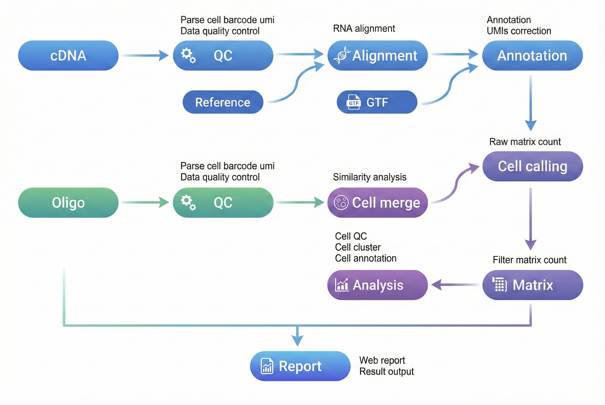

<div align="right" style="margin-bottom: 20px; max-width: 1200px; margin-left: auto; margin-right: auto;" markdown="block">

[首页](../../index.md)

</div>

<div align="center" style="padding: 40px 20px; background: linear-gradient(135deg, #f5f5f7 0%, #ffffff 100%); border-radius: 12px; margin-bottom: 30px; max-width: 1200px; margin-left: auto; margin-right: auto;" markdown="block">

<h1 style="font-size: 48px; font-weight: 600; color: #1d1d1f; margin: 0 0 16px 0; letter-spacing: -0.02em;">DNBelab C Series HT scRNA 分析流程</h1>

<p style="font-size: 21px; color: #86868b; margin: 0 0 30px 0; font-weight: 400;">单细胞 RNA 测序数据分析说明</p>

<div style="display: flex; gap: 12px; justify-content: center; flex-wrap: wrap;" markdown="block">
<a href="#概述" style="background: #0071e3; color: white; padding: 8px 16px; border-radius: 980px; text-decoration: none; font-size: 14px;">概述</a>
<a href="#文件准备" style="background: transparent; color: #0071e3; padding: 8px 16px; border-radius: 980px; text-decoration: none; font-size: 14px; border: 1px solid #0071e3;">文件准备</a>
<a href="#参考数据库" style="background: transparent; color: #0071e3; padding: 8px 16px; border-radius: 980px; text-decoration: none; font-size: 14px; border: 1px solid #0071e3;">参考数据库</a>
<a href="#主流程分析" style="background: transparent; color: #0071e3; padding: 8px 16px; border-radius: 980px; text-decoration: none; font-size: 14px; border: 1px solid #0071e3;">主流程分析</a>
<a href="#结果解析" style="background: transparent; color: #0071e3; padding: 8px 16px; border-radius: 980px; text-decoration: none; font-size: 14px; border: 1px solid #0071e3;">结果解析</a>
</div>

</div>

<div style="max-width: 1200px; margin: 0 auto;" markdown="block"><hr style="border: none; border-top: 1px solid #d2d2d7; margin: 24px 0;"></div>

<div style="background: #f5f5f7; border-radius: 12px; padding: 24px; margin: 24px auto; max-width: 1200px;" markdown="block">

## 概述 <a id="概述"></a>

</div>

<div style="background: #ffffff; border-radius: 12px; padding: 24px; margin: 20px auto; max-width: 1200px; border: 1px solid #e5e5e5; box-shadow: 0 1px 3px rgba(0,0,0,0.1);" markdown="block">

本文档旨在提供一份完整的指南，详细介绍如何使用 dnbc4tools 对单细胞 RNA 测序数据进行分析。

**工作流程**：原始数据 → 质量控制 → 比对 → 细胞识别 → 表达矩阵 → 分析报告

<div align="center" markdown="block">
  
</div>

<div style="background-color: #e7f3fe; border-left: 6px solid #2196F3; padding: 15px; margin: 1.5em 0; border-radius: 4px;" markdown="block">
 <strong>使用说明</strong>：<code>$dnbc4tools</code> 代表可执行程序路径，需替换为您的实际安装路径。本文示例使用换行符 `\` 分隔命令以提高可读性，实际分析时可写为单行。
</div>

</div>

<div style="max-width: 1200px; margin: 0 auto;" markdown="block"><hr style="border: none; border-top: 1px solid #d2d2d7; margin: 24px 0;"></div>

<div style="background: #f5f5f7; border-radius: 12px; padding: 24px; margin: 24px auto; max-width: 1200px;" markdown="block">

## 文件准备 <a id="文件准备"></a>

</div>

<div style="background: #ffffff; border-radius: 12px; padding: 24px; margin: 20px auto; max-width: 1200px; border: 1px solid #e5e5e5; box-shadow: 0 1px 3px rgba(0,0,0,0.1);" markdown="block">

分析需要两种类型的 FASTQ 文件：

<table style="width:100%; border-collapse: collapse; margin: 1.5em 0; box-shadow: 0 2px 3px rgba(0,0,0,0.1);">
  <thead style="background-color: #f2f2f2; border-bottom: 2px solid #ddd;">
    <tr>
      <th style="padding: 12px 15px; border: 1px solid #ddd; text-align: left;">文件类型</th>
      <th style="padding: 12px 15px; border: 1px solid #ddd; text-align: left;">说明</th>
    </tr>
  </thead>
  <tbody>
    <tr>
      <td style="padding: 12px 15px; border: 1px solid #ddd;"><b>cDNA 文库</b></td>
      <td style="padding: 12px 15px; border: 1px solid #ddd;">包含 Cell Barcode、UMI 和转录组信息的测序数据。</td>
    </tr>
    <tr>
      <td style="padding: 12px 15px; border: 1px solid #ddd;"><b>Oligo 文库</b></td>
      <td style="padding: 12px 15px; border: 1px solid #ddd;">包含大小磁珠的 Cell Barcode 信息及小磁珠的 UMI 信息。</td>
    </tr>
  </tbody>
</table>

<div style="background-color: #fffbe6; border-left: 6px solid #ffc107; padding: 15px; margin: 1.5em 0; border-radius: 4px;" markdown="block">
 <strong>注意</strong>：请确保 FASTQ 文件质量良好，并记录文件路径以备后续分析使用。
</div>

</div>

<div style="max-width: 1200px; margin: 0 auto;" markdown="block"><hr style="border: none; border-top: 1px solid #d2d2d7; margin: 24px 0;"></div>

<div style="background: #f5f5f7; border-radius: 12px; padding: 24px; margin: 24px auto; max-width: 1200px;" markdown="block">

## 参考数据库 <a id="参考数据库"></a>

</div>

<div style="background: #ffffff; border-radius: 12px; padding: 24px; margin: 20px auto; max-width: 1200px; border: 1px solid #e5e5e5; box-shadow: 0 1px 3px rgba(0,0,0,0.1);" markdown="block">

### 参考数据库输入文件

<table style="width:100%; border-collapse: collapse; margin: 1.5em 0; box-shadow: 0 2px 3px rgba(0,0,0,0.1);">
  <thead style="background-color: #f2f2f2; border-bottom: 2px solid #ddd;">
    <tr>
      <th style="padding: 12px 15px; border: 1px solid #ddd; text-align: left;">文件类型</th>
      <th style="padding: 12px 15px; border: 1px solid #ddd; text-align: left;">格式</th>
      <th style="padding: 12px 15px; border: 1px solid #ddd; text-align: left;">说明</th>
    </tr>
  </thead>
  <tbody>
    <tr>
      <td style="padding: 12px 15px; border: 1px solid #ddd;"><b>基因组文件</b></td>
      <td style="padding: 12px 15px; border: 1px solid #ddd;">FASTA</td>
      <td style="padding: 12px 15px; border: 1px solid #ddd;">包含特定物种的完整基因组序列（通常是主装配版本），涵盖染色体、线粒体及其他遗传信息。该文件是基因组比对和分析的基础。</td>
    </tr>
    <tr>
      <td style="padding: 12px 15px; border: 1px solid #ddd;"><b>注释文件</b></td>
      <td style="padding: 12px 15px; border: 1px solid #ddd;">GTF</td>
      <td style="padding: 12px 15px; border: 1px solid #ddd;">详细描述基因组中的基因、转录本、外显子等功能区域。此文件明确了基因的位置、类型及相关属性。</td>
    </tr>
  </tbody>
</table>

<div style="background-color: #e7f3fe; border-left: 6px solid #2196F3; padding: 15px; margin: 1.5em 0; border-radius: 4px;" markdown="block">
 <strong>推荐数据来源</strong>：优先使用 <a href="https://www.ensembl.org/index.html">Ensembl 数据库</a> 提供的文件。Ensembl 的 GTF 文件包含可选标签，便于通过 <code>dnbc4tools tools mkgtf</code> 进行过滤。
</div>

<p><strong>GTF 文件要求：</strong></p>

<ul>
  <li>必须包含 <code>gene</code> 或 <code>transcript</code> 类型以及 <code>exon</code> 类型的注释。</li>
  <li>属性中必须包含 <code>gene_id</code> 或 <code>gene_name</code> 以及 <code>transcript_id</code> 或 <code>transcript_name</code>。</li>
  <li>不支持 GFF 文件格式。</li>
  <li>基因组文件与注释文件需版本对应。</li>
</ul>

### GTF 文件预处理（可选） <a id="gtf-file-processing-optional-zh"></a>

从 ENSEMBL 和 UCSC 等网站下载的 GTF 文件通常包含多种类型的基因。根据您的研究兴趣选择特定的基因类型进行分析，可以有效减少基因注释的重叠，从而提高比对的唯一性。与多个基因非唯一比对的 reads 会被过滤。

我们提供以下三种 GTF 文件处理功能：

<table style="width:100%; border-collapse: collapse; margin: 1.5em 0; box-shadow: 0 2px 3px rgba(0,0,0,0.1);">
  <thead style="background-color: #f2f2f2; border-bottom: 2px solid #ddd;">
    <tr>
      <th style="padding: 12px 15px; border: 1px solid #ddd; text-align: left;">功能</th>
      <th style="padding: 12px 15px; border: 1px solid #ddd; text-align: left;">说明</th>
    </tr>
  </thead>
  <tbody>
    <tr>
      <td style="padding: 12px 15px; border: 1px solid #ddd;"><b>基因类型统计</b></td>
      <td style="padding: 12px 15px; border: 1px solid #ddd;">统计 GTF 文件中各基因类型的数量。</td>
    </tr>
    <tr>
      <td style="padding: 12px 15px; border: 1px solid #ddd;"><b>GTF 文件校正</b></td>
      <td style="padding: 12px 15px; border: 1px solid #ddd;">填补缺失信息，确保 GTF 文件符合分析要求。</td>
    </tr>
    <tr>
      <td style="padding: 12px 15px; border: 1px solid #ddd;"><b>基因类型过滤</b></td>
      <td style="padding: 12px 15px; border: 1px solid #ddd;">根据研究需要筛选特定基因类型。</td>
    </tr>
  </tbody>
</table>

#### 基因类型统计

```shell
# 统计基因类型数量
$dnbc4tools tools mkgtf \
  --action stats \
  --ingtf genes.gtf
```

<div style="background-color: #fffbe6; border-left: 6px solid #ffc107; padding: 15px; margin: 1.5em 0; border-radius: 4px;" markdown="block">
 <strong>注意</strong>：软件会自动尝试识别 <code>type</code> 参数。如需手动确定，可查看 GTF 文件中的 tag。
</div>

<div align="center" markdown="block">
  
</div>

输出示例：

```shell
Type    Count
protein_coding  20006
lncRNA  17755
processed_pseudogene    10159
unprocessed_pseudogene  2605
misc_RNA        2221
snRNA   1910
miRNA   1879
TEC     1056
transcribed_unprocessed_pseudogene      950
snoRNA  943
transcribed_processed_pseudogene        503
rRNA_pseudogene 497
IG_V_pseudogene 187
transcribed_unitary_pseudogene  146
IG_V_gene       145
......
```

#### GTF 文件校正

当 GTF 文件内容不完整时，主分析流程可能会因无法完全注释而中断。此功能能够自动填补基因（gene）与转录本（transcript）条目中的缺失信息，确保流程顺利进行。

```shell
# 校正GTF 文件
$dnbc4tools tools mkgtf \
  --action check \
  --ingtf genes.gtf \
  --output corrected.gtf
```

软件会根据 `gene_id` 和 `gene_name` 以及 `transcript_id` 和 `transcript_name` 互相填补，并提示可能存在多个基因信息的位置。

#### 基因类型过滤

```shell
# 基因类型过滤
$dnbc4tools tools mkgtf \
  --ingtf genes.gtf \
  --output genes.filter.gtf \
  --type gene_biotype
```

默认包含的基因类型：
```
protein_coding
lncRNA/lincRNA
antisense
IG_V_gene
IG_LV_gene
IG_D_gene
IG_J_gene
IG_C_gene
IG_V_pseudogene
IG_J_pseudogene
IG_C_pseudogene
TR_V_gene
TR_D_gene
TR_J_gene
TR_C_gene
```

也可使用 `include` 参数自定义需要保留的基因类型：

```shell
# 自定义基因类型过滤
$dnbc4tools tools mkgtf \
  --ingtf genes.gtf \
  --output genes.filter.gtf \
  --type gene_biotype \
  --include protein_coding,lncRNA,lincRNA,antisense,IG_V_gene,\
           IG_LV_gene,IG_J_gene,IG_C_gene,IG_V_pseudogene,\
           IG_J_pseudogene,IG_C_pseudogene,TR_V_gene,TR_D_gene,\
           TR_J_gene,TR_C_gene
```

### 参考数据库构建

在执行 `dnbc4tools rna run` 分析前，必须先构建参考数据库。此步骤利用注释文件（GTF）和参考基因组（FASTA）创建索引，用于后续测序 reads 的比对和注释。

<p><strong>运行命令：</strong></p>

```shell
# 构建参考数据库
$dnbc4tools rna mkref \
  --fasta genome.fa \
  --ingtf genes.filter.gtf \
  --species Homo_sapiens \
  --threads 20
```

<p><strong>输出目录：</strong></p>

成功运行后，将在指定位置创建参考数据库目录，包含以下文件结构：

```
/database/scRNA/Homo_sapiens

├── fasta
│   ├── genome.fa
│   └── genome.fa.fai
├── genes
│   └── genes.gtf
├── ref.json
└── star
    ├── chrLength.txt
    ├── chrNameLength.txt
    ├── chrName.txt
    ├── chrStart.txt
    ├── exonGeTrInfo.tab
    ├── exonInfo.tab
    ├── geneInfo.tab
    ├── Genome
    ├── genomeParameters.txt
    ├── mtgene.list
    ├── SA
    ├── SAindex
    ├── sjdbInfo.txt
    ├── sjdbList.fromGTF.out.tab
    ├── sjdbList.out.tab
    └── transcriptInfo.tab
```

<p><strong>ref.json 示例：</strong></p>

其中 `ref.json` 文件记录了数据库的主要信息。

```json
{
    "chrmt": "chrM",
    "genome": "fasta/genome.fa",
    "genomeDir": "star",
    "gtf": "genes/genes.gtf",
    "input_fasta_files": [
        "genome.fa"
    ],
    "input_gtf_files": [
        "genes.filter.gtf"
    ],
    "mtgenes": "star/mtgene.list",
    "species": "Homo_sapiens",
    "version": "3.1"
}
```

<div style="background-color: #fffbe6; border-left: 6px solid #ffc107; padding: 15px; margin: 1.5em 0; border-radius: 4px;" markdown="block">
 <strong>注意</strong>：构建参考数据库可能需要较长时间，具体取决于基因组大小和计算性能。软件主分析流程兼容旧版本数据库。
</div>

<p><strong>运行日志示例：</strong></p>

运行时将打印如下信息：

```shell
 2026-04-03 16:29:02 Creating new reference folder at /database/scRNA/Homo_sapiens                          
...done

 2026-04-03 16:29:02 Writing genome FASTA file into reference folder...                             
...done

 2026-04-03 16:29:57 Indexing genome FASTA file...                                                  
...done

 2026-04-03 16:30:09 Writing genes GTF file into reference folder...                                
...done

 2026-04-03 16:33:20 Generating STAR genome index...                                                
...done

 2026-04-03 17:13:34 Writing Reference JSON file into reference folder...                           
...done

 2026-04-03 17:13:37 RNA reference building finished. 
```

</div>

<div style="max-width: 1200px; margin: 0 auto;" markdown="block"><hr style="border: none; border-top: 1px solid #d2d2d7; margin: 24px 0;"></div>

<div style="background: #f5f5f7; border-radius: 12px; padding: 24px; margin: 24px auto; max-width: 1200px;" markdown="block">

## 主流程分析 <a id="主流程分析"></a>

</div>

<div style="background: #ffffff; border-radius: 12px; padding: 24px; margin: 20px auto; max-width: 1200px; border: 1px solid #e5e5e5; box-shadow: 0 1px 3px rgba(0,0,0,0.1);" markdown="block">

主流程分析包括单样本分析和多样本批处理两种使用方式：

- **单样本分析**：直接运行 `dnbc4tools rna run`，适用于单个样本的完整分析。
- **多样本批处理**：先通过 `dnbc4tools rna multi` 生成每个样本的运行脚本，适用于多个样本的批量任务准备。

### 单样本分析

RNA 主分析流程处理单个样本的 cDNA 和 Oligo 文库测序数据。该流程的核心步骤包括：
<ol>
  <li><strong>数据处理</strong>：执行质量控制、比对和功能区域注释。</li>
  <li><strong>细胞识别</strong>：合并磁珠，识别有效细胞。</li>
  <li><strong>矩阵生成</strong>：生成原始及过滤后的基因表达矩阵。</li>
  <li><strong>高级分析</strong>：对过滤后矩阵进行细胞筛选、降维、聚类和注释。</li>
  <li><strong>报告生成</strong>：输出 HTML 格式的分析报告及其他结果文件。</li>
</ol>

支持两种输入方式：

**方式1：目录方式（推荐）**

```shell
$dnbc4tools rna run \
  --name sample \
  --fastqs /data \
  --genomeDir /opt/database/Homo_sapiens \
  --threads 30
```

目录结构示例：
```
/data/
├── cDNA/
│   ├── sample_cDNA_R1.fastq.gz
│   └── sample_cDNA_R2.fastq.gz
└── oligo/
    ├── sample_oligo_1_R1.fastq.gz
    ├── sample_oligo_1_R2.fastq.gz
    ├── sample_oligo_2_R1.fastq.gz
    └── sample_oligo_2_R2.fastq.gz
```

目录要求：

- `--fastqs` 指向的目录必须包含 `cDNA/` 和 `oligo/` 两个子目录。
- 每个子目录内放置对应文库的 R1/R2 配对 FASTQ 文件。
- 自动识别依赖文件名中的 R1/R2 标识。建议使用 `_R1`/`_R2` 或 `_R1_`/`_R2_` 命名。
- 不同样本或不同文库的数据不要混放到同一输入目录中。

**方式2：单独参数方式**

```shell
$dnbc4tools rna run \
  --name sample \
  --cDNAfastq1 /data/cDNA/sample_cDNA_R1.fastq.gz \
  --cDNAfastq2 /data/cDNA/sample_cDNA_R2.fastq.gz \
  --oligofastq1 /data/oligo/sample_oligo_1_R1.fastq.gz,/data/oligo/sample_oligo_2_R1.fastq.gz \
  --oligofastq2 /data/oligo/sample_oligo_1_R2.fastq.gz,/data/oligo/sample_oligo_2_R2.fastq.gz \
  --genomeDir /opt/database/Homo_sapiens \
  --threads 30
```

在对试剂版本和暗反应自动检测后，软件开始运行分析，以下是一个示例：

```shell
──────────────────────────── Parsed FASTQ Inputs — 2025-11-12 15:00:24 ─────────────────────────────
┌─────────────┬────────────────────────────────────────────────────────────────────────────────────┐
│ Type        │ Path                                                                               │
├─────────────┼────────────────────────────────────────────────────────────────────────────────────┤
│ cDNA Read 1 │ /data/cDNA/sample_cDNA_R1.fastq.gz                                                 │
│ cDNA Read 2 │ /data/cDNA/sample_cDNA_R2.fastq.gz                                                 │
│ oligo Read 1 │ /data/oligo/sample_oligo_1_R1.fastq.gz,/data/oligo/sample_oligo_2_R1.fastq.gz      │
│ oligo Read 2 │ /data/oligo/sample_oligo_1_R2.fastq.gz,/data/oligo/sample_oligo_2_R2.fastq.gz      │
└─────────────┴────────────────────────────────────────────────────────────────────────────────────┘
────────────────────────────────────────────────────────────────────────────────────────────────────

──────────────────────────── Chemistry Detection — 2025-11-12 15:00:31 ─────────────────────────────
┌───────────────────────────────────────────────┬──────────────────────────────────────────────────┐
│ Type                                          │ Result                                           │
├───────────────────────────────────────────────┼──────────────────────────────────────────────────┤
│ oligo Read 1                                   │ darkreaction                                     │
│ oligo Read 2                                   │ darkreaction                                     │
└───────────────────────────────────────────────┴──────────────────────────────────────────────────┘
────────────────────────────────────────────────────────────────────────────────────────────────────

──────────────────────────── Chemistry Detection — 2025-11-12 15:00:31 ─────────────────────────────
┌─────────────────────────────────────────────┬────────────────────────────────────────────────────┐
│ Type                                        │ Result                                             │
├─────────────────────────────────────────────┼────────────────────────────────────────────────────┤
│ cDNA Read 1                                  │ darkreaction                                       │
└─────────────────────────────────────────────┴────────────────────────────────────────────────────┘
────────────────────────────────────────────────────────────────────────────────────────────────────

 2025-11-12 15:00:31 Starting oligo library filtering...                                            
...done

 2025-11-12 15:05:53 Starting cDNA library filtering...                                             
...done

 2025-11-12 15:07:49 Performing read alignment and UMI counting...                                  
...done

 2025-11-12 15:15:25 Calculating bead similarity and merging beads within droplets...               
...done

 2025-11-12 15:15:41 Generating raw gene expression matrix...                                       
...done

 2025-11-12 15:17:24 Generating cell-filtered gene expression matrix...                             
...done

 2025-11-12 15:17:43 Calculating sequencing saturation metrics...                                   
...done

 2025-11-12 15:18:08 Generating position-sorted BAM file...                                         
...done

 2025-11-12 15:24:46 Performing dimensionality reduction and clustering analysis...                 
...done

 2025-11-12 15:27:21 Generating analysis report and summary statistics...                           
...done

 2025-11-12 15:27:40 Analysis Finished. Elapsed Time: 0:27:16
```

当出现 `Analysis Finished` 消息时，表示分析已成功完成。

<div style="border-top: 1px solid #d2d2d7; margin: 32px 0;" markdown="block"></div>

### 多样本批处理（可选）

为简化多样本分析流程，可使用配置文件批量生成针对每个样本的 shell 脚本。

```shell
$dnbc4tools rna multi \
  --list sample.tsv \
  --genomeDir /opt/database/Homo_sapiens \
  --threads 30
```

其中 `sample.tsv` 文件使用制表符 (`\t`) 分隔，包含三列：

<table style="width:100%; border-collapse: collapse; margin: 1.5em 0; box-shadow: 0 2px 3px rgba(0,0,0,0.1);">
  <thead style="background-color: #f2f2f2; border-bottom: 2px solid #ddd;">
    <tr>
      <th style="padding: 12px 15px; border: 1px solid #ddd; text-align: left;">列</th>
      <th style="padding: 12px 15px; border: 1px solid #ddd; text-align: left;">内容</th>
    </tr>
  </thead>
  <tbody>
    <tr>
      <td style="padding: 12px 15px; border: 1px solid #ddd;">1</td>
      <td style="padding: 12px 15px; border: 1px solid #ddd;">样本名称</td>
    </tr>
    <tr>
      <td style="padding: 12px 15px; border: 1px solid #ddd;">2</td>
      <td style="padding: 12px 15px; border: 1px solid #ddd;">cDNA 文库测序数据</td>
    </tr>
    <tr>
      <td style="padding: 12px 15px; border: 1px solid #ddd;">3</td>
      <td style="padding: 12px 15px; border: 1px solid #ddd;">Oligo 文库测序数据</td>
    </tr>
  </tbody>
</table>

<div style="background-color: #fffbe6; border-left: 6px solid #ffc107; padding: 15px; margin: 1.5em 0; border-radius: 4px;" markdown="block">
 <strong>注意</strong>：多个 FASTQ 文件以逗号分隔，R1 和 R2 文件以分号分隔。
</div>

```tsv
sample1	/data/cDNA1_R1.fq.gz;/data/cDNA1_R2.fq.gz	/data/oligo1_R1.fq.gz,/data/oligo4_R1.fq.gz;/data/oligo1_R2.fq.gz,/data/oligo4_R2.fq.gz
sample2	/data/cDNA2_R1.fq.gz;/data/cDNA2_R2.fq.gz	/data/oligo2_R1.fq.gz;/data/oligo2_R2.fq.gz
sample3	/data/cDNA3_R1.fq.gz;/data/cDNA3_R2.fq.gz	/data/oligo3_R1.fq.gz;/data/oligo3_R2.fq.gz
```

运行完成后，将为每个样本生成一个 shell 脚本：

```shell
sample1.sh
sample2.sh
sample3.sh
```

`sample1.sh` 文件内容示例：

```shell
$cat sample1.sh
/opt/software/dnbc4tools3.1/dnbc4tools rna run --name sample1 --cDNAfastq1 /data/cDNA1_R1.fq.gz --cDNAfastq2 /data/cDNA1_R2.fq.gz --oligofastq1 /data/oligo1_R1.fq.gz,/data/oligo4_R1.fq.gz --oligofastq2 /data/oligo1_R2.fq.gz,/data/oligo4_R2.fq.gz --genomeDir /database/scRNA/Mus_musculus/mm10 --threads 30
```

随后可执行这些脚本进行主流程分析。

</div>

<div style="max-width: 1200px; margin: 0 auto;" markdown="block"><hr style="border: none; border-top: 1px solid #d2d2d7; margin: 24px 0;"></div>

<div style="background: #f5f5f7; border-radius: 12px; padding: 24px; margin: 24px auto; max-width: 1200px;" markdown="block">

## 结果解析 <a id="结果解析"></a>

</div>

<div style="background: #ffffff; border-radius: 12px; padding: 24px; margin: 20px auto; max-width: 1200px; border: 1px solid #e5e5e5; box-shadow: 0 1px 3px rgba(0,0,0,0.1);" markdown="block">

分析完成后，将生成 `outs`（结果输出）和 `logs`（日志）目录。`outs` 目录结构如下：

```
. 
├── analysis/
│   ├── cluster.csv
│   ├── marker.csv
│   └── QC_Cluster.h5ad
├── anno_decon_sorted.bam
├── anno_decon_sorted.bam.bai
├── filter_feature.h5ad
├── filter_matrix/
│   ├── barcodes.tsv.gz
│   ├── features.tsv.gz
│   └── matrix.mtx.gz
├── metrics_summary.xls
├── raw_matrix/
│   ├── barcodes.tsv.gz
│   ├── features.tsv.gz
│   └── matrix.mtx.gz
├── *_scRNA_report.html
└── singlecell.csv
```

</div>

<div style="max-width: 1200px; margin: 0 auto;" markdown="block"><hr style="border: none; border-top: 1px solid #d2d2d7; margin: 24px 0;"></div>

<div style="background: #f5f5f7; border-radius: 12px; padding: 24px; margin: 24px auto; max-width: 1200px;" markdown="block">

## 相关文档

</div>

<div style="background: #ffffff; border-radius: 12px; padding: 24px; margin: 20px auto; max-width: 1200px; border: 1px solid #e5e5e5; box-shadow: 0 1px 3px rgba(0,0,0,0.1);" markdown="block">

| 资源 | 描述 |
| :--- | :--- |
| [输出文件使用方法](../io.md) | 了解输出文件结构和格式 |
| [分析参数设置](../parameter/scRNA.md) | 完整的参数参考和说明 |
| [输出文件解释](../outs/scRNA.md) | 分析结果的详细解读 |

</div>

<div style="max-width: 1200px; margin: 0 auto;" markdown="block"><hr style="border: none; border-top: 1px solid #d2d2d7; margin: 24px 0;"></div>

<div style="background: #f5f5f7; border-radius: 12px; padding: 24px; margin: 24px auto; max-width: 1200px;" markdown="block">

## 常见问题

</div>

<div style="background: #ffffff; border-radius: 12px; padding: 24px; margin: 20px auto; max-width: 1200px; border: 1px solid #e5e5e5; box-shadow: 0 1px 3px rgba(0,0,0,0.1);" markdown="block">

本节将根据常见使用问题持续补充。当前版本请优先参考运行日志、参数说明和输出文件说明进行排查。

</div>

<div style="max-width: 1200px; margin: 0 auto;" markdown="block"><hr style="border: none; border-top: 1px solid #d2d2d7; margin: 24px 0;"></div>

<div style="background: #f5f5f7; border-radius: 12px; padding: 24px; margin: 24px auto; max-width: 1200px;" markdown="block">

<div align="center" markdown="block">

> <strong>反馈与支持</strong>
>
> 本文档持续维护更新。若发现内容错误或需要补充信息，请通过 GitHub Issues 反馈。
>
> <strong>文档版本：</strong> 3.1 | <strong>最后更新：</strong> 2026 年 5 月 15 日

</div>

</div>
