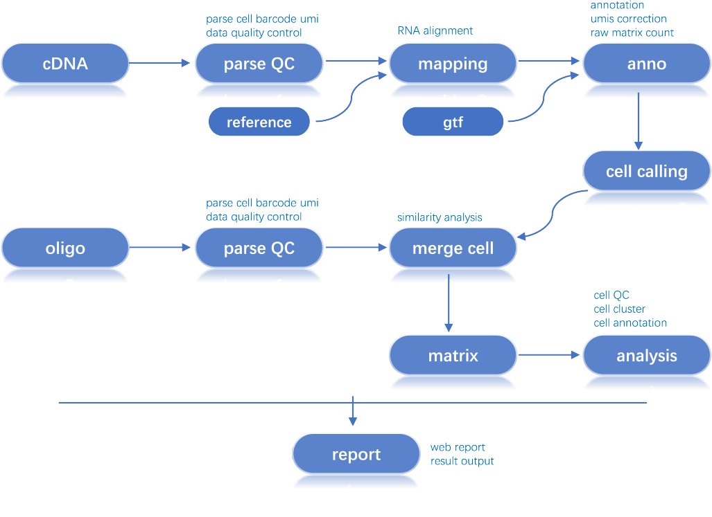

# DNBelab_C_Series_HT_scRNA-analysis-software

## Introduction

An open source and flexible pipeline to analyze high-throughput DNBelab C SeriesTM single-cell RNA datasets. 

**Hardware/Software requirements** 

- x86-64 compatible processors.
- require at least 50GB of RAM and 4 CPU. 
- centos 7.x 64-bit operating system (Linux kernel 3.10.0, compatible with higher software and hardware configuration). 

**Workflow**
 
 

## Start

- [**installation** ](./doc/installation.md)

- [**quick start** ](./doc/quickstart.md)

- [**Documentation** ](./doc/detail.md)

## Support

- Please use github issue tracker for questions. [**issues**](https://github.com/MGI-tech-bioinformatics/DNBelab_C_Series_HT_scRNA-analysis-software/issues)
- Read the Docs. [**docs**](https://dnbc4tools.readthedocs.io)
