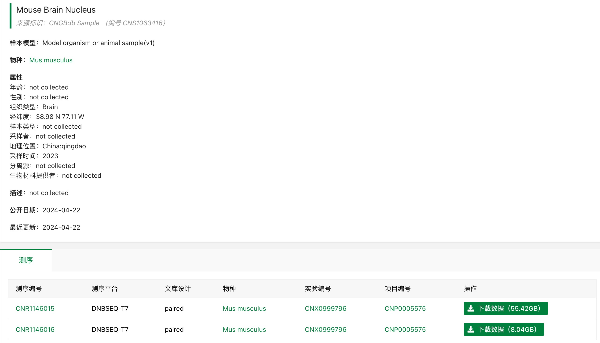
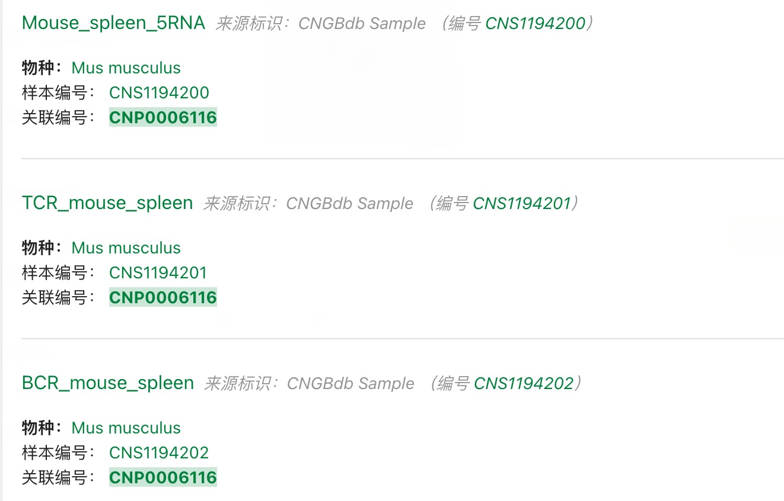
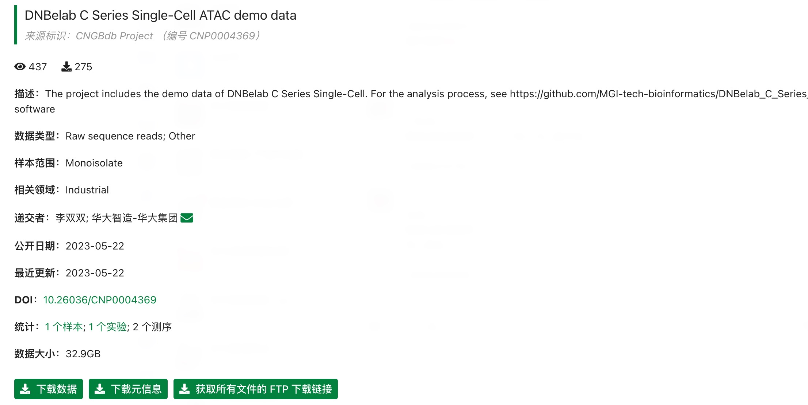

# 🧬 DNBelab C Series Demo Datasets

Demo datasets are hosted on CNG B (China National GeneBank). Due to human genetic resource regulations, only mouse sample data is provided.

## 📋 Navigation

[scRNA-seq v3 Data](#scrna-seq-v3-data) • [scVDJ-seq Data](#scvdj-seq-data) • [scATAC-seq Data](#scatac-seq-data)

---

## scRNA-seq v3 Data 

**Project URL:** https://db.cngb.org/data_resources/project/CNP0005575/

**Project Overview:**

  

You can click on "Sample" or "Experiment" to access specific sample information:

  

**Data Composition:**
- Large data volume: cDNA library sequencing data
- Small data volume: Oligo library data

---

## scVDJ-seq Data 

**Project URL:** https://db.cngb.org/data_resources/project/CNP0006116/

**Sample Information:**
The sample is mouse spleen tissue, containing 5' RNA, TCR, and BCR data.

  

**Usage Tip:**
If you don't need to analyze 5' RNA data, you can directly download the `singlecell.csv` file from the single-cell data FTP directory within the 5' RNA data.

---

## scATAC-seq Data 

**Project URL:** https://db.cngb.org/data_resources/project/CNP0004369

**Sample Information:**
The sample is mouse brain tissue.

  

**Usage:**
You can directly download the raw data via the FTP link for analysis.

---