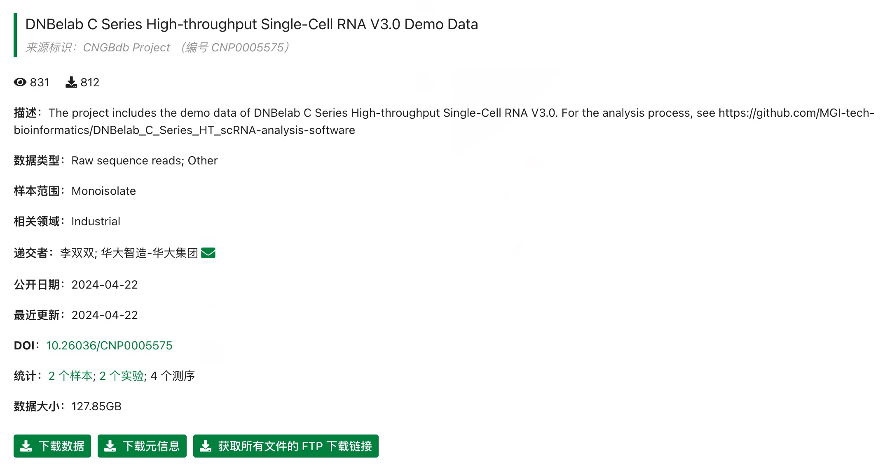

[首页](../README.md)

# DNBelab C 系列示例数据集

示例数据托管在 CNGB（中国国家基因库）。当前提供小鼠样本数据。

---

<table style="width:100%; border-collapse: collapse; margin: 1.5em 0;">
  <thead style="background-color: #f2f2f2; border-bottom: 2px solid #ddd;">
    <tr>
      <th style="padding: 12px 15px; border: 1px solid #ddd; text-align: left;">分析类型</th>
      <th style="padding: 12px 15px; border: 1px solid #ddd; text-align: left;">样本说明</th>
      <th style="padding: 12px 15px; border: 1px solid #ddd; text-align: left;">项目链接</th>
    </tr>
  </thead>
  <tbody>
    <tr>
      <td style="padding: 12px 15px; border: 1px solid #ddd;"><b>scRNA-seq v3</b></td>
      <td style="padding: 12px 15px; border: 1px solid #ddd;">小鼠样本，包含分离的 cDNA 和 Oligo 文库。</td>
      <td style="padding: 12px 15px; border: 1px solid #ddd;"><a href="https://db.cngb.org/data_resources/project/CNP0005575/" target="_blank">CNP0005575</a></td>
    </tr>
    <tr>
      <td style="padding: 12px 15px; border: 1px solid #ddd;"><b>scVDJ-seq</b></td>
      <td style="padding: 12px 15px; border: 1px solid #ddd;">小鼠脾脏组织，包含 5' RNA、TCR、BCR 数据。</td>
      <td style="padding: 12px 15px; border: 1px solid #ddd;"><a href="https://db.cngb.org/data_resources/project/CNP0006116/" target="_blank">CNP0006116</a></td>
    </tr>
    <tr>
      <td style="padding: 12px 15px; border: 1px solid #ddd;"><b>scATAC-seq</b></td>
      <td style="padding: 12px 15px; border: 1px solid #ddd;">小鼠脑组织样本。</td>
      <td style="padding: 12px 15px; border: 1px solid #ddd;"><a href="https://db.cngb.org/data_resources/project/CNP0004369" target="_blank">CNP0004369</a></td>
    </tr>
  </tbody>
</table>

---

## 数据使用说明

<strong>scVDJ 使用说明</strong>：如果不需要分析 5' RNA 数据，可直接从对应 FTP 目录下载 `singlecell.csv` 作为 VDJ 流程输入。

<strong>通用说明</strong>：访问项目链接后，在 “Sample” 或 “Experiment” 页面中可找到原始数据 FTP 下载地址。

  
  
<i>示例：在 CNGB 项目页面中定位 FTP 下载链接。</i>

