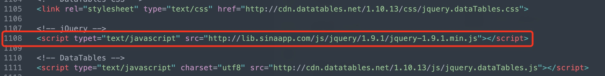

# Historical Guide and Solutions for HTML Report Display Issues

Dear User,

Greetings!

We have received feedback twice regarding the analysis software generated HTML reports failing to display correctly in certain network environments, appearing as blank pages or with missing content. Technical investigation revealed that the cause was the inability to access certain external Javascript library addresses referenced in the reports due to network issues.

To help you resolve such issues and understand the background, we have summarized the historical events and solutions below.

## I. Latest Issue and Solution (January 2026)

**Important: The latest software installation package has fixed this issue. We strongly recommend that you download and use the re-uploaded software directly, as this is the most thorough solution.**

### 1. Problem Description

Recently, we received feedback again that some users in mainland China could not open HTML reports.
Upon investigation, the reason was that the `cdn.datatables.net` resource `http://cdn.datatables.net/1.10.13` referenced in the report could not be accessed, causing tables and other content to fail to load.

### 2. Modification Plan for Generated Reports

#### Manual Modification

1.  Use a text editor to open the HTML report file that cannot be displayed normally.
    -   Windows recommendations: Notepad, Notepad++ (supports batch find and replace for specified formats in a specified directory), VS Code.
    -   macOS recommendations: TextEdit (please set to display HTML as code rather than formatted text), Sublime Text, VS Code.
    -   Linux recommendations: vim, nano.
2.  Find and replace all `http://cdn.datatables.net/1.10.13` with `https://cdn.datatables.net/1.10.13` in the file.
3.  Save the file and reopen it with a browser.

#### Batch Modification (Applicable to Linux/macOS Users)

If you need to batch replace multiple HTML files, you can execute the following terminal command in the directory containing the HTML files:

```shell
# For Linux systems:
sed -i 's|http://cdn.datatables.net/1.10.13|https://cdn.datatables.net/1.10.13|g' *.html

# For macOS systems:
sed -i '' 's|http://cdn.datatables.net/1.10.13|https://cdn.datatables.net/1.10.13|g' *.html
```
**Note:**
-   Please execute this in the directory containing HTML files.
-   The `sed -i` command will directly modify the file content without generating a backup. Please operate with caution. It is recommended to manually back up important files before modification.

## II. Historical Issues and Solutions (July 2025)

### 1. Problem Description

Around July 2025, HTML reports failed to load scripts and pages could not be displayed because the referenced jQuery library address `http://lib.sinaapp.com/js/jquery/1.9.1/jquery-1.9.1.min.js` became invalid.

### 2. Recommended Replacement Method at That Time

The solution to this problem is to replace the jQuery reference address with `http://code.jquery.com/jquery-1.9.1.min.js`.

- **Old Address**: `http://lib.sinaapp.com/js/jquery/1.9.1/jquery-1.9.1.min.js`
- **New Address**: `http://code.jquery.com/jquery-1.9.1.min.js`

The corresponding position is shown in the figure below (taking the RNA analysis report as an example):



For older versions of the software that need to be manually fixed, you can refer to the method above, enter the software template directory, and execute the corresponding `sed` replacement command.

Batch replacement command example:
```shell
# For Linux systems:
sed -i 's|http://lib.sinaapp.com/js/jquery/1.9.1/jquery-1.9.1.min.js|http://code.jquery.com/jquery-1.9.1.min.js|g' *.html

# For macOS systems:
sed -i '' 's|http://lib.sinaapp.com/js/jquery/1.9.1/jquery-1.9.1.min.js|http://code.jquery.com/jquery-1.9.1.min.js|g' *.html
```

## III. Contact Us

If you encounter any problems during the operation, please feel free to contact the technical support team for assistance.

Thank you for your understanding and support!

MGI Technical Support Team