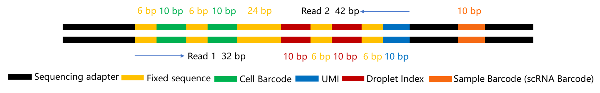

<div align="right">

[首页](../README.md)

</div>

# JSON 配置说明

本文档用于说明 `dnbc4tools` 中用于定义文库结构的 JSON 配置格式。

---

## 文库结构

该配置用于描述 `scRNAv2HT` 试剂盒文库结构。

<div style="display: flex; justify-content: space-around; align-items: center; flex-wrap: wrap; margin: 1.5em 0;">
  <div style="text-align: center; margin: 1em;">
    <h4>cDNA 文库结构</h4>
    
  </div>

  <div style="text-align: center; margin: 1em;">
    <h4>Oligo 文库结构</h4>
    
  </div>

</div>

---

## JSON 字段解释

JSON 配置用于定义如何从 FASTQ 中解析 barcode、UMI 和有效序列。核心说明如下：

- **必填字段**：`"cell barcode tag"`、`"cell barcode"`、`"read 1"` 为必填。
- **Tag 含义**：`value` 中通常用 `CB` 表示纠错后的细胞 barcode，用 `UR` 表示 UMI。
- **位置定义**：`location` 使用 `R1`/`R2` 加区间坐标，例如 `"R1:1-10"` 表示 Read 1 的 1-10 bp。
- **Barcode 片段**：一个细胞 barcode 可以由多个片段拼接而成（例如 `"R1:1-10"` + `"R1:17-26"`）。
- **输出行为**：程序会把解析出的 barcode 和 UMI 写入输出 FASTQ 的 read name 字段；`"read 1"` 指定的序列（如 `"R2:1-100"`）保留在 sequence 字段。
- **白名单纠错**：可通过 `"white list"` 指定合法 barcode；若不在白名单中，则按 `"distance"`（汉明距离阈值）尝试纠错。

### JSON 示例

```json
{
    "cell barcode tag":"CB",
    "cell barcode":[
	{
	    "location":"R1:1-10",
            "distance":"1",
            "white list":[
                "TAACAGCCAA",
                "CTAAGAGTCC",
                "..."
            ]
	},
	{
	    "location":"R1:11-20",
            "distance":"1",
            "white list":[
                "TAACAGCCAA",
                "CTAAGAGTCC",
                "..."
            ]
	}
    ],
    "UMI tag":"UR",
    "UMI":{
	"location":"R1:21-30"
    },
    "read 1":{
	"location":"R2:1-100"
    }
}
```

---

## 支持字段列表

<table style="width:100%; border-collapse: collapse; margin: 1.5em 0; box-shadow: 0 2px 3px rgba(0,0,0,0.1);">
  <thead style="background-color: #f2f2f2; border-bottom: 2px solid #ddd;">
    <tr>
      <th style="padding: 12px 15px; border: 1px solid #ddd; text-align: left;">字段</th>
      <th style="padding: 12px 15px; border: 1px solid #ddd; text-align: left;">说明</th>
    </tr>
  </thead>
  <tbody>
    <tr><td style="padding: 12px 15px; border: 1px solid #ddd;"><code>cell barcode tag</code></td><td style="padding: 12px 15px; border: 1px solid #ddd;">纠错后细胞 barcode 的 SAM tag，建议使用 `CB`。</td></tr>
    <tr><td style="padding: 12px 15px; border: 1px solid #ddd;"><code>cell barcode</code></td><td style="padding: 12px 15px; border: 1px solid #ddd;">定义细胞 barcode 片段的 JSON 数组。</td></tr>
    <tr><td style="padding: 12px 15px; border: 1px solid #ddd;"><code>cell barcode raw tag</code></td><td style="padding: 12px 15px; border: 1px solid #ddd;">原始细胞 barcode 的 SAM tag，建议使用 `CR`。</td></tr>
    <tr><td style="padding: 12px 15px; border: 1px solid #ddd;"><code>cell barcode raw qual tag</code></td><td style="padding: 12px 15px; border: 1px solid #ddd;">原始细胞 barcode 质量值的 SAM tag，建议使用 `CY`。</td></tr>
    <tr><td style="padding: 12px 15px; border: 1px solid #ddd;"><code>distance</code></td><td style="padding: 12px 15px; border: 1px solid #ddd;">barcode 纠错使用的最小汉明距离阈值。</td></tr>
    <tr><td style="padding: 12px 15px; border: 1px solid #ddd;"><code>white list</code></td><td style="padding: 12px 15px; border: 1px solid #ddd;">用于纠错的合法 barcode 列表。</td></tr>
    <tr><td style="padding: 12px 15px; border: 1px solid #ddd;"><code>location</code></td><td style="padding: 12px 15px; border: 1px solid #ddd;">序列位置（例如 `R1:1-10`）。</td></tr>
    <tr><td style="padding: 12px 15px; border: 1px solid #ddd;"><code>sample barcode tag</code></td><td style="padding: 12px 15px; border: 1px solid #ddd;">样本 barcode 的 SAM tag。</td></tr>
    <tr><td style="padding: 12px 15px; border: 1px solid #ddd;"><code>sample barcode</code></td><td style="padding: 12px 15px; border: 1px solid #ddd;">定义样本 barcode 片段。</td></tr>
    <tr><td style="padding: 12px 15px; border: 1px solid #ddd;"><code>UMI tag</code></td><td style="padding: 12px 15px; border: 1px solid #ddd;">UMI 的 SAM tag。原始 UMI 建议使用 `UR`，纠错后可使用 `UB`。</td></tr>
    <tr><td style="padding: 12px 15px; border: 1px solid #ddd;"><code>UMI qual tag</code></td><td style="padding: 12px 15px; border: 1px solid #ddd;">UMI 质量值对应的 SAM tag。</td></tr>
    <tr><td style="padding: 12px 15px; border: 1px solid #ddd;"><code>UMI</code></td><td style="padding: 12px 15px; border: 1px solid #ddd;">定义 UMI 的位置。</td></tr>
    <tr><td style="padding: 12px 15px; border: 1px solid #ddd;"><code>read 1</code></td><td style="padding: 12px 15px; border: 1px solid #ddd;">定义保留的 read1 序列区域。</td></tr>
    <tr><td style="padding: 12px 15px; border: 1px solid #ddd;"><code>read 2</code></td><td style="padding: 12px 15px; border: 1px solid #ddd;">定义保留的 read2 序列区域。</td></tr>
  </tbody>
</table>

---

## 位置配置示例

<div style="background-color: #f8f9fa; border: 1px solid #dee2e6; padding: 1px 20px; margin: 20px 0; border-radius: 8px;">

<h4>场景 1：cDNA R1 与 Oligo R1/R2 均存在暗反应</h4>

<ul>
  <li><b>cDNA - Cell Barcode:</b> <code>R1:1-10,R1:11-20</code></li>
  <li><b>cDNA - UMI:</b> <code>R1:21-30</code></li>
  <li><b>cDNA - Read 1:</b> <code>R2:1-100</code></li>
  <li><b>Oligo - Cell Barcode:</b> <code>R1:1-10,R1:11-20</code></li>
  <li><b>Oligo - Read 1:</b> <code>R2:1-30</code></li>
</ul>

</div>

<div style="background-color: #f8f9fa; border: 1px solid #dee2e6; padding: 1px 20px; margin: 20px 0; border-radius: 8px;">

<h4>场景 2：cDNA R1 与 Oligo R1 存在暗反应（Oligo R2 正常）</h4>

<ul>
  <li><b>cDNA - Cell Barcode:</b> <code>R1:1-10,R1:11-20</code></li>
  <li><b>cDNA - UMI:</b> <code>R1:21-30</code></li>
  <li><b>cDNA - Read 1:</b> <code>R2:1-100</code></li>
  <li><b>Oligo - Cell Barcode:</b> <code>R1:1-10,R1:11-20</code></li>
  <li><b>Oligo - Read 1:</b> <code>R2:1-10,R2:17-26,R2:33-42</code></li>
</ul>

</div>
