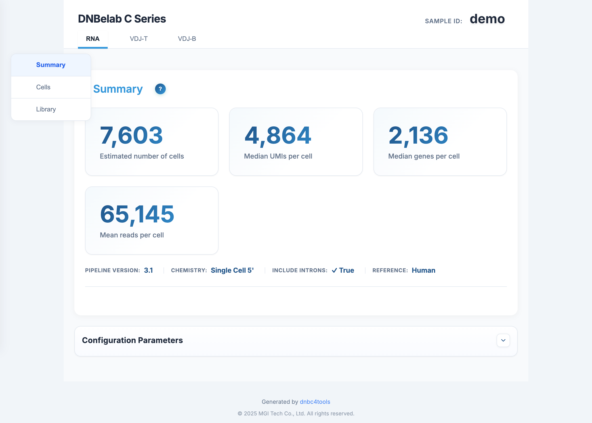
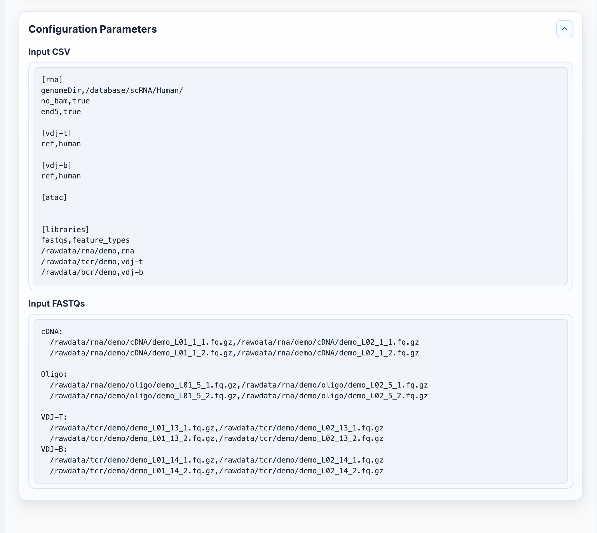
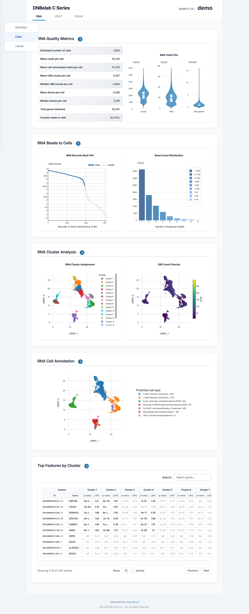
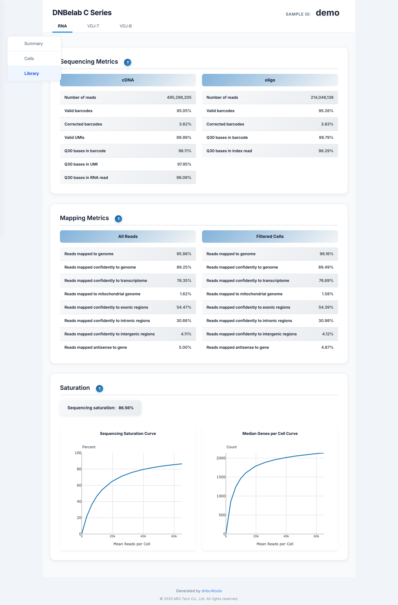
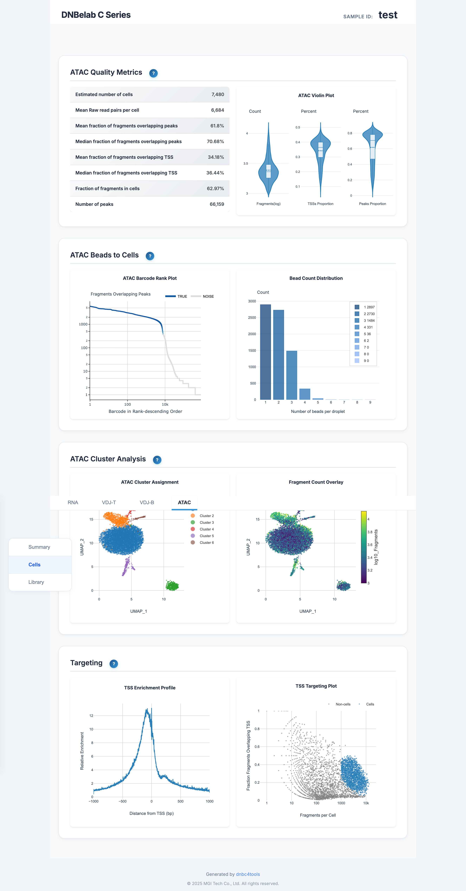
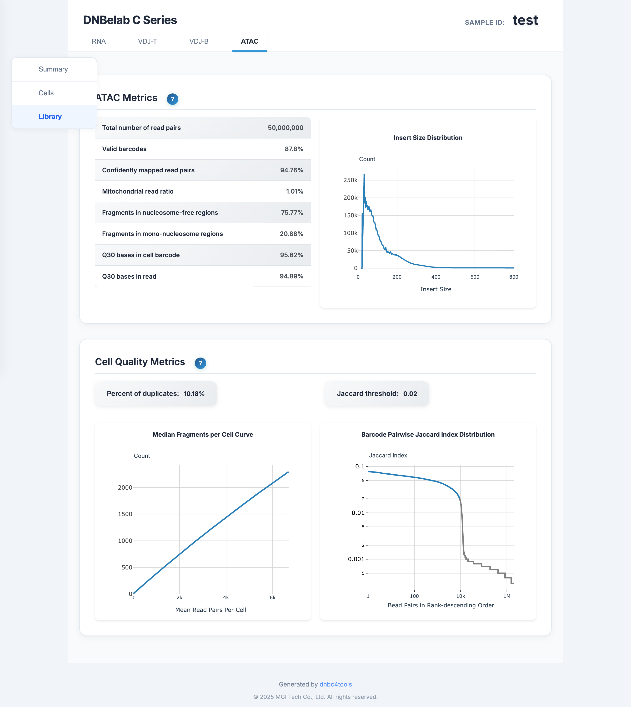
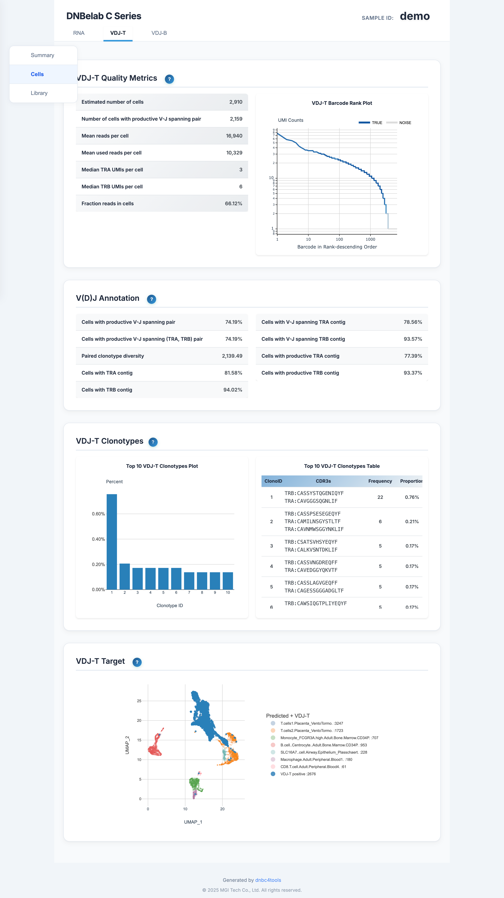
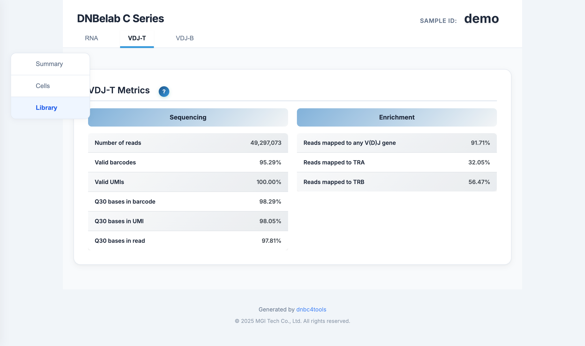

<div align="right" style="margin-bottom: 20px; max-width: 1200px; margin-left: auto; margin-right: auto;">

[Home](../../README.md)

</div>

<div align="center" style="padding: 40px 20px; background: linear-gradient(135deg, #f5f5f7 0%, #ffffff 100%); border-radius: 12px; margin-bottom: 30px; max-width: 1200px; margin-left: auto; margin-right: auto;">

<h1 style="font-size: 48px; font-weight: 600; color: #1d1d1f; margin: 0 0 16px 0; letter-spacing: -0.02em;">Multi-omics Analysis Output</h1>

<p style="font-size: 21px; color: rgba(0,0,0,0.6); margin: 0 0 30px 0; font-weight: 400;">Integrated Multi-omics Output File Guide</p>

<div style="display: flex; gap: 12px; justify-content: center; flex-wrap: wrap;">
<a href="#output-directory-structure" style="background: #0071e3; color: white; padding: 8px 16px; border-radius: 980px; text-decoration: none; font-size: 14px;">Directory Structure</a>
<a href="#detailed-file-description" style="background: transparent; color: #0071e3; padding: 8px 16px; border-radius: 980px; text-decoration: none; font-size: 14px; border: 1px solid #0071e3;">File Details</a>
<a href="#web-report-interpretation" style="background: transparent; color: #0071e3; padding: 8px 16px; border-radius: 980px; text-decoration: none; font-size: 14px; border: 1px solid #0071e3;">Report Interpretation</a>
</div>

</div>

<div style="background: #f5f5f7; border-radius: 12px; padding: 24px; margin: 24px auto; max-width: 1200px;">

## Overview <a id="overview"></a>

The multi-omics workflow organizes key RNA / ATAC / VDJ results into one sample-level directory, enabling cross-omics browsing and comparison within a single report.

> **Tip**
>
> The combined report is intended for fast overview and cross-module inspection. For detailed interpretation, please refer to each single-omics output document.

</div>

<div style="max-width: 1200px; margin: 0 auto;"><hr style="border: none; border-top: 1px solid #d2d2d7; margin: 24px 0;"></div>

<div style="background: #f5f5f7; border-radius: 12px; padding: 24px; margin: 24px auto; max-width: 1200px;">

## Output Directory Structure <a id="output-directory-structure"></a>

</div>

<div style="background: #ffffff; border-radius: 12px; padding: 20px; margin: 20px auto; max-width: 1200px; overflow-x: auto; border: 1px solid #d2d2d7;">

```text
<outdir>/<sample>/
└── outs/
    ├── <sample>_multi_report.html             # Combined multi-omics report
    ├── rna/                                   # RNA outputs (if enabled)
    ├── atac/                                  # ATAC outputs (if enabled)
    ├── vdj-t/                                 # VDJ-T outputs (if enabled)
    └── vdj-b/                                 # VDJ-B outputs (if enabled)
```

</div>

<div style="max-width: 1200px; margin: 0 auto;"><hr style="border: none; border-top: 1px solid #d2d2d7; margin: 24px 0;"></div>

<div style="background: #f5f5f7; border-radius: 12px; padding: 24px; margin: 24px auto; max-width: 1200px;">

## Detailed File Description <a id="detailed-file-description"></a>

</div>

<div style="background: #ffffff; border-radius: 12px; padding: 24px; box-shadow: 0 1px 3px rgba(0,0,0,0.1); border: 1px solid #e5e5e5; margin: 20px auto; max-width: 1200px;">

### `outs/<sample>_multi_report.html`

- **Content**: Integrated QC and analysis charts across RNA / ATAC / VDJ.
- **Purpose**: Cross-omics quality check and result overview on one page.

</div>

<div style="background: #ffffff; border-radius: 12px; padding: 24px; box-shadow: 0 1px 3px rgba(0,0,0,0.1); border: 1px solid #e5e5e5; margin: 20px auto; max-width: 1200px;">

### `outs/rna`, `outs/atac`, `outs/vdj-t`, `outs/vdj-b`

- **Content**: Standard module outputs (matrices, metrics tables, module reports, etc.).
- **Purpose**: Module-specific downstream analysis or single-omics reuse.

</div>

<div style="max-width: 1200px; margin: 0 auto;"><hr style="border: none; border-top: 1px solid #d2d2d7; margin: 24px 0;"></div>

<div style="background: #f5f5f7; border-radius: 12px; padding: 24px; margin: 24px auto; max-width: 1200px;">

## Web Report Interpretation <a id="web-report-interpretation"></a>

<div align="center">

**Overview**: The combined multi-omics report provides integrated views of core QC and analysis charts from RNA / ATAC / VDJ modules.

</div>

</div>

<div style="background: #ffffff; border-radius: 12px; padding: 24px; box-shadow: 0 1px 3px rgba(0,0,0,0.1); border: 1px solid #e5e5e5; margin: 20px auto; max-width: 1200px;">

### Summary and Navigation

<div align="center" style="margin: 24px auto; max-width: 1200px;">

</div>

The `Summary` page defines two-level navigation:

- **Top omics tabs (level 1)**: `RNA`, `ATAC`, `VDJ-T`, `VDJ-B`.
- **Left functional tabs (level 2)**: `Summary`, `Cells`, `Library`.

Left-tab roles:

- `Summary`: Core overview metrics and run parameters for the current module.
- `Cells`: Cell-level QC, clustering, annotation, and clonotype views.
- `Library`: Library/sequencing-level quality metrics (Q30, mapping, enrichment).

</div>

<div style="background: #ffffff; border-radius: 12px; padding: 24px; box-shadow: 0 1px 3px rgba(0,0,0,0.1); border: 1px solid #e5e5e5; margin: 20px auto; max-width: 1200px;">

### Configuration Parameters

<div align="center" style="margin: 24px auto; max-width: 1200px;">

</div>

This section is recommended for reproducibility checks and troubleshooting.

Page content includes:

- Module parameter blocks: `[rna]`, `[atac]`, `[vdj-t]`, `[vdj-b]`.
- Input data mapping: `fastqs` and `feature_types` relations in `[libraries]`.
- Input file paths: actual FASTQ paths in the `Input FASTQs` section.
- View switching: inspect parameter blocks by omics tabs.

</div>

<div style="max-width: 1200px; margin: 0 auto;"><hr style="border: none; border-top: 1px solid #d2d2d7; margin: 24px 0;"></div>

<div style="background: #f5f5f7; border-radius: 12px; padding: 24px; margin: 24px auto; max-width: 1200px;">

### RNA Pages

</div>

<div style="background: #ffffff; border-radius: 12px; padding: 24px; box-shadow: 0 1px 3px rgba(0,0,0,0.1); border: 1px solid #e5e5e5; margin: 20px auto; max-width: 1200px;">

#### `RNA > Cells`

<div align="center" style="margin: 24px auto; max-width: 1200px;">

</div>

Page content includes:

- `RNA Quality Metrics`: Cell-level quality statistics and distributions.
- `RNA Beads to Cells`: Barcode-rank curve and beads-per-cell distribution.
- `RNA Cluster Analysis`: Clustering results and UMAP visualization.
- `RNA Cell Annotation`: Cell-type annotation results.
- `Top Features by Cluster`: Feature-gene table by cluster.

</div>

<div style="background: #ffffff; border-radius: 12px; padding: 24px; box-shadow: 0 1px 3px rgba(0,0,0,0.1); border: 1px solid #e5e5e5; margin: 20px auto; max-width: 1200px;">

#### `RNA > Library`

<div align="center" style="margin: 24px auto; max-width: 1200px;">

</div>

Page content includes:

- `Sequencing Metrics`: Reads, valid barcodes, valid UMIs, Q30, etc.
- `Mapping Metrics`: Alignment composition for all reads and filtered cells.
- `Saturation`: Sequencing saturation and gene discovery curves.

Reference:

- [scRNA output documentation](scRNA.en.md)

</div>

<div style="max-width: 1200px; margin: 0 auto;"><hr style="border: none; border-top: 1px solid #d2d2d7; margin: 24px 0;"></div>

<div style="background: #f5f5f7; border-radius: 12px; padding: 24px; margin: 24px auto; max-width: 1200px;">

### ATAC Pages

</div>

<div style="background: #ffffff; border-radius: 12px; padding: 24px; box-shadow: 0 1px 3px rgba(0,0,0,0.1); border: 1px solid #e5e5e5; margin: 20px auto; max-width: 1200px;">

#### `ATAC > Cells`

<div align="center" style="margin: 24px auto; max-width: 1200px;">

</div>

Page content includes:

- `ATAC Quality Metrics`: Cell-level fragment and TSS-related metrics.
- `ATAC Beads to Cells`: Barcode-rank curve and beads-per-cell distribution.
- `ATAC Cluster Analysis`: ATAC clustering and low-dimensional visualization.
- `Targeting`: TSS enrichment profile and targeting-related charts.

</div>

<div style="background: #ffffff; border-radius: 12px; padding: 24px; box-shadow: 0 1px 3px rgba(0,0,0,0.1); border: 1px solid #e5e5e5; margin: 20px auto; max-width: 1200px;">

#### `ATAC > Library`

<div align="center" style="margin: 24px auto; max-width: 1200px;">

</div>

Page content includes:

- `ATAC Metrics`: Read pairs, valid barcodes, mapping, mitochondrial ratio, etc.
- `Cell Quality Metrics`: Duplication rate, Jaccard threshold, and related curves.

Reference:

- [scATAC output documentation](scATAC.en.md)

</div>

<div style="max-width: 1200px; margin: 0 auto;"><hr style="border: none; border-top: 1px solid #d2d2d7; margin: 24px 0;"></div>

<div style="background: #f5f5f7; border-radius: 12px; padding: 24px; margin: 24px auto; max-width: 1200px;">

### VDJ Pages

</div>

<div style="background: #ffffff; border-radius: 12px; padding: 24px; box-shadow: 0 1px 3px rgba(0,0,0,0.1); border: 1px solid #e5e5e5; margin: 20px auto; max-width: 1200px;">

#### `VDJ-T / VDJ-B > Cells`

<div align="center" style="margin: 24px auto; max-width: 1200px;">

</div>

Page content includes:

- `VDJ Quality Metrics`: Productive pairing and UMI/read support metrics.
- `V(D)J Annotation`: Chain and pairing annotation statistics.
- `VDJ Clonotypes`: Clonotype abundance plot and top-clonotype table.
- `VDJ Target`: Distribution of V(D)J cells in low-dimensional embedding.

</div>

<div style="background: #ffffff; border-radius: 12px; padding: 24px; box-shadow: 0 1px 3px rgba(0,0,0,0.1); border: 1px solid #e5e5e5; margin: 20px auto; max-width: 1200px;">

#### `VDJ-T / VDJ-B > Library`

<div align="center" style="margin: 24px auto; max-width: 1200px;">

</div>

Page content includes:

- `Sequencing`: Reads, valid barcodes, valid UMIs, Q30, etc.
- `Enrichment`: Mapping proportions to V(D)J genes and chain types (TRA/TRB or IGH/IGK/IGL).

Reference:

- [scVDJ output documentation](scVDJ.en.md)

</div>

<div style="max-width: 1200px; margin: 0 auto;"><hr style="border: none; border-top: 1px solid #d2d2d7; margin: 24px 0;"></div>

<div style="background: #f5f5f7; border-radius: 12px; padding: 24px; margin: 24px auto; max-width: 1200px;">

## Related Documentation

</div>

<div style="background: #ffffff; border-radius: 12px; padding: 24px; margin: 20px auto; max-width: 1200px; border: 1px solid #e5e5e5; box-shadow: 0 1px 3px rgba(0,0,0,0.1);" markdown="1">

| Document | Description |
| :--- | :--- |
| [Multi Pipeline](../pipeline/multi.en.md) | Detailed multi-omics analysis workflow |
| [Multi Parameters](../parameter/multi.en.md) | Command parameter reference |
| [scRNA Outputs](scRNA.en.md) | scRNA module output documentation |
| [scATAC Outputs](scATAC.en.md) | scATAC module output documentation |
| [scVDJ Outputs](scVDJ.en.md) | scVDJ module output documentation |
| [Output Files](./outs.en.md) | Return to output documentation index |

</div>

<div style="max-width: 1200px; margin: 0 auto;"><hr style="border: none; border-top: 1px solid #d2d2d7; margin: 24px 0;"></div>

<div align="center" style="background: #f5f5f7; border-radius: 12px; padding: 30px; margin: 40px auto; max-width: 1200px;">

> <strong>Feedback & Support</strong>
>
> This document is continuously maintained. If you identify issues or missing information, please submit feedback via GitHub Issues.
>
<strong>Document Version:</strong> 3.1 | <strong>Last Updated:</strong> May 15, 2026

</div>
