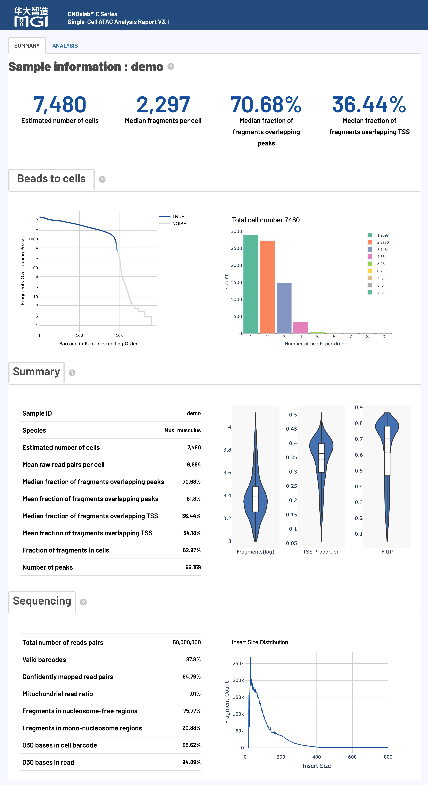
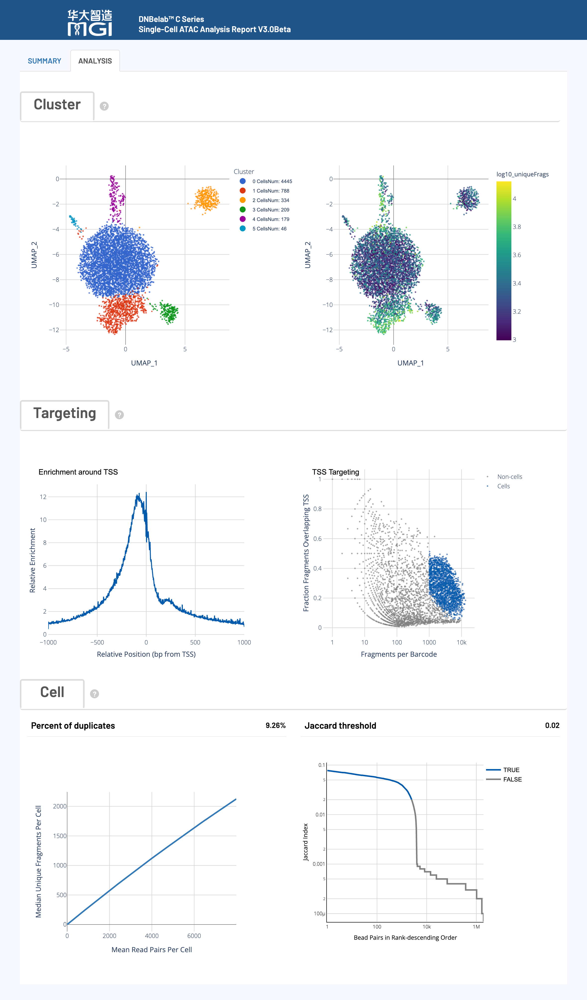

<div align="right" style="margin-bottom: 20px; max-width: 1200px; margin-left: auto; margin-right: auto;">

[首页](../../README.md)

</div>

<div align="center" style="padding: 40px 20px; background: linear-gradient(135deg, #f5f5f7 0%, #ffffff 100%); border-radius: 12px; margin-bottom: 30px; max-width: 1200px; margin-left: auto; margin-right: auto;">

<h1 style="font-size: 48px; font-weight: 600; color: #1d1d1f; margin: 0 0 16px 0; letter-spacing: -0.02em;"> scATAC 分析输出</h1>

<p style="font-size: 21px; color: #86868b; margin: 0; font-weight: 400;">单细胞 ATAC 测序分析输出文件完整指南</p>

<div style="margin-top: 24px;">

[ 目录结构](#输出目录结构) • [文件详情](#详细文件说明) • [数据矩阵](#峰矩阵文件) • [分析结果](#分析指标汇总) • [报告解读](#网页报告释义)

</div>

</div>

<div style="max-width: 1200px; margin: 0 auto;"><hr style="border: none; border-top: 1px solid #d2d2d7; margin: 24px 0;"></div>

<div style="background: #f5f5f7; border-radius: 12px; padding: 24px; margin: 24px auto; max-width: 1200px;">

## 概述 <a id="概述"></a>

<div align="center">

单细胞 ATAC 测序分析完成后，会在指定的输出目录中生成标准化的文件和子目录结构，专门用于染色质可及性分析和表观基因组学研究。

</div>

> **提示***: 所有输出文件均采用标准格式，兼容主流单细胞表观基因组分析工具（如Signac、ArchR等），遵循国际通用的数据格式规范。

</div>

<div style="max-width: 1200px; margin: 0 auto;"><hr style="border: none; border-top: 1px solid #d2d2d7; margin: 24px 0;"></div>

<div style="background: #f5f5f7; border-radius: 12px; padding: 24px; margin: 24px auto; max-width: 1200px;">

## 输出目录结构 <a id="输出目录结构"></a>

</div>

<div style="background: #ffffff; border-radius: 12px; padding: 20px; margin: 20px auto; max-width: 1200px; overflow-x: auto; border: 1px solid #e5e5e5; box-shadow: 0 1px 3px rgba(0,0,0,0.1);">

```
.
├── alignment.fragments.sorted.tagged.bam       # 质控后的比对结果（分析需添加need_bam参数）
├── alignment.fragments.sorted.tagged.bam.bai   # 比对结果索引文件
├── filter_peak_matrix/                         # 过滤后的峰矩阵MEX格式目录
│   ├── barcodes.tsv.gz                         # 过滤后的细胞条形码信息
│   ├── matrix.mtx.gz                           # 过滤后的稀疏矩阵格式的峰信号数据
│   └── peaks.bed.gz                            # 过滤后的峰位置信息
├── fragments.tsv.gz                            # 包含所有比对到基因组的片段信息
├── fragments.tsv.gz.tbi                        # 片段文件的索引，用于快速随机访问
├── filtered.fragments.tsv.gz                   # 质量控制后的ATAC片段文件，仅包含通过细胞过滤的片段信息
├── filtered.fragments.tsv.gz.tbi               # 细胞过滤的片段文件的Tabix索引，支持基因组区间的快速查询
├── metrics_summary.xls                         # 分析质量指标汇总表
├── raw_peak_matrix/                            # 原始峰矩阵MEX格式目录
│   ├── barcodes.tsv.gz                         # 原始细胞条形码信息
│   ├── matrix.mtx.gz                           # 原始稀疏矩阵格式的峰信号数据
│   └── peaks.bed.gz                            # 原始峰位置信息
├── singlecell.csv                              # 细胞信息汇总表
└── *_scATAC_report.html                        # HTML格式的分析报告
```

</div>

<div style="max-width: 1200px; margin: 0 auto;"><hr style="border: none; border-top: 1px solid #d2d2d7; margin: 24px 0;"></div>

<div style="background: #f5f5f7; border-radius: 12px; padding: 24px; margin: 24px auto; max-width: 1200px;">

## 文件详细说明 <a id="详细文件说明"></a>

</div>

<div style="background: #f5f5f7; border-radius: 12px; padding: 24px; margin: 24px auto; max-width: 1200px;">

### ATAC片段和峰文件 <a id="atac片段和峰文件"></a>

<div align="center">

**核心内容**: ATAC-seq 片段信息和峰识别结果，包含完整的染色质可及性数据和细胞条形码标记

</div>

</div>

<div style="background: #ffffff; border-radius: 12px; padding: 24px; margin: 20px auto; max-width: 1200px; border: 1px solid #e5e5e5; box-shadow: 0 1px 3px rgba(0,0,0,0.1);" markdown="1">

#### fragments.tsv.gz

`fragments.tsv.gz` 是一个包含 ATAC-seq 片段信息的压缩 TSV 文件，是进行下游分析的核心数据之一。

*   **用途**:
    *   **染色质可及性分析**: 精确定位每个开放染色质区域的基因组坐标。
    *   **数据可视化**: 可直接在 IGV、UCSC 等基因组浏览器中作为 BED 文件加载。
    *   **下游工具输入**: 兼容 ArchR、Signac 等主流单细胞分析工具。

*   **内容与格式**:
    *   文件为 **BED-like** 格式，每行代表一个唯一的 ATAC-seq 片段。
    *   文件具体包含的 **5列信息** 如下表所示：

        <table style="width:100%; border-collapse: collapse; margin: 15px 0;">
        <thead>
        <tr>
        <th width="20%" align="left"><strong>字段名</strong></th>
        <th width="80%" align="left"><strong>详细描述</strong></th>
        </tr>
        </thead>
        <tbody>
        <tr>
        <td align="left"><code>chrom</code></td>
        <td>参考基因组染色体名称，标识片段所在的染色体位置</td>
        </tr>
        <tr>
        <td align="left"><code>chromStart</code></td>
        <td>片段在染色体上的调整起始位置（0-based坐标系统），经过转座酶切割位点修正</td>
        </tr>
        <tr>
        <td align="left"><code>chromEnd</code></td>
        <td>片段在染色体上的调整结束位置（不包含该位置），经过转座酶切割位点修正</td>
        </tr>
        <tr>
        <td align="left"><code>barcode</code></td>
        <td>细胞ID标识符，对应BAM文件中的<code>CB</code>标签，用于将片段归属到特定细胞</td>
        </tr>
        <tr>
        <td align="left"><code>readSupport</code></td>
        <td>与该片段相关的总读段对数（包括唯一和重复读段）</td>
        </tr>
        </tbody>
        </table>

*   **坐标调整**:
    *   为精确定位转座酶切位点，片段区间经过调整：起始位置从最左端比对位置向前移动4bp，结束位置从最右端比对位置向后移动5bp。

</div>

<div style="background: #ffffff; border-radius: 12px; padding: 24px; margin: 20px auto; max-width: 1200px; border: 1px solid #e5e5e5; box-shadow: 0 1px 3px rgba(0,0,0,0.1);">

#### fragments.tsv.gz.tbi

`fragments.tsv.gz` 文件的 Tabix 索引。

*   **核心用途**:
    *   **快速数据访问**: 允许对大型 `fragments.tsv.gz` 文件进行快速的、基于基因组区间的查询，而无需读取整个文件。
    *   **工具性能优化**: 被 ArchR、Signac、IGV 等工具用于高效加载和处理特定区域的数据。
*   **格式**:
    *   由 `tabix` 工具生成的标准二进制索引文件。

</div>

<div style="background: #ffffff; border-radius: 12px; padding: 24px; margin: 20px auto; max-width: 1200px; border: 1px solid #e5e5e5; box-shadow: 0 1px 3px rgba(0,0,0,0.1);">

#### filtered.fragments.tsv.gz

这是经过细胞质量控制和过滤后的 ATAC-seq 片段文件，是 `fragments.tsv.gz` 的子集，仅包含高质量细胞的片段。

*   **核心用途**:
    *   **核心下游分析**: 这是进行细胞聚类、差异可及性分析等核心下游步骤的**推荐输入文件**。
    *   **信噪比提升**: 由于去除了低质量细胞和背景噪音，使用此文件可以提高分析结果的准确性和信噪比。
*   **内容与格式**:
    *   文件格式与 `fragments.tsv.gz` 完全相同（压缩的 BED-like TSV），包含相同的5列信息。
    *   仅包含通过细胞过滤算法（例如，基于TSS富集和峰区域覆盖的片段数）被识别为"真实细胞"的片段。

</div>

<div style="background: #ffffff; border-radius: 12px; padding: 24px; margin: 20px auto; max-width: 1200px; border: 1px solid #e5e5e5; box-shadow: 0 1px 3px rgba(0,0,0,0.1);">

#### filtered.fragments.tsv.gz.tbi

`filtered.fragments.tsv.gz` 文件的 Tabix 索引。

*   **核心用途**:
    *   **高效下游分析**: 确保在使用过滤后的片段文件时，下游工具（如 ArchR, Signac）能够快速、高效地访问特定基因组区域的数据。
*   **格式**:
    *   由 `tabix` 工具生成的标准二进制索引文件。

</div>

<div style="background: #ffffff; border-radius: 12px; padding: 24px; margin: 20px auto; max-width: 1200px; border: 1px solid #e5e5e5; box-shadow: 0 1px 3px rgba(0,0,0,0.1);">

#### alignment.fragments.sorted.tagged.bam

这是包含所有具有有效条形码（valid barcode）并且成功比对的片段的 ATAC-seq 比对结果文件。

*   **核心用途**:
    *   **深度分析与可视化**: 可用于 IGV 等基因组浏览器进行深度可视化，检查特定基因座的比对情况。
    *   **自定义分析**: 为需要直接操作比对级别数据的用户提供原始输入。

*   **内容与格式**:
    *   采用国际标准的 **BAM (Binary Alignment Map)** 格式。
    *   文件已按**基因组坐标排序**，并建立了索引（`.bai` 文件），便于快速随机访问。
    *   每个读段都通过 TAG 字段标记了细胞来源信息。

*   **关键TAG字段说明**:
    *   细胞和分子条形码信息存储在以下TAG字段中：

        <table style="width:100%; border-collapse: collapse; margin: 15px 0;">
        <thead>
        <tr>
        <th width="15%" align="left"><strong>标签</strong></th>
        <th width="15%" align="left"><strong>类型</strong></th>
        <th width="70%" align="left"><strong>描述</strong></th>
        </tr>
        </thead>
        <tbody>
        <tr>
        <td align="left"><code>CB</code></td>
        <td align="left">Z</td>
        <td>经过错误校正和细胞合并处理后的细胞条形码标识符</td>
        </tr>
        <tr>
        <td align="left"><code>CC</code></td>
        <td align="left">Z</td>
        <td>经过错误校正的细胞条形码序列</td>
        </tr>
        <tr>
        <td align="left"><code>CR</code></td>
        <td align="left">Z</td>
        <td>测序仪报告的细胞条形码序列</td>
        </tr>
        </tbody>
        </table>

</div>

<div style="background: #ffffff; border-radius: 12px; padding: 24px; margin: 20px auto; max-width: 1200px; border: 1px solid #e5e5e5; box-shadow: 0 1px 3px rgba(0,0,0,0.1);">

#### alignment.fragments.sorted.tagged.bam.bai

`alignment.fragments.sorted.tagged.bam` 文件的索引。

*   **核心用途**:
    *   **快速数据访问**: 允许 IGV、Samtools 等工具在无需完整加载BAM文件的情况下，快速跳转和读取任意基因组区域的比对数据。
    *   **性能保障**: 是所有对BAM文件进行随机访问操作的性能保障。
*   **格式**:
    *   由 `samtools index` 命令生成的标准 **BAI (BAM Index)** 格式。

</div>

<div style="background: #f5f5f7; border-radius: 12px; padding: 24px; margin: 24px auto; max-width: 1200px;">

### 峰矩阵文件 <a id="峰矩阵文件"></a>

<div align="center">

**核心内容**: 单细胞峰信号计数矩阵，分为原始数据和质控过滤后数据，采用标准稀疏矩阵格式

</div>

</div>

<div style="background: #ffffff; border-radius: 12px; padding: 24px; margin: 20px auto; max-width: 1200px; border: 1px solid #e5e5e5; box-shadow: 0 1px 3px rgba(0,0,0,0.1);">

#### 过滤后的峰矩阵 (`filter_peak_matrix/`)

包含经过高质量细胞过滤后的峰计数矩阵，是进行下游定量分析的核心数据。

*   **核心用途**:
    *   **下游定量分析**: 作为细胞聚类、差异可及性分析、轨迹推断等分析的**主要输入**。
    *   **高质量数据**: 只包含被鉴定为真实细胞的条形码，确保分析结果的准确性。

*   **内容与格式**:
    *   采用标准的 **Matrix Market Exchange (MEX)** 格式，由以下三个压缩文件组成：
        <table style="width:100%; border-collapse: collapse; margin: 15px 0;">
        <thead>
        <tr>
        <th width="25%" align="left"><strong>文件名</strong></th>
        <th width="75%" align="left"><strong>内容描述</strong></th>
        </tr>
        </thead>
        <tbody>
        <tr>
        <td align="left"><code>barcodes.tsv.gz</code></td>
        <td>细胞ID列表，标识通过质控筛选的高质量细胞。每行包含一个细胞ID信息，对应矩阵的列索引</td>
        </tr>
        <tr>
        <td align="left"><code>peaks.bed.gz</code></td>
        <td>峰区域位置信息文件，采用BED格式存储。包含染色体、起始位置和结束位置，对应矩阵的行索引</td>
        </tr>
        <tr>
        <td align="left"><code>matrix.mtx.gz</code></td>
        <td>峰区域计数矩阵，采用 Matrix Market 格式。包含矩阵维度信息和非零元素的行、列索引及数值</td>
        </tr>
        </tbody>
        </table>

*   **格式优势**:
    *   **空间高效**: 稀疏矩阵格式（`.mtx`）仅存储非零元素，极大节省了存储空间。
    *   **高度兼容**: MEX 格式是单细胞社区的标准（关于矩阵格式详见[Matrix Market 格式说明](#market-matrix-format-mtxgz)），兼容 Seurat, Signac, Scanpy 等几乎所有主流分析工具。

</div>

<div style="background: #ffffff; border-radius: 12px; padding: 24px; margin: 20px auto; max-width: 1200px; border: 1px solid #e5e5e5; box-shadow: 0 1px 3px rgba(0,0,0,0.1);">

#### 原始峰矩阵 (`raw_peak_matrix/`)

包含所有检测到的细胞条形码（未经过滤）的原始峰计数矩阵。

*   **核心用途**:
    *   **质量控制评估**: 可用于评估细胞过滤的效果，或根据自定义标准进行手动过滤。
    *   **数据完整性**: 保留了所有原始数据，可用于深度挖掘或在需要时重新分析。

*   **内容与格式**:
    *   采用标准的 **Matrix Market Exchange (MEX)** 格式，其文件组成与 `filter_peak_matrix/` 目录完全相同。
    *   包含所有被检测到的条形码，包括高质量细胞、低质量细胞和背景液滴。

</div>

<div style="background: #f5f5f7; border-radius: 12px; padding: 24px; margin: 24px auto; max-width: 1200px;">

### 分析指标汇总 <a id="分析指标汇总"></a>

<div align="center">

**核心内容**: 实验质量评估和统计指标汇总，提供完整的数据质量控制信息

</div>

</div>

<div style="background: #ffffff; border-radius: 12px; padding: 24px; margin: 20px auto; max-width: 1200px; border: 1px solid #e5e5e5; box-shadow: 0 1px 3px rgba(0,0,0,0.1);">

#### metrics_summary.xls

采用 Excel 格式的关键分析指标汇总表，提供了对实验整体质量的全面评估。

*   **核心用途**:
    *   **质量评估**: 快速评估测序数据质量、比对效率、细胞鉴定结果等核心指标。
    *   **结果概览**: 无需查看所有文件即可对分析结果有一个全面的了解。

*   **内容与格式**:
    *   包含三大类别的关键指标：
        <table style="width:100%; border-collapse: collapse; margin: 15px 0;">
        <thead>
        <tr>
        <th width="20%" align="left"><strong>指标类别</strong></th>
        <th width="80%" align="left"><strong>包含内容</strong></th>
        </tr>
        </thead>
        <tbody>
        <tr>
        <td align="left"><strong>基本统计</strong></td>
        <td>总读段对数、有效条形码比例、Q30碱基质量等基础测序指标</td>
        </tr>
        <tr>
        <td align="left"><strong>细胞识别</strong></td>
        <td>估计细胞数量、峰区域片段占比、TSS区域片段占比、峰检测数量、TSS富集等细胞调用结果</td>
        </tr>
        <tr>
        <td align="left"><strong>比对指标</strong></td>
        <td>基因组比对率、线粒体比例等比对统计</td>
        </tr>
        </tbody>
        </table>
    *   内置推荐的质量控制标准，方便用户判断：
        <details open>
        <summary><strong>推荐质量阈值：</strong></summary>
        <ul>
        <li><strong>有效条形码比例</strong>: >70%</li>
        <li><strong>Q30碱基质量</strong>: >75%（条形码和UMI区域）</li>
        <li><strong>基因组比对率</strong>: >50%</li>
        <li><strong>TSS富集分数（人/鼠）</strong>: >4</li>
        <li><strong>峰区域片段比例</strong>: >15%</li>
        <li><strong>TSS区域片段比例</strong>: >10%</li>
        <li><strong>重复序列百分比</strong>: >10%</li>
        </ul>
        </details>

</div>

<div style="background: #ffffff; border-radius: 12px; padding: 24px; margin: 20px auto; max-width: 1200px; border: 1px solid #e5e5e5; box-shadow: 0 1px 3px rgba(0,0,0,0.1);">

#### singlecell.csv

采用 CSV 格式的单细胞级别质量控制信息表，记录了每个细胞条形码的详细统计数据。

*   **核心用途**:
    *   **精细化质控**: 支持用户根据自定义标准进行更精细的细胞过滤和分析。
    *   **下游分析输入**: 可作为 Signac、Scanpy 等分析工具的细胞元数据(metadata)输入。

*   **内容与格式**:
    *   每一行代表一个细胞条形码。
    *   主要列包括：片段数量、峰数量、TSS/peak区域片段数以及是否被判定为高质量细胞、磁珠合并信息等。

</div>

<div style="background: #ffffff; border-radius: 12px; padding: 24px; margin: 20px auto; max-width: 1200px; border: 1px solid #e5e5e5; box-shadow: 0 1px 3px rgba(0,0,0,0.1);">

#### *_scATAC_report.html

采用 HTML 网页格式的交互式综合分析报告。

*   **核心用途**:
    *   **结果可视化**: 以交互式图表的形式，直观展示质控结果、细胞聚类、TSS富集等关键分析结果。
    *   **结果解读**: 提供各项指标的生物学意义和技术解释，帮助用户深度解读数据。
    *   **便捷分享**: 单个 HTML 文件，易于传阅和分享。

*   **内容与格式**:
    *   无需网络，可在任何现代浏览器中打开。
    *   报告的详细解读请参考本文档下方的 [网页报告释义](#网页报告释义) 部分。
    *   包含的关键内容模块如下：
        <table style="width:100%; border-collapse: collapse; margin: 15px 0;">
        <thead>
        <tr>
        <th width="25%" align="left"><strong>报告特点</strong></th>
        <th width="75%" align="left"><strong>内容描述</strong></th>
        </tr>
        </thead>
        <tbody>
        <tr>
        <td align="left"><strong>交互式图表</strong></td>
        <td>质控指标、细胞聚类、峰分析等可交互可视化图表</td>
        </tr>
        <tr>
        <td align="left"><strong>统计汇总</strong></td>
        <td>关键性能指标的数值汇总和趋势分析</td>
        </tr>
        <tr>
        <td align="left"><strong>详细解读</strong></td>
        <td>各项指标的生物学意义和技术解释</td>
        </tr>
        </tbody>
        </table>

</div>

<div style="max-width: 1200px; margin: 0 auto;"><hr style="border: none; border-top: 1px solid #d2d2d7; margin: 24px 0;"></div>

<div style="background: #f5f5f7; border-radius: 12px; padding: 24px; margin: 24px auto; max-width: 1200px;">

## 文件格式说明 <a id="文件格式说明"></a>

<div align="center">

**技术规范**: 输出文件采用的标准格式详细说明

</div>

</div>

<div style="background: #ffffff; border-radius: 12px; padding: 24px; margin: 20px auto; max-width: 1200px; border: 1px solid #e5e5e5; box-shadow: 0 1px 3px rgba(0,0,0,0.1);">

#### Matrix Market 格式 (`.mtx.gz`) <a id="market-matrix-format-mtxgz"></a>

Market Exchange Format (MEX) 是单细胞分析中用于存储稀疏计数矩阵的标准格式，具有空间高效和高度兼容的优点。

*   **核心优势**:
    *   **空间高效**: 稀疏矩阵仅存储非零元素，对于通常超过95%为零值的单细胞数据，可极大节省存储空间。
    *   **高度兼容**: 作为国际标准格式，可被 Seurat, Scanpy, Signac 等几乎所有主流分析工具直接读取。

*   **文件组成**:
    *   一个完整的MEX格式数据由以下 **三个文件** 构成：
        <table style="width:100%; border-collapse: collapse; margin: 15px 0;">
        <thead>
        <tr>
        <th width="25%" align="left"><strong>文件名</strong></th>
        <th width="75%" align="left"><strong>描述</strong></th>
        </tr>
        </thead>
        <tbody>
        <tr>
        <td align="left"><code>matrix.mtx.gz</code></td>
        <td>压缩的稀疏矩阵文件。文件头包含矩阵维度，后续每行记录一个非零元素的位置（行/列索引）和数值。</td>
        </tr>
        <tr>
        <td align="left"><code>barcodes.tsv.gz</code></td>
        <td>压缩的细胞条形码文件。每行是一个细胞ID，行号对应矩阵的<strong>列</strong>。</td>
        </tr>
        <tr>
        <td align="left"><code>peaks.bed.gz</code></td>
        <td>压缩的特征（峰）文件。每行是一个峰的BED格式坐标，行号对应矩阵的<strong>行</strong>。</td>
        </tr>
        </tbody>
        </table>

</div>

<div style="max-width: 1200px; margin: 0 auto;"><hr style="border: none; border-top: 1px solid #d2d2d7; margin: 24px 0;"></div>

<div style="background: #f5f5f7; border-radius: 12px; padding: 24px; margin: 24px auto; max-width: 1200px;">

## 网页报告释义 <a id="网页报告释义"></a>

<div align="center">

**概述**: HTML 网页报告提供了单细胞 ATAC 测序分析结果的全面可视化展示和详细解读，包含关键性能指标的评估，帮助用户快速了解实验质量和分析结果

</div>

</div>

<div style="background: #ffffff; border-radius: 12px; padding: 24px; margin: 20px auto; max-width: 1200px; border: 1px solid #e5e5e5; box-shadow: 0 1px 3px rgba(0,0,0,0.1);">

HTML 网页报告是单细胞 ATAC 测序分析的综合展示平台，整合了从数据质量控制到下游表观基因组学分析的完整结果。该报告采用交互式可视化设计，帮助用户快速评估实验质量、理解分析结果并指导后续研究方向。

> **使用建议***: 建议按照报告展示顺序依次查看各项指标。

> **注意**: 以下标准仅供参考，实际质量评估应考虑组织类型、细胞状态和实验目标等多种因素。不同样本间存在显著差异，建议结合具体实验背景进行判断。

</div>

<div style="background: #ffffff; border-radius: 12px; padding: 24px; margin: 20px auto; max-width: 1200px; border: 1px solid #e5e5e5; box-shadow: 0 1px 3px rgba(0,0,0,0.1);">

### 报告主要内容与结构

<div align="center">

</div>

</div>

<div style="background: #f5f5f7; border-radius: 12px; padding: 24px; margin: 24px auto; max-width: 1200px;">

### 核心分析指标详解

</div>

<div style="background: #ffffff; border-radius: 12px; padding: 24px; margin: 20px auto; max-width: 1200px; border: 1px solid #e5e5e5; box-shadow: 0 1px 3px rgba(0,0,0,0.1);">

#### 细胞指标 (Cell Metrics) <a id="细胞指标"></a>

<div align="center">

**核心功能**: 细胞识别、质量评估和染色质可及性统计，提供实验整体效果的关键指标

</div>

**质量控制标准：**
> **注意**: 以下标准仅供参考，实际质量评估应考虑组织类型、细胞状态和实验目标等多种因素。不同样本间存在显著差异，建议结合具体实验背景进行判断。

<table style="width:100%; border-collapse: collapse; margin: 15px 0;">
<thead>
<tr>
<th width="25%" align="left"><strong>指标名称</strong></th>
<th width="30%" align="left"><strong>推荐值</strong></th>
<th width="30%" align="left"><strong>可接受</strong></th>
<th width="15%" align="left"><strong>需优化</strong></th>
</tr>
</thead>
<tbody>
<tr>
<td align="left"><strong>Median fragments per cell</strong></td>
<td align="left">≥ 10,000</td>
<td align="left">2,000–10,000</td>
<td align="left">< 2,000</td>
</tr>
<tr>
<td align="left"><strong>Median fraction of fragments overlapping peaks</strong></td>
<td align="left">≥ 30%</td>
<td align="left">15–30%</td>
<td align="left">< 15%</td>
</tr>
<tr>
<td align="left"><strong>Median fraction of fragments overlapping TSS</strong></td>
<td align="left">≥ 20%</td>
<td align="left">10–20%</td>
<td align="left">< 10%</td>
</tr>
<tr>
<td align="left"><strong>Fraction fragments in cells</strong></td>
<td align="left">≥ 50%</td>
<td align="left">20–50%</td>
<td align="left">< 20%</td>
</tr>

</tbody>
</table>

**详细指标解释：**

<table style="width:100%; border-collapse: collapse; margin: 15px 0;">
<thead>
<tr>
<th width="30%" align="left"><strong>指标名称</strong></th>
<th width="70%" align="left"><strong>详细解释与技术要求</strong></th>
</tr>
</thead>
<tbody>
<tr>
<td align="left">
<strong>Estimated number of cells</strong><br>
<em>估计细胞数量</em>
</td>
<td>
<ul>
<li><strong>定义</strong>: 从测序数据中鉴定出的有效细胞（区别于背景噪音或空液滴）的总数。</li>
<li><strong>计算过程</strong>: 合并同液滴的细胞条形码后，通过峰区域片段数量、TSS比例等参数进行过滤。</li>
<li><strong>质量判读</strong>: 
<ul><li><strong>异常原因</strong>: 细胞计数不准、细胞裂解、样本或文库质量差、测序深度低。</li></ul>
</li>
</ul>
</td>
</tr>
<tr>
<td align="left">
<strong>Species</strong><br>
<em>物种信息</em>
</td>
<td>
<ul>
<li><strong>定义</strong>: 分析所采用的物种或参考基因组版本。</li>
<li><strong>说明</strong>: 该信息来源于建库时提供的参考基因组，用于确保比对和注释的准确性。</li>
</ul>
</td>
</tr>
<tr>
<td align="left">
<strong>Median fragments per cell</strong><br>
<em>每细胞中位片段数</em>
</td>
<td>
<ul>
<li><strong>定义</strong>: 单个细胞内所包含的有效ATAC-seq片段数量的中位数。</li>
<li><strong>生物学意义</strong>: 此指标直接反映了单个细胞核内染色质开放区域的捕获效率和测序深度。数值越高，表明单细胞数据质量越好。</li>
<li><strong>质量判读</strong>:
<ul>
<li><strong>高质量标准</strong>: ≥ 10,000</li>
<li><strong>推荐最低值</strong>: ≥ 2,000</li>
<li><strong>注意</strong>: 该数值受细胞类型和测序深度影响较大。</li>
</ul>
</li>
</ul>
</td>
</tr>
<tr>
<td align="left">
<strong>Mean raw read pairs per cell</strong><br>
<em>每细胞平均原始读段对数</em>
</td>
<td>
<ul>
<li><strong>定义</strong>: 平均分配到每个细胞上的原始测序读段对（Read Pairs）数量。</li>
<li><strong>计算</strong>: `原始测序读段对总数 / 估计细胞数量`</li>
<li><strong>质量判读</strong>: 建议此值 ≥ 25,000 以确保充分的染色质覆盖。</li>
</ul>
</td>
</tr>
<tr>
<td align="left">
<strong>Fraction overlapping peaks</strong><br>
<em>片段重叠峰区域比例</em>
</td>
<td>
<ul>
<li><strong>定义</strong>: 单个细胞内，其片段（fragments）落入开放染色质区域（Peaks）的比例。</li>
<li><strong>生物学意义</strong>: 这是一个关键的信噪比指标。高比例意味着转座酶切割更集中于开放染色质，数据信噪比高。</li>
<li><strong>质量判读</strong>:
<ul><li><strong>质量警告</strong>: < 15% 可能提示样本质量问题。</li></ul>
</li>
</ul>
</td>
</tr>
<tr>
<td align="left">
<strong>Fraction overlapping TSS</strong><br>
<em>TSS区域片段重叠比例</em>
</td>
<td>
<ul>
<li><strong>定义</strong>: 单个细胞内，其片段落在转录起始位点（TSS）±2kb 区域内的比例。</li>
<li><strong>生物学意义</strong>: 评估染色质在启动子区域的活跃性与测序特异性的关键指标。</li>
<li><strong>质量判读</strong>:
<ul><li><strong>质量警告</strong>: < 10% 可能提示样本质量问题。</li></ul>
</li>
</ul>
</td>
</tr>
<tr>
<td align="left">
<strong>Fraction of fragments in cells</strong><br>
<em>细胞内片段比例</em>
</td>
<td>
<ul>
<li><strong>定义</strong>: 在所有有效片段中，成功归属于高质量细胞ID的片段所占的比例。</li>
<li><strong>生物学意义</strong>: 反映细胞捕获的效率和信噪比。</li>
<li><strong>质量判读</strong>:
<ul><li><strong>质量问题</strong>: 比例偏低可能指示样本质量差或文库构建异常。</li></ul>
</li>
</ul>
</td>
</tr>
<tr>
<td align="left">
<strong>Number of peaks</strong><br>
<em>识别峰数量</em>
</td>
<td>
<ul>
<li><strong>定义</strong>: 通过聚合所有细胞的信号后，在全基因组范围内识别出的开放染色质区域（峰）的总数量。</li>
<li><strong>生物学意义</strong>: 反映了样本的整体复杂度和可检测到的调控元件数量。</li>
<li><strong>影响因素</strong>: 受细胞数量、细胞类型异质性及测序深度影响。</li>
<li><strong>典型范围</strong>: 50,000 – 150,000 个。</li>
</ul>
</td>
</tr>
</tbody>
</table>

</div>

<div style="background: #ffffff; border-radius: 12px; padding: 24px; margin: 20px auto; max-width: 1200px; border: 1px solid #e5e5e5; box-shadow: 0 1px 3px rgba(0,0,0,0.1);">

#### 测序指标 (Sequencing Metrics) <a id="测序指标"></a>

<div align="center">

**核心功能**: 测序数据的基础质量评估，包括条形码识别率、比对质量和测序准确性

</div>

**质量控制标准：**
> **注意**: 以下标准仅供参考，实际质量评估应考虑组织类型、细胞状态和实验目标等多种因素。不同样本间存在显著差异，建议结合具体实验背景进行判断。

<table style="width:100%; border-collapse: collapse; margin: 15px 0;">
<thead>
<tr>
<th width="25%" align="left"><strong>指标类别</strong></th>
<th width="25%" align="left"><strong>推荐值</strong></th>
<th width="25%" align="left"><strong>可接受</strong></th>
<th width="25%" align="left"><strong>需优化</strong></th>
</tr>
</thead>
<tbody>
<tr>
<td align="left"><strong>Valid barcodes</strong></td>
<td align="left">≥ 80%</td>
<td align="left">70–80%</td>
<td align="left">< 70%</td>
</tr>
<tr>
<td align="left"><strong>Q30 bases in barcode</strong></td>
<td align="left">> 85%</td>
<td align="left">75–85%</td>
<td align="left">< 75%</td>
</tr>
<tr>
<td align="left"><strong>Q30 bases in read</strong></td>
<td align="left">> 85%</td>
<td align="left">75–85%</td>
<td align="left">< 75%</td>
</tr>
<tr>
<td align="left"><strong>Confidently mapped read pairs</strong></td>
<td align="left">> 80%</td>
<td align="left">50–80%</td>
<td align="left">< 50%</td>
</tr>
</tbody>
</table>

**详细指标解释：**

<table style="width:100%; border-collapse: collapse; margin: 15px 0;">
<thead>
<tr>
<th width="30%" align="left"><strong>指标名称</strong></th>
<th width="70%" align="left"><strong>详细解释与技术要求</strong></th>
</tr>
</thead>
<tbody>
<tr>
<td align="left">
<strong>Total number of reads pairs</strong><br>
<em>测序读段对总数</em>
</td>
<td>
<ul>
<li><strong>定义</strong>: 分配给该样本的原始测序读段对（Read Pairs）总数。</li>
<li><strong>意义</strong>: 代表本次测序的总体数据量。</li>
</ul>
</td>
</tr>
<tr>
<td align="left">
<strong>Valid barcodes</strong><br>
<em>有效条形码比例</em>
</td>
<td>
<ul>
<li><strong>定义</strong>: 在所有读段中，其细胞条形码（Cell Barcode）能够匹配到预设白名单（经过容错校正）的读段所占的比例。</li>
<li><strong>生物学意义</strong>: 反映了细胞标记的有效性。</li>
<li><strong>质量判读</strong>: 比例过低通常提示文库构建问题（如条形码降解、污染）或测序错误率高。</li>
</ul>
</td>
</tr>
<tr>
<td align="left">
<strong>Confidently mapped read pairs</strong><br>
<em>基因组比对率</em>
</td>
<td>
<ul>
<li><strong>定义</strong>: 在所有读段中，成功比对到参考基因组上任意位置的读段所占的比例。</li>
<li><strong>质量判读</strong>:
<ul><li><strong>需要关注</strong>: < 50% 可能提示样本污染或物种不匹配。</li></ul>
</li>
</ul>
</td>
</tr>
<tr>
<td align="left">
<strong>Mitochondria reads ratio</strong><br>
<em>线粒体 reads 比例</em>
</td>
<td>
<ul>
<li><strong>定义</strong>: 所有比对上的读段中，比对到线粒体基因组上的读段所占的比例。</li>
<li><strong>生物学意义</strong>: 这是细胞健康状况的一个重要指标。</li>
<li><strong>质量判读</strong>: 比例过高（如 > 10%）通常提示细胞死亡或裂解过度，导致胞质中的线粒体DNA被大量捕获。</li>
</ul>
</td>
</tr>
<tr>
<td align="left">
<strong>Nucleosome-free regions</strong><br>
<em>无核小体区域比例</em>
</td>
<td>
<ul>
<li><strong>定义</strong>: 来自开放染色质区域（即无核小体区域）的片段比例。</li>
<li><strong>生物学意义</strong>: 反映了有效的ATAC-seq信号强度。</li>
<li><strong>质量判读</strong>: 高比例（如 > 40%）表示良好的染色质可及性信号和高效的转座酶效率。</li>
</ul>
</td>
</tr>
<tr>
<td align="left">
<strong>Mono-nucleosome regions</strong><br>
<em>单核小体区域比例</em>
</td>
<td>
<ul>
<li><strong>定义</strong>: 包含单个核小体的片段区域所占的比例。</li>
<li><strong>生物学意义</strong>: 反映了染色质结构的完整性。该指标与"无核小体区域比例"共同评估染色质状态。</li>
</ul>
</td>
</tr>
<tr>
<td align="left">
<strong>Q30 bases in barcode</strong><br>
<em>条形码Q30碱基比例</em>
</td>
<td>
<ul>
<li><strong>定义</strong>: 在细胞条形码（Cell Barcode）序列中，测序质量值 Q30 及以上的碱基所占比例。</li>
<li><strong>意义</strong>: Q30 代表碱基测序错误率低于 0.1%，该指标直接影响细胞身份识别的准确性。</li>
</ul>
</td>
</tr>
<tr>
<td align="left">
<strong>Q30 bases in read</strong><br>
<em>读段Q30碱基比例</em>
</td>
<td>
<ul>
<li><strong>定义</strong>: 在测序读段（Read）序列中，测序质量值 Q30 及以上的碱基所占比例。</li>
<li><strong>意义</strong>: 反映了整体测序数据的质量水平，是后续比对和片段识别准确性的基础。</li>
</ul>
</td>
</tr>
</tbody>
</table>

</div>

<div style="background: #f5f5f7; border-radius: 12px; padding: 24px; margin: 24px auto; max-width: 1200px;">

#### 可视化图表1 <a id="可视化图表1"></a>

<div align="center">

**核心功能**: 细胞质量控制、片段分析和染色质可及性评估的多维度可视化展示

</div>

</div>

<div style="background: #ffffff; border-radius: 12px; padding: 24px; margin: 20px auto; max-width: 1200px; border: 1px solid #e5e5e5; box-shadow: 0 1px 3px rgba(0,0,0,0.1);">

#### 细胞排序图 (Barcode Rank Plot)

**图表功能**:
该图通过将所有细胞条形码按其包含的片段数进行排序，来区分高质量的真实细胞与背景噪音。

**如何解读**:

*   **坐标轴**:
    *   **X轴 (Barcode Rank)**: 所有细胞条形码按片段数降序排列。左侧为高片段数细胞，右侧为低片段数细胞。
    *   **Y轴 (Fragment Counts)**: 每个细胞对应的峰区域片段总数（对数刻度）。
*   **关键特征 (Knee Point)**:
    *   图中曲线通常会有一个明显的"拐点"（Knee Point）。
    *   拐点左侧的 **蓝色区域** 代表被算法识别为高质量的真实细胞。
    *   拐点右侧的 **灰色区域** 则代表背景噪音。
*   **交互功能**:
    *   鼠标悬停可查看细胞的详细排序和片段数。
    *   蓝色区域的颜色深浅代表该区域内真实细胞的密度。

</div>

<div style="background: #ffffff; border-radius: 12px; padding: 24px; margin: 20px auto; max-width: 1200px; border: 1px solid #e5e5e5; box-shadow: 0 1px 3px rgba(0,0,0,0.1);">

#### 液滴磁珠分布图 (Droplet Beads Distribution)

**图表功能**:
展示在真实细胞液滴中，捕获到的细胞条形码（Beads）的数量分布情况。

**如何解读**:

*   **理论分布**: 液滴中磁珠的数量分布理论上符合**泊松分布**，这反映了微反应体系中随机捕获过程的统计特性。
*   **实际影响**: 最终的分布会受到测序饱和度、液滴大小均一性、细胞浓度等实验因素的影响。

</div>

<div style="background: #ffffff; border-radius: 12px; padding: 24px; margin: 20px auto; max-width: 1200px; border: 1px solid #e5e5e5; box-shadow: 0 1px 3px rgba(0,0,0,0.1);">

#### 细胞数据分布图 (Cell Data Distribution)

**图表功能**:
通过三个独立的小提琴图（Violin Plots），分别展示高质量细胞在 **片段数 (Fragments)**、**TSS富集比例 (TSS Proportion)** 和 **Peak区域片段比例 (Peak Proportion)** 这三个关键质量指标上的分布情况。

**如何解读**:

*   **小提琴图简介**:
    *   图的**宽度**表示在该数值位置的细胞密度。越宽的地方，代表有越多的细胞聚集在该数值附近。
    *   内部的箱线图（Box Plot）展示了中位数、四分位数等统计信息。
*   **各图解读**:
    *   **片段数 (Fragments)**: 展示了细胞包含的片段总数的分布。一个好的文库，其分布的中心（最宽处）应该在一个较高的数值。
    *   **TSS富集比例 (TSS Proportion)**: 展示了TSS区域片段占比的分布。分布的中心越高，说明细胞整体的转录活性信号越好。
    *   **Peak区域片段比例 (Peak Proportion)**: 展示了峰区域片段占比的分布。分布的中心越高，说明信噪比越高。

</div>

<div style="background: #ffffff; border-radius: 12px; padding: 24px; margin: 20px auto; max-width: 1200px; border: 1px solid #e5e5e5; box-shadow: 0 1px 3px rgba(0,0,0,0.1);">

#### 片段长度分布图 (Fragment Length Distribution)

**图表功能**:
展示去重后ATAC-seq片段的插入长度分布，是评估样本质量和染色质结构完整性的关键图表。

**如何解读**:

*   **周期性峰 (Periodic Peaks)**:
    *   **~100bp 以下**: 第一个高峰，代表**无核小体区域 (Nucleosome-free regions, NFR)** 的片段，即开放的染色质。
    *   **~200bp 左右**: 第二个高峰，代表包含**单核小体**的片段。
    *   **~400bp, ~600bp**: 后续的山峰，代表包含**双核小体**、**三核小体**的片段。
*   **质量评估**:
    *   **优质样本**: 具有清晰的、以约200bp为周期的阶梯状山峰，且第一个峰（NFR）显著。这表明细胞核完整性好，染色质结构清晰。
    *   **质量不佳**: 曲线平坦，没有明显的周期性峰，通常意味着样本过度裂解，染色质结构被破坏。

</div>

<div style="background: #ffffff; border-radius: 12px; padding: 24px; margin: 20px auto; max-width: 1200px; border: 1px solid #e5e5e5; box-shadow: 0 1px 3px rgba(0,0,0,0.1);">

#### 其他核心指标 (Additional Key Metrics) <a id="其他核心指标"></a>

<div align="center">

</div>

##### Percent duplicates（重复序列百分比）

- **定义**: 被认定为 PCR 重复的片段所占比例。  
- **生物学意义**: 衡量文库复杂度和测序饱和度的关键指标。  
- **质量判读**:
  - **高重复率**（如 >20-30%）通常表示测序深度已接近饱和。
  - **极低重复率**（如 <10%）可能表示测序深度不足，建议增加测序以发现更多独特片段。

##### Jaccard threshold（Jaccard 相似度阈值）

- **定义**: 用于判断任意两个磁珠（Beads）是否来自同一个细胞液滴的相似度阈值。  
- **技术背景**: 在 C4 ATAC 技术中，一个液滴可能包含多个磁珠，需要通过它们捕获片段的 Jaccard Index 进行合并判断。  
- **算法说明**: 该阈值由 Otsu 算法自动确定，以获得较优区分效果。为保证分析质量，当计算值低于 `0.02` 时，系统会自动设为 `0.02`。

</div>

<div style="background: #f5f5f7; border-radius: 12px; padding: 24px; margin: 24px auto; max-width: 1200px;">

#### 可视化图表2 <a id="可视化图表2"></a>

<div align="center">

**核心功能**: 细胞聚类分析、TSS富集模式、饱和度评估和磁珠相似性的高级可视化展示

</div>

</div>

<div style="background: #ffffff; border-radius: 12px; padding: 24px; margin: 20px auto; max-width: 1200px; border: 1px solid #e5e5e5; box-shadow: 0 1px 3px rgba(0,0,0,0.1);">

#### 细胞聚类分析图 (Cluster Analysis)

**图表功能**:  
通过 UMAP 降维和 Louvain 聚类算法，将具有相似染色质可及性模式的细胞投影到二维空间，以识别潜在细胞亚群。

**如何解读**:

1. **左图（细胞类型聚类）**
    - 每个点代表一个细胞。
    - 不同颜色代表不同细胞聚类（Cluster），可能对应不同细胞类型或状态。
    - 空间位置越接近，细胞染色质开放模式通常越相似。
2. **右图（片段数分布）**
    - 在相同 UMAP 空间上，用颜色梯度展示每个细胞总片段数。
    - 颜色越深，片段数越多，通常表示该细胞数据质量更高，可辅助判断聚类可靠性。

</div>

<div style="background: #ffffff; border-radius: 12px; padding: 24px; margin: 20px auto; max-width: 1200px; border: 1px solid #e5e5e5; box-shadow: 0 1px 3px rgba(0,0,0,0.1);">

#### 转录起始位点（TSS）富集图 (TSS Enrichment Profile)

**图表功能**:  
展示所有基因转录起始位点（TSS）附近的 ATAC-seq 片段切割位点富集情况，是衡量 ATAC-seq 信噪比和数据质量的核心指标之一。

**如何解读**:

1. **坐标轴**
    - **X 轴**: 相对 TSS 的位置（0 点为 TSS）。
    - **Y 轴**: 归一化后的信号强度（切割频率）。
2. **关键特征**
    - 高质量 ATAC-seq 数据通常在 TSS 中心（0 点）出现明显富集尖峰。
    - TSS 两侧信号会快速下降。
3. **质量评估**
    - **TSS Enrichment Score** 为该图的量化指标，分数越高（如 >4-6）通常表示信噪比越好、数据质量越高。
    - 若曲线较平坦、无明显尖峰，通常提示样本质量较差或实验流程存在问题。

</div>

<div style="background: #ffffff; border-radius: 12px; padding: 24px; margin: 20px auto; max-width: 1200px; border: 1px solid #e5e5e5; box-shadow: 0 1px 3px rgba(0,0,0,0.1);">

#### 单细胞靶向图 (Single Cell Targeting Plot)

**图表功能**:  
通过散点图展示每个细胞的两个关键质量指标，用于评估细胞识别（Cell Calling）算法效果。

**如何解读**:

1. **坐标轴**
    - **X 轴（Fragment Counts）**: 每个细胞总片段数（对数刻度）。
    - **Y 轴（TSS Enrichment）**: 每个细胞的 TSS 富集分数。
2. **质量评估**
    - **右上角**: 高片段数 + 高 TSS 富集分数，通常为高质量真实细胞。
    - **左下角**: 低片段数 + 低 TSS 富集分数，通常为背景噪音或空液滴，分析中会被过滤。
    - 理想情况下，真实细胞与背景噪音之间应存在清晰分界。

</div>

<div style="background: #ffffff; border-radius: 12px; padding: 24px; margin: 20px auto; max-width: 1200px; border: 1px solid #e5e5e5; box-shadow: 0 1px 3px rgba(0,0,0,0.1);">

#### 饱和度曲线图 (Saturation Curve)

**图表功能**:  
评估测序深度是否充分及文库复杂度，即继续增加测序量是否还能发现更多新的（Unique）片段。

**如何解读**:

1. **坐标轴**
    - **X 轴**: 平均每个细胞测序读段对数（测序深度）。
    - **Y 轴**: 平均每个细胞中位唯一片段数。
2. **曲线趋势**
    - **线性上升阶段**: 曲线较陡，增加测序深度可有效发现更多新片段，投入产出比较高。
    - **平台期/饱和阶段**: 曲线逐渐平缓，表示文库复杂度基本被充分测序，继续加深测序的新增收益递减。
3. **质量评估**
    - 饱和度（重复率）是该图的量化指标。实践中可将 20%-50% 作为成本与数据完整性之间的常用平衡区间。

</div>

<div style="background: #ffffff; border-radius: 12px; padding: 24px; margin: 20px auto; max-width: 1200px; border: 1px solid #e5e5e5; box-shadow: 0 1px 3px rgba(0,0,0,0.1);">

#### 磁珠相似性排序图 (Bead Similarity Ranking)

**图表功能**:  
用于 C4 ATAC 技术场景下，通过 Jaccard 相似度合并来自同一细胞液滴的多个磁珠（Beads）。

**如何解读**:

1. **坐标轴**
    - **X 轴**: 所有磁珠对按 Jaccard 相似度降序排列。
    - **Y 轴**: Jaccard 相似度指数（对数刻度）。
2. **关键区域**
    - **蓝色区域**: Jaccard 相似度高于 Otsu 算法自动计算阈值，通常判定为同一细胞来源，片段会在分析中合并。
    - **灰色区域**: Jaccard 相似度低于阈值，通常判定为不同细胞来源，不进行合并。

</div>

<div style="max-width: 1200px; margin: 0 auto;"><hr style="border: none; border-top: 1px solid #d2d2d7; margin: 24px 0;"></div>

<div style="background: #f5f5f7; border-radius: 12px; padding: 24px; margin: 24px auto; max-width: 1200px;">

## 相关文档

</div>

<div style="background: #ffffff; border-radius: 12px; padding: 24px; margin: 20px auto; max-width: 1200px; border: 1px solid #e5e5e5; box-shadow: 0 1px 3px rgba(0,0,0,0.1);" markdown="1">

| 文档 | 说明 |
| :--- | :--- |
| [scATAC 流程](../pipeline/scATAC.md) | scATAC 分析流程详细说明 |
| [scATAC 参数](../parameter/scATAC.md) | 命令参数参考文档 |
| [输出文件](./outs.md) | 返回总输出文档索引 |

</div>

<div align="center" style="background: #f5f5f7; border-radius: 12px; padding: 30px; margin: 40px auto; max-width: 1200px;">

> <strong>反馈与支持</strong>
> 
> 本文档持续更新中，如发现内容错误或需要补充的信息，欢迎反馈。
> 
<strong>文档版本：</strong> 3.1 | <strong>最后更新：</strong> 2026年4月

</div>
