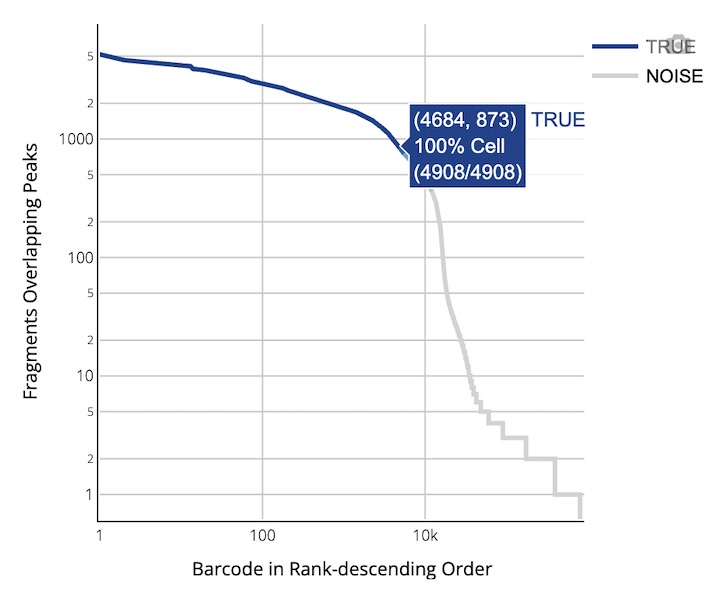

# DNBelab C Series HT scATAC Analysis Output Directory Description

After single-cell ATAC analysis is completed, the following files and subdirectories will be generated in the specified output directory. This document provides detailed descriptions of the content, format, and purpose of each output file to help users understand and utilize the analysis results.

---

## 📁 Output Directory Structure

```
.
├── alignment.fragments.sorted.tagged.bam       # Quality-controlled alignment results (requires need_bam parameter)
├── alignment.fragments.sorted.tagged.bam.bai   # Alignment result index file
├── filter_peak_matrix/                         # Filtered peak matrix MEX format directory
│   ├── barcodes.tsv.gz                         # Filtered cell barcode information
│   ├── matrix.mtx.gz                           # Filtered sparse matrix format peak signal data
│   └── peaks.bed.gz                            # Filtered peak position information
├── fragments.tsv.gz                            # Contains all fragment information aligned to genome
├── fragments.tsv.gz.tbi                        # Fragment file index for fast random access
├── filtered.fragments.tsv.gz                   # Quality-controlled ATAC fragment file containing only high-quality fragments passing cell filtering
├── filtered.fragments.tsv.gz.tbi               # Tabix index for filtered fragment file, supporting fast genomic interval queries
├── metrics_summary.xls                         # Analysis quality metrics summary table
├── raw_peak_matrix/                            # Raw peak matrix MEX format directory
│   ├── barcodes.tsv.gz                         # Raw cell barcode information
│   ├── matrix.mtx.gz                           # Raw sparse matrix format peak signal data
│   └── peaks.bed.gz                            # Raw peak position information
├── singlecell.csv                              # Cell information summary table
└── *_scATAC_report.html                        # HTML format analysis report
```

---

## 📑 Table of Contents

- [📁 Output Directory Structure](#-output-directory-structure)
- [📋 Detailed File Description](#-detailed-file-description)
  - [🧬 ATAC Fragment and Peak Files](#-atac-fragment-and-peak-files)
  - [📈 Peak Matrix Files](#-peak-matrix-files)
  - [📝 Analysis Metrics Summary](#-analysis-metrics-summary)
- [📄 File Format Description](#-file-format-description)
- [📊 Web Report Interpretation](#-web-report-interpretation)

---

## 📋 Detailed File Description

### 🧬 ATAC Fragment and Peak Files

#### `fragments.tsv.gz`

This is a compressed TSV format file (BED-like format) containing ATAC-seq fragment information, with each line representing a unique ATAC-seq fragment. Fragment intervals are obtained by adjusting alignment intervals: the start position is moved 4bp forward from the leftmost alignment position, and the end position is moved 5bp backward from the rightmost alignment position, representing the center point of transposase cleavage sites.

The file contains 5 columns of information:
- **`chrom`**: Reference genome chromosome
- **`chromStart`**: Adjusted start position of fragment on chromosome (0-based)
- **`chromEnd`**: Adjusted end position of fragment on chromosome (exclusive)
- **`barcode`**: Cell barcode, corresponding to the `CB` tag in BAM file
- **`readSupport`**: Total number of read pairs associated with this fragment (including unique and duplicate reads)

This file is used for visualizing and analyzing chromatin accessible regions and can be processed as a BED file. Compatible with ArchR, Signac and other tools.

#### `fragments.tsv.gz.tbi`

Tabix index file for the `fragments.tsv.gz` file, enabling fast random access to records in any genomic interval and improving data query efficiency.

#### `filtered.fragments.tsv.gz`

This is a quality-controlled and cell-filtered ATAC-seq fragment file stored in compressed TSV format (BED-like format).

#### `filtered.fragments.tsv.gz.tbi`

Tabix index file for the `filtered.fragments.tsv.gz` file, used for fast random access to quality-controlled fragment files. This index file supports genomic interval queries and improves retrieval efficiency for filtered data.

#### `alignment.fragments.sorted.tagged.bam`

This is a quality-controlled alignment result file stored in standard BAM format. The file contains ATAC-seq alignment information that has undergone quality control and filtering, with each read tagged with cell barcodes (`CB` tag) and molecular identifiers. The file is sorted by genomic coordinates for fast retrieval and analysis.

Cell and molecular barcode information is stored in the following TAG fields:

| Tag | Type | Description |
| :--- | :--- | :--- |
| `CB` | Z | Cell barcode identifier after error correction and cell merging |
| `CC` | Z | Error-corrected cell barcode sequence |
| `CR` | Z | Cell barcode sequence reported by sequencer |

#### `alignment.fragments.sorted.tagged.bam.bai`

Index file corresponding to the BAM file, used to achieve fast random access to any genomic region in the BAM file. This index file is a standard BAI format index generated using the `samtools index` command.

---

### 📈 Peak Matrix Files

#### Filtered Peak Matrix (`filter_peak_matrix/`)

- **Directory Contents:** Contains three core files
  - `barcodes.tsv.gz`: Cell barcode list, identifying cells that passed quality control
  - `peaks.bed.gz`: Peak region position information, including chromosome, start position and end position
  - `matrix.mtx.gz`: Peak region count matrix in Market Matrix format
- **Purpose:** Compatible with analysis tools like Signac
- **Reference:** For matrix format details, see [Market Matrix Format Description](#-market-matrix-format-mtxgz)

#### Raw Peak Matrix (`raw_peak_matrix/`)

- **Directory Contents:** Contains three core files
  - `barcodes.tsv.gz`: Raw cell barcode list, identifying all detected cells
  - `peaks.bed.gz`: Peak region position information, including chromosome, start position and end position
  - `matrix.mtx.gz`: Raw peak region count matrix in Market Matrix format
- **Purpose:** Stores unfiltered peak data
- **Reference:** For matrix format details, see [Market Matrix Format Description](#-market-matrix-format-mtxgz)

---

### 📝 Analysis Metrics Summary

#### `metrics_summary.xls`
- **File Type:** Excel format
- **Content Description:** Summary table of key analysis metrics, including sequencing data quality, alignment rates, cell counts, peak detection numbers and other statistical information
- **Purpose:** Used for evaluating data quality and analysis effectiveness

#### `singlecell.csv`
- **File Type:** CSV format
- **Content Description:** Single-cell quality control and statistical information table, including cell barcodes, fragment counts, peak counts and other quality control indicators, as well as cell filtering results
- **Purpose:** Supports downstream personalized analysis and cell quality assessment

#### `*_scATAC_report.html`
- **File Type:** HTML web format
- **Content Description:** Complete analysis report containing quality control indicators, clustering results, peak detection, TSS detection and other interactive visualization charts
- **Purpose:** Provides comprehensive overview of analysis results
- **Reference:** For detailed content, please see [Web Report Interpretation](#-web-report-interpretation)

---

## 📄 File Format Description

### 📊 Market Matrix Format (`.mtx.gz`)
Market Exchange Format (MEX) is a standard file format for storing sparse matrices. This format includes three core files:

#### File Components
- **`matrix.mtx.gz`**: Compressed sparse matrix file
  - File header contains matrix dimension information (number of rows, columns, non-zero elements)
  - Each line records one non-zero element: row index, column index, value
- **`barcodes.tsv.gz`**: Compressed cell barcode file
  - Each line contains one cell barcode sequence
  - Line number corresponds to matrix column index (cells)
  - Barcode format is typically: e.g., `CELL1_N2`, where `CELL1` is the cell ID and `N2` consists of two barcodes
- **`features.tsv.gz`**: Compressed feature information file
  - Each line contains three columns: peak ID, peak coordinates, feature type
  - Line number corresponds to matrix row index (peak regions/features)
  - Feature types include: `Peaks`

#### Use Cases
- Standard storage format for single-cell ATAC-seq data
- Supports various downstream analysis tools: Scanpy, Seurat, etc.
- Suitable for efficient storage and transmission of large-scale sparse matrices

---

## 📊 Web Report Interpretation

The HTML web report provides comprehensive visualization and detailed interpretation of single-cell ATAC sequencing analysis results. This report includes evaluation of key performance indicators to help users quickly understand experiment quality and analysis results.

### 📊 Main Report Content


#### 🧬 Cell Metrics
- **Estimated number of cells**  
  Estimated cell count: Refers to the number of cells identified as real cells (rather than background noise or empty droplets) in the sequencing data. The calculation process involves merging cell barcodes from the same droplet and then filtering cells based on parameters such as fragment counts in peak regions and TSS proportions.

- **Species**  
  Species information: Displays the species origin or reference genome information of the sample, derived from information provided during database construction.

- **Median fragments per cell**  
  Median fragment count per cell: Refers to the median number of fragments identified as valid in each cell, reflecting the sequencing coverage of chromatin accessible regions in individual cells. This value is significantly affected by cell type and sequencing depth.

- **Mean raw read pairs per cell**  
  Average raw read pairs per cell: Refers to the total number of raw sequencing read pairs divided by the number of detected cells, used to assess the raw sequencing depth per cell.

- **Median/Mean fraction of fragments overlapping peaks**  
  Median/Mean fraction of fragments overlapping peak regions: Represents the median and mean proportion of fragments in each cell that overlap with identified peak regions (representing open chromatin), reflecting signal-to-noise ratio and enrichment effects.

- **Median/Mean fraction of fragments overlapping TSS**  
  Median/Mean fraction of fragments overlapping transcription start sites (TSS): Refers to the median and mean proportion of fragments in each cell that fall within TSS±2 kb regions, which is a commonly used indicator for assessing chromatin activity and sequencing specificity.

- **Fraction of fragments in cells**  
  Fraction of fragments in cell barcodes: Refers to the proportion of fragments successfully attributed to real cell IDs among all valid fragments. This indicator reflects the accuracy of cell identification and the purity of cellular components in the library.

- **Number of peaks**  
  Number of identified peaks: Represents the total number of open chromatin regions (i.e., "peaks") identified through aggregate analysis based on all valid fragments. This indicator is related to cell count, cell type heterogeneity, and sequencing depth.

#### 🔬 Sequencing Metrics
- **Total number of reads pairs**  
  Total sequencing read pairs: Total number of sequencing read pairs allocated to the sample, representing the overall data volume of sequencing.

- **Valid barcodes**  
  Valid barcode proportion: Refers to the proportion of cell barcodes that can be successfully matched to the preset whitelist (with error correction) out of total reads. Low proportions may result from library construction issues (such as barcode degradation or contamination) or sequencing errors.

- **Reads mapped to genome**  
  Proportion of reads mapped to reference genome: Refers to the proportion of all reads that successfully align to any position on the reference genome.

- **Mitochondria reads ratio**  
  Mitochondrial reads proportion: Refers to the proportion of reads that align to the mitochondrial genome.

- **Fraction of nucleosome-free-regions**  
  Fraction of nucleosome-free region fragments: Represents the proportion of fragments from open chromatin regions.

- **Fraction of fragments mono-nucleosome regions**  
  Fraction of mono-nucleosome region fragments: Represents the proportion of fragments containing single nucleosome regions.

- **Q30 bases in barcode**  
  Proportion of Q30 bases in barcode region: Represents the proportion of bases with quality values ≥30 in the cell barcode region, where Q30 represents a sequencing error rate <0.1%.

- **Q30 bases in read**  
  Proportion of Q30 bases in read region: Represents the proportion of all bases in sequencing reads with quality values ≥30.

---

#### 📈 Visualization Chart 1
- **Barcode Rank Plot**:
  Visualizes the fragment count distribution in peak regions for each cell, intuitively displaying cell quality control results and background noise levels. This chart is used to distinguish the distribution differences between identified valid cells and background cells. Blue lines represent valid cells, gray lines represent background noise, and the blue gradient area represents the mixed transition region of cells and background noise.

  

  **(1) X-axis**
  
  **Barcode Rank (Cell Ranking)**: All detected cells are ranked by total fragment count in peak regions from high to low (descending order, logarithmic scale).
  
  The further left the ranking, the higher the fragment count, representing likely real cells; barcodes ranked to the right have low fragment counts and may be empty droplets or background noise.
  
  **(2) Y-axis**
  
  **Fragments overlapping peaks (Fragment Count)**: The total number of peak region fragments corresponding to each cell (logarithmic scale).
  
  Higher fragment counts indicate more open chromatin regions captured in that droplet, making it more likely to be a real cell.

  **(3) Chart Interactive Content**
  
  Mouse hover displays detailed cell information, with data in parentheses showing the cell's ranking position and fragment count respectively. The percentage "cell" represents the proportion of cells identified as real cells in the region where this cell is located (real cells in the region / total cells in the region). Higher percentage values correspond to deeper colors (blue), lower proportions correspond to lighter colors, intuitively reflecting cell density distribution.

- **Droplet Bead Distribution (Real Cells)**:
  Shows the distribution of cell barcode counts captured in real cell droplets. This chart changes dynamically according to adjustments in cell count filtering parameters.
  
  The distribution of bead counts in droplets theoretically follows a Poisson distribution, but the actual distribution is affected by various factors, such as when sequencing saturation is low, beads may not be effectively merged.

- **Cell Data Distribution**:
  Shows the distribution of cell fragment counts, TSS proportions, and peak region fragment proportions.
  - **X-axis**:
    - **Fragment count (fragments)**: Total fragment count for each cell.
    - **TSS proportion (tss proportion)**: Proportion of fragments in transcription start site (TSS) regions for each cell (percentage).
    - **Peak region fragment proportion (peak proportion)**: Proportion of fragments in peak regions for each cell (percentage).

- **Fragment Length Distribution**:
  Shows the distribution of insertion lengths of transposase accessibility fragments (deduplicated fragments). In ideal samples, the periodic pattern of approximately 150 bp reflects the characteristics of fragments spanning different nucleosomes (including nucleosome-free, mono-nucleosome, and di-nucleosome fragments). The sawtooth pattern that appears when insertion fragment length is less than 200 bp corresponds to the helical pitch of DNA double helix (approximately 10.5 bp). If this periodic feature is lacking, it may suggest chromatin structure damage due to poor sample quality.

---


#### 📊 Other Metrics
- **Percent duplicates**  
  Duplicate sequence percentage: Proportion of fragments identified as PCR duplicates. Expected value: ≥20%. This is a measure of sequencing saturation, depending on library complexity and sequencing depth.

- **Jaccard threshold**  
  Jaccard similarity threshold: An indicator used to assess the similarity of chromatin accessibility patterns between cells. This threshold is automatically determined by the Otsu algorithm and is used to distinguish whether pairs of beads are located in the same droplet. When the calculated value is below 0.02, the system automatically sets it to 0.02 to ensure analysis quality. This indicator is highly correlated with the duplicate sequence percentage; the higher the saturation, the more likely multiple beads in the same droplet are to capture the same DNA fragments. Merging results are reflected in the droplet bead distribution chart.

---

#### 📈 Visualization Chart 2

- **Cell Clustering Analysis**
  
  **Left Chart - Cell Type Clustering:**
  - **Algorithm Principle**: Unsupervised clustering analysis of single cells based on the Louvain algorithm
  - **Biological Significance**: Cells with similar chromatin accessibility patterns are grouped into the same cluster, representing potential cell types or cell states
  - **Visualization Method**: High-dimensional chromatin accessibility data is projected into two-dimensional space through UMAP dimensionality reduction algorithm
  - **Color Coding**: Each point represents a cell, with different colors corresponding to different cell clusters/types
  
  **Right Chart - Fragment Count Distribution:**
  - **Data Source**: Total fragment count detected in each cell
  - **Coordinate System**: Uses the same UMAP two-dimensional coordinate system as the left chart, ensuring cell position consistency
  - **Color Gradient**: Higher fragment counts are represented by deeper colors (usually blue to red gradient)
  - **Quality Control Significance**: Helps identify high-quality cell regions and potential technical noise

- **Transcription Start Site (TSS) Enrichment Plot**
  
  **Definition:**
  Shows the distribution of fragment cleavage sites for all barcodes within ±2,000 bp upstream and downstream of transcription start sites (TSS).
  
  **Y-axis Meaning:**
  Shows signal intensity at each position, normalized by the minimum value within local windows.
  
  **Purpose and Interpretation:**
  
  - **Ideal Sample:** Clear signal peaks near TSS, indicating chromatin opening at transcription start sites, suggesting good sample quality, complete cell lysis, and intact nuclear structure.
  - **Problematic Sample:** No obvious enrichment in TSS regions or flat curves, possibly indicating:
    - Sample degradation or chromatin structure damage
    - Excessive or incomplete cell lysis
    - High contamination from non-cellular sources

- **Single Cell Targeting Plot**
  
  **Definition:**
  Scatter plot showing two indicators for each barcode (cell barcode):
  - **X-axis:** Total fragment count corresponding to that barcode (Fragment Counts)
  - **Y-axis:** Proportion of fragments in that barcode falling within TSS±2kb regions (TSS Enrichment Fraction)
  
  **Ideal Data Distribution:**
  - **Upper right:** High fragment count + high TSS enrichment, representing real high-quality cells
  - **Lower left:** Low fragment count + low TSS enrichment, possibly background noise or empty droplets
  - Cell and non-cell barcodes should have good separation (distinct distributions)
  
  **Suspicious or Abnormal Samples:**
  Scatter points concentrated in middle regions or without obvious distinction, indicating:
  - Cell identification errors
  - Abnormalities in library construction or lysis procedures
  - High background signals affecting real cell identification

- **Saturation Curve**
  **Meaning Interpretation:**
  - **X-axis:** Average reads pair count per cell (i.e., sequencing depth)
  - **Y-axis:** Median unique fragment count per cell (unique fragments after PCR duplicate removal)
  
  **Curve Trends:**
  - **Initial Stage:** Rapid curve rise, indicating that more deduplicated unique fragments can be obtained as sequencing depth increases
  - **Saturation Stage:** Ideally, the curve gradually flattens and forms a saturation plateau, indicating that most accessibility regions have been adequately detected
  - **Quality Assessment:** Saturation greater than 20% is recommended; too low saturation may suggest sample quality issues or insufficient sequencing depth
  
  **Purpose:** Assess the adequacy of sequencing depth and data complexity, guide sequencing depth selection for subsequent analyses

- **Bead Similarity Ranking Plot**

  **Background:** In C4 ATAC technology, there are cases where one droplet contains multiple beads, requiring similarity calculations to merge bead fragments from the same droplet to obtain accurate single-cell data.
  
  **Meaning Interpretation:**
  - **Jaccard Index:** A similarity indicator measuring the degree of fragment overlap between two cell barcodes (bead barcodes)
    - **Calculation Formula:** `Jaccard = (A∩B) / (A∪B)`
    - **Numerical Meaning:** Higher values indicate greater similarity between two barcodes, possibly from different beads in the same droplet
  - **X-axis:** All barcode pairs, ranked by Jaccard similarity values from high to low
  - **Y-axis:** Jaccard Index values (logarithmic coordinate display)
  
  **Color Distinction:**
  - **Blue Region:** High similarity barcode pairs (Jaccard values above set threshold), identified as multiple beads from the same cell, will undergo merging
  - **Gray Region:** Low similarity barcode pairs (Jaccard values below set threshold), considered from different cells, will not be merged
  
  **Interactive Function:** Mouse hover displays specific information, including similarity ranking position and corresponding Jaccard Index values
  
  **Purpose:** This plot visualizes the effectiveness of barcode merging strategies, helping determine optimal Jaccard similarity thresholds through "inflection point" characteristics to achieve accurate data merging.