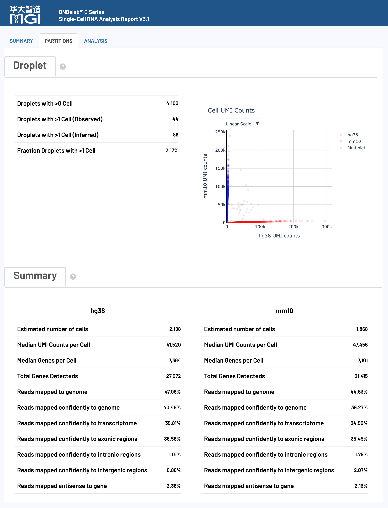

<div align="right" style="margin-bottom: 20px; max-width: 1200px; margin-left: auto; margin-right: auto;">

[首页](../../README.md)

</div>

<div align="center" style="padding: 40px 20px; background: linear-gradient(135deg, #f5f5f7 0%, #ffffff 100%); border-radius: 12px; margin-bottom: 30px; max-width: 1200px; margin-left: auto; margin-right: auto;">

<h1 style="font-size: 48px; font-weight: 600; color: #1d1d1f; margin: 0 0 16px 0; letter-spacing: -0.02em;"> scRNA 分析输出</h1>

<p style="font-size: 21px; color: rgba(0,0,0,0.6); margin: 0 0 30px 0; font-weight: 400;">单细胞 RNA 测序分析输出文件说明</p>

<div style="display: flex; gap: 12px; justify-content: center; flex-wrap: wrap;">
<a href="#输出目录结构" style="background: #0071e3; color: white; padding: 8px 16px; border-radius: 980px; text-decoration: none; font-size: 14px;">目录结构</a>
<a href="#详细文件说明" style="background: transparent; color: #0071e3; padding: 8px 16px; border-radius: 980px; text-decoration: none; font-size: 14px; border: 1px solid #0071e3;">文件详情</a>
<a href="#网页报告释义" style="background: transparent; color: #0071e3; padding: 8px 16px; border-radius: 980px; text-decoration: none; font-size: 14px; border: 1px solid #0071e3;">报告解读</a>
</div>

</div>

<div style="background: #f5f5f7; border-radius: 12px; padding: 24px; margin: 24px auto; max-width: 1200px;">

## 概述 <a id="概述"></a>

单细胞 RNA 分析完成后，会在指定的输出目录中生成标准化的文件和子目录结构，用于基因表达谱分析和细胞类型鉴定。本文档详细说明了每个输出文件的内容、格式和用途，帮助用户理解和使用单细胞 RNA 分析结果。

> **提示**
> 
> 所有输出文件均采用标准格式，兼容主流单细胞分析工具（如Scanpy、Seurat等），遵循国际通用的数据格式规范。

</div>

<div style="max-width: 1200px; margin: 0 auto;"><hr style="border: none; border-top: 1px solid #d2d2d7; margin: 24px 0;"></div>

<div style="background: #f5f5f7; border-radius: 12px; padding: 24px; margin: 24px auto; max-width: 1200px;">

## 输出目录结构 <a id="输出目录结构"></a>

</div>

<div style="background: #ffffff; border-radius: 12px; padding: 20px; margin: 20px auto; max-width: 1200px; overflow-x: auto; border: 1px solid #d2d2d7;">

```
.
├── analysis/                      # 下游分析结果目录
│   ├── cluster.csv                # 细胞聚类结果文件
│   ├── cell_classification.csv    # 双物种细胞归属结果文件（仅双物种分析）
│   ├── marker.csv                 # 差异表达基因标记文件
│   └── QC_Cluster.h5ad            # 质控和聚类后的AnnData对象
├── anno_decon_sorted.bam          # 比对注释并排序的 BAM 文件
├── anno_decon_sorted.bam.bai      # BAM 索引文件
├── filter_feature.h5ad            # 过滤后的特征矩阵（AnnData格式）
├── filter_matrix/                 # 过滤后的基因表达矩阵目录
│   ├── barcodes.tsv.gz            # 细胞条形码文件
│   ├── features.tsv.gz            # 基因/特征信息文件
│   └── matrix.mtx.gz              # 稀疏矩阵文件（Matrix Market 格式）
├── metrics_summary.xls            # 分析指标汇总表
├── raw_matrix/                    # 原始基因表达矩阵目录
│   ├── barcodes.tsv.gz            # 原始细胞条形码文件
│   ├── features.tsv.gz            # 原始基因/特征信息文件
│   └── matrix.mtx.gz              # 原始稀疏矩阵文件
├── singlecell.csv                 # 单细胞元数据表
└── *_scRNA_report.html            # HTML格式的分析报告
```

</div>

<div style="max-width: 1200px; margin: 0 auto;"><hr style="border: none; border-top: 1px solid #d2d2d7; margin: 24px 0;"></div>

<div style="background: #f5f5f7; border-radius: 12px; padding: 24px; margin: 24px auto; max-width: 1200px;">

## 详细文件说明 <a id="详细文件说明"></a>

</div>

<div style="background: #f5f5f7; border-radius: 12px; padding: 24px; margin: 24px auto; max-width: 1200px;">

### 比对与注释文件 <a id="比对与注释文件"></a>

<div align="center">

**核心内容**: 原始测序数据比对到参考基因组的结果文件，包含完整的比对信息和细胞条形码标记

</div>

</div>

<div style="max-width: 1200px; margin: 0 auto;"><hr style="border: none; border-top: 1px solid #d2d2d7; margin: 24px 0;"></div>

<div style="background: #ffffff; border-radius: 12px; padding: 24px; box-shadow: 0 1px 3px rgba(0,0,0,0.1); border: 1px solid #e5e5e5; margin: 20px auto; max-width: 1200px; ">

#### anno_decon_sorted.bam

这是包含所有原始数据的 scRNA-seq 比对结果文件。

*   **核心用途**:
    *   **比对结果查看与可视化**: 可用于 IGV 等基因组浏览器进行结果可视化，检查特定基因座的比对情况和剪接模式。
    *   **自定义分析**: 为需要直接操作比对级别数据的用户提供原始输入，例如进行可变剪接分析、RNA速率分析等。

*   **内容与格式**:
    *   采用国际标准的 **BAM (Binary Alignment Map)** 格式。
    *   文件已按**基因组坐标排序**，并建立了索引（`.bai` 文件），便于快速随机访问。
    *   每个读段都通过 TAG 字段标记了细胞来源、UMI 和基因注释信息。

*   **关键TAG字段说明**:
    *   BAM 文件通过丰富的 TAG 字段来存储单细胞特有的信息，主要分为细胞/分子标识和基因注释两大类。

    **细胞和分子标识标签：**

    <table style="width:100%; border-collapse: collapse; margin: 15px 0; border-radius: 8px; overflow: hidden;">
    <thead style="background-color: #f5f5f7; border-bottom: 1px solid #d2d2d7;">
    <tr>
    <th width="10%" align="left" style="padding: 12px 16px; font-weight: 600; color: #1d1d1f;">标签</th>
    <th width="15%" align="left" style="padding: 12px 16px; font-weight: 600; color: #1d1d1f;">类型</th>
    <th width="37%" align="left" style="padding: 12px 16px; font-weight: 600; color: #1d1d1f;">描述</th>
    <th width="38%" align="left" style="padding: 12px 16px; font-weight: 600; color: #1d1d1f;">生物学意义</th>
    </tr>
    </thead>
    <tbody>
    <tr>
    <td align="left"><code>CB</code></td>
    <td align="left">String</td>
    <td align="left">细胞条形码合并后的细胞 ID</td>
    <td>用于将 reads 归属到特定细胞，是经过纠错和合并的最终细胞 ID</td>
    </tr>
    <tr>
    <td align="left"><code>CC</code></td>
    <td align="left">String</td>
    <td align="left">经过错误校正细胞条形码序列</td>
    <td>纠错后的细胞条形码，是生成<code>CB</code>标签的中间步骤</td>
    </tr>
    <tr>
    <td align="left"><code>CR</code></td>
    <td align="left">String</td>
    <td align="left">原始测序细胞条形码</td>
    <td>保留原始测序信息，用于质量评估和错误追溯</td>
    </tr>
    <tr>
    <td align="left"><code>CY</code></td>
    <td align="left">String</td>
    <td align="left">细胞条形码质量分数</td>
    <td>Phred质量分数，评估条形码测序的可靠性</td>
    </tr>
    <tr>
    <td align="left"><code>UB</code></td>
    <td align="left">String</td>
    <td align="left">错误校正后的 UMI 序列</td>
    <td>用于分子去重，识别 PCR 重复和原始 mRNA 分子</td>
    </tr>
    <tr>
    <td align="left"><code>UR</code></td>
    <td align="left">String</td>
    <td align="left">原始测序 UMI 序列</td>
    <td>保留原始 UMI 信息，用于质量评估和算法优化</td>
    </tr>
    <tr>
    <td align="left"><code>UY</code></td>
    <td align="left">String</td>
    <td align="left">UMI 质量分数</td>
    <td>Phred 质量分数，评估 UMI 测序的准确性</td>
    </tr>
    </tbody>
    </table>

    **基因注释和功能标签：**

    <table style="width:100%; border-collapse: collapse; margin: 15px 0; border-radius: 8px; overflow: hidden;">
    <thead style="background-color: #f5f5f7; border-bottom: 1px solid #d2d2d7;">
    <tr>
    <th width="10%" align="left" style="padding: 12px 16px; font-weight: 600; color: #1d1d1f;">标签</th>
    <th width="15%" align="left" style="padding: 12px 16px; font-weight: 600; color: #1d1d1f;">类型</th>
    <th width="37%" align="left" style="padding: 12px 16px; font-weight: 600; color: #1d1d1f;">描述</th>
    <th width="38%" align="left" style="padding: 12px 16px; font-weight: 600; color: #1d1d1f;">功能用途</th>
    </tr>
    </thead>
    <tbody>
    <tr>
    <td align="left"><code>GX</code></td>
    <td align="left">String</td>
    <td align="left">Ensembl ID</td>
    <td>基因表达定量的主要ID</td>
    </tr>
    <tr>
    <td align="left"><code>GN</code></td>
    <td align="left">String</td>
    <td align="left">基因名称</td>
    <td>便于生物学解释，支持基因功能注释</td>
    </tr>
    <tr>
    <td align="left"><code>TX</code></td>
    <td align="left">String</td>
    <td align="left">转录本ID</td>
    <td>用于转录本水平的表达分析和可变剪接研究</td>
    </tr>
    <tr>
    <td align="left"><code>AN</code></td>
    <td align="left">String</td>
    <td align="left">反义转录本标记</td>
    <td>识别反义RNA，评估文库方向性和非编码RNA表达</td>
    </tr>
    <tr>
    <td align="left"><code>RE</code></td>
    <td align="left">String</td>
    <td align="left">基因组区域类型</td>
    <td>区分外显子(E)、内含子(N)、基因间区(I)，用于转录组特征分析</td>
    </tr>
    </tbody>
    </table>

</div>

<div style="max-width: 1200px; margin: 0 auto;"><hr style="border: none; border-top: 1px solid #d2d2d7; margin: 24px 0;"></div>

<div style="background: #ffffff; border-radius: 12px; padding: 24px; box-shadow: 0 1px 3px rgba(0,0,0,0.1); border: 1px solid #e5e5e5; margin: 20px auto; max-width: 1200px; ">

#### anno_decon_sorted.bam.bai

`anno_decon_sorted.bam` 文件的索引。

*   **核心用途**:
    *   **快速数据访问**: 允许 IGV、Samtools 等工具在无需完整加载 BAM 文件的情况下，快速跳转并读取任意基因组区域的比对数据。
    *   **性能保障**: 是所有对 BAM 文件进行随机访问操作的性能保障。
*   **格式与说明**:
    *   索引文件由 `samtools index` 命令生成。为了兼容不同大小的基因组，流程会自动选择合适的索引格式（BAI 或 CSI）。

        <table style="width:100%; border-collapse: collapse; margin: 15px 0; border-radius: 8px; overflow: hidden;">
        <thead style="background-color: #f5f5f7; border-bottom: 1px solid #d2d2d7;">
        <tr>
        <th width="20%" align="left" style="padding: 12px 16px; font-weight: 600; color: #1d1d1f;">格式类型</th>
        <th width="80%" align="left" style="padding: 12px 16px; font-weight: 600; color: #1d1d1f;">使用说明</th>
        </tr>
        </thead>
        <tbody>
        <tr>
        <td align="left"><strong>BAI 格式</strong></td>
        <td>默认生成的索引格式，兼容性最佳，适用于大多数分析工具和基因组。</td>
        </tr>
        <tr>
        <td align="left"><strong>CSI 格式</strong></td>
        <td>当 BAM 文件包含长度超过 512 Mbp (2^29-1 bp) 的染色体时自动生成，以支持超大基因组。</td>
        </tr>
        </tbody>
        </table>

</div>

<div style="max-width: 1200px; margin: 0 auto;"><hr style="border: none; border-top: 1px solid #d2d2d7; margin: 24px 0;"></div>

<div style="background: #f5f5f7; border-radius: 12px; padding: 24px; margin: 24px auto; max-width: 1200px;">

### 特征矩阵文件 <a id="特征矩阵文件"></a>

<div align="center">

**核心内容**: 单细胞基因表达计数矩阵，分为原始数据和质控过滤后数据，采用标准稀疏矩阵或AnnData格式

</div>

</div>

<div style="max-width: 1200px; margin: 0 auto;"><hr style="border: none; border-top: 1px solid #d2d2d7; margin: 24px 0;"></div>

<div style="background: #ffffff; border-radius: 12px; padding: 24px; box-shadow: 0 1px 3px rgba(0,0,0,0.1); border: 1px solid #e5e5e5; margin: 20px auto; max-width: 1200px; ">

#### 过滤后的基因表达矩阵 (`filter_matrix/`)

包含经过高质量细胞过滤后的基因表达计数矩阵，是进行下游定量分析的核心数据。

*   **核心用途**:
    *   **下游定量分析**: 作为细胞聚类、差异表达分析等分析的**主要输入**。
    *   **高质量数据**: 只包含被鉴定为真实细胞的条形码，确保分析结果的准确性。

*   **内容与格式**:
    *   采用标准的 **Matrix Market Exchange (MEX)** 格式（关于矩阵格式详见[Matrix Market 格式说明](#market-matrix-format-mtxgz)），由以下三个压缩文件组成：
        <table style="width:100%; border-collapse: collapse; margin: 15px 0; border-radius: 8px; overflow: hidden;">
        <thead style="background-color: #f5f5f7; border-bottom: 1px solid #d2d2d7;">
        <tr>
        <th width="25%" align="left" style="padding: 12px 16px; font-weight: 600; color: #1d1d1f;">文件名</th>
        <th width="75%" align="left" style="padding: 12px 16px; font-weight: 600; color: #1d1d1f;">内容描述</th>
        </tr>
        </thead>
        <tbody>
        <tr>
        <td align="left"><code>barcodes.tsv.gz</code></td>
        <td>细胞 ID 列表，标识通过质控筛选的高质量细胞。每行包含一个细胞 ID 信息，对应矩阵的列索引</td>
        </tr>
        <tr>
        <td align="left"><code>features.tsv.gz</code></td>
        <td>基因/特征信息文件，包含基因ID、名称和类型。每行包含三列信息，对应矩阵的行索引</td>
        </tr>
        <tr>
        <td align="left"><code>matrix.mtx.gz</code></td>
        <td>基因表达计数矩阵，采用 Matrix Market 格式。包含矩阵维度信息和非零元素的行、列索引及数值</td>
        </tr>
        </tbody>
        </table>

*   **格式优势**:
    *   **空间高效**: 稀疏矩阵格式（`.mtx`）仅存储非零元素，极大节省了存储空间。
    *   **高度兼容**: MEX 格式是单细胞社区的标准，兼容 Seurat, Scanpy 等几乎所有主流分析工具。

</div>

<div style="max-width: 1200px; margin: 0 auto;"><hr style="border: none; border-top: 1px solid #d2d2d7; margin: 24px 0;"></div>

<div style="background: #ffffff; border-radius: 12px; padding: 24px; box-shadow: 0 1px 3px rgba(0,0,0,0.1); border: 1px solid #e5e5e5; margin: 20px auto; max-width: 1200px; ">

#### 原始基因表达矩阵 (`raw_matrix/`)

包含所有检测到的细胞条形码（未经过滤）的原始基因表达计数矩阵。

*   **核心用途**:
    *   **质量控制评估**: 可用于评估细胞过滤的效果，或根据自定义标准进行手动过滤。
    *   **数据完整性**: 保留了所有原始数据，可用于进一步分析或在需要时重新分析。

*   **内容与格式**:
    *   采用标准的 **Matrix Market Exchange (MEX)** 格式，其文件组成与 `filter_matrix/` 目录完全相同。
    *   包含所有被检测到的条形码，包括高质量细胞、低质量细胞和背景液滴。

</div>

<div style="max-width: 1200px; margin: 0 auto;"><hr style="border: none; border-top: 1px solid #d2d2d7; margin: 24px 0;"></div>

<div style="background: #ffffff; border-radius: 12px; padding: 24px; box-shadow: 0 1px 3px rgba(0,0,0,0.1); border: 1px solid #e5e5e5; margin: 20px auto; max-width: 1200px; ">

#### filter_feature.h5ad

经过细胞鉴定和过滤后的特征矩阵，采用 AnnData (`.h5ad`) 格式存储，是 `filter_matrix/` 目录内容的替代和补充。

*   **核心用途**:
    *   **Python 生态系统集成**: 作为 `scanpy` 等 Python 单细胞分析库的标准输入格式，无缝衔接下游分析。
    *   **数据整合**: 单个文件即可封装表达矩阵、细胞元数据和基因元数据，便于管理和分享。
*   **内容与格式**:
    *   基于 HDF5 的二进制格式，详细格式参考[AnnData格式说明](#anndata-format-h5ad)。

</div>

<div style="max-width: 1200px; margin: 0 auto;"><hr style="border: none; border-top: 1px solid #d2d2d7; margin: 24px 0;"></div>

<div style="background: #f5f5f7; border-radius: 12px; padding: 24px; margin: 24px auto; max-width: 1200px;">

### 分析结果目录 (`analysis/`) <a id="分析结果目录-analysis"></a>

<div align="center">

**核心内容**: 下游生物信息学分析结果，包括细胞聚类、差异基因和质控后数据

</div>

</div>

<div style="max-width: 1200px; margin: 0 auto;"><hr style="border: none; border-top: 1px solid #d2d2d7; margin: 24px 0;"></div>

<div style="background: #ffffff; border-radius: 12px; padding: 24px; box-shadow: 0 1px 3px rgba(0,0,0,0.1); border: 1px solid #e5e5e5; margin: 20px auto; max-width: 1200px; ">

#### cluster.csv

细胞聚类分析结果文件，采用 CSV 格式。包含每个细胞的 ID、所属聚类、降维坐标以及关键质控指标。

*   **核心用途**:
    *   **聚类结果可视化**: 可直接用于绘图软件，可视化 UMAP 降维结果。
    *   **细胞注释基础**: 为手动或自动细胞类型注释提供基础分组信息。
*   **内容与格式**:
    *   每一行代表一个高质量细胞，主要列包括：
        *   `Barcode`: 细胞 ID
        *   `Cluster`: 该细胞所属的聚类编号
        *   `UMAP_1`, `UMAP_2`: UMAP 降维的二维坐标
        *   `nGene`, `nUMI`: 每个细胞检测到的基因数和 UMI 数

</div>

<div style="max-width: 1200px; margin: 0 auto;"><hr style="border: none; border-top: 1px solid #d2d2d7; margin: 24px 0;"></div>

<div style="background: #ffffff; border-radius: 12px; padding: 24px; box-shadow: 0 1px 3px rgba(0,0,0,0.1); border: 1px solid #e5e5e5; margin: 20px auto; max-width: 1200px; ">

#### cell_classification.csv（仅双物种分析）

双物种（如 `hg38 + mm10`）分析时生成的细胞物种归属结果文件，采用 CSV 格式。

*   **核心用途**:
    *   **细胞物种鉴定**: 判定每个细胞主要来源于哪一个物种。
    *   **混合细胞识别**: 标记潜在双细胞/混合细胞（`Multiplet`），用于后续过滤或单独分析。
*   **内容与格式**:
    *   每一行代表一个细胞条形码，主要列包括：
        *   `barcode`: 细胞条形码 ID
        *   `hg38`: 归属于人参考（hg38）的计数
        *   `mm10`: 归属于鼠参考（mm10）的计数
        *   `call`: 物种归属结果（`hg38` / `mm10` / `Multiplet`）
<p><strong>示例：</strong></p>

<div style="background-color: #f5f5f7; border-radius: 12px; padding: 20px; margin: 16px auto; max-width: 1200px; overflow-x: auto; border: 1px solid #d2d2d7;">
<pre><code>barcode,hg38,mm10,call
CELL1_N2,17098,821,hg38
CELL2_N8,56978,1939,hg38
CELL5_N2,868,4216,mm10
CELL8_N2,2371,71601,mm10
CELL10_N2,1299,36697,mm10
CELL11_N1,1633,44048,mm10
CELL14_N3,110102,2919,hg38
CELL19_N1,763,19995,mm10
CELL21_N3,44712,1603,hg38
CELL27_N3,64247,90800,Multiplet
CELL31_N3,87308,2773,hg38
CELL32_N2,1871,51359,mm10
CELL36_N2,871,19635,mm10
CELL38_N3,42964,1487,hg38
CELL41_N3,360,6379,mm10
CELL42_N3,2853,74058,mm10
CELL43_N7,54863,1875,hg38
CELL44_N2,14431,638,hg38
CELL46_N3,4071,129035,mm10
CELL47_N4,1865,51515,mm10
CELL49_N2,49776,1521,hg38
CELL51_N5,1362,40817,mm10</code></pre>
</div>

</div>

<div style="max-width: 1200px; margin: 0 auto;"><hr style="border: none; border-top: 1px solid #d2d2d7; margin: 24px 0;"></div>

<div style="background: #ffffff; border-radius: 12px; padding: 24px; margin: 20px auto; max-width: 1200px; border: 1px solid #e5e5e5; box-shadow: 0 1px 3px rgba(0,0,0,0.1);">

#### marker.csv

各聚类的差异表达基因（标记基因）列表，采用 CSV 格式。记录了每个基因在特定聚类中的表达显著性、表达量变化等信息。

*   **核心用途**:
    *   **细胞类型鉴定**: 通过查找已知细胞类型的标记基因，对无监督聚类结果进行生物学注释。
    *   **功能富集分析**: 可作为后续 GO、KEGG 等功能富集分析的输入基因列表。
*   **内容与格式**:
    *   每一行代表一个基因在一个聚类中的差异表达信息，主要列包括：
        *   `cluster`: 基因作为标记基因的聚类编号
        *   `gene`: 基因名称
        *   `avg_log2FC`: 平均对数倍数变化
        *   `p_val_adj`: 调整后的 p 值，评估统计显著性
        *   `pct.1`, `pct.2`: 该基因在目标聚类和其他聚类中的表达细胞比例

</div>

<div style="max-width: 1200px; margin: 0 auto;"><hr style="border: none; border-top: 1px solid #d2d2d7; margin: 24px 0;"></div>

<div style="background: #ffffff; border-radius: 12px; padding: 24px; margin: 20px auto; max-width: 1200px; border: 1px solid #e5e5e5; box-shadow: 0 1px 3px rgba(0,0,0,0.1);">

#### QC_Cluster.h5ad

经过完整质控、降维和聚类分析的单细胞数据对象，采用 AnnData (`.h5ad`) 格式。它整合了上游的表达矩阵和下游的分析结果。

*   **核心用途**:
    *   **分析复现与探索**: 包含完整的分析流程和结果，可直接在 `scanpy` 中加载，进行深入探索性分析或可视化。
    *   **数据交付**: 作为最终分析结果的交付文件，结构清晰，信息完整。
*   **内容与格式**:
    *   在 `filter_feature.h5ad` 的基础上，增加了以下信息：
        *   `obs`: 包含聚类结果 (`cluster`) 等细胞元数据。
        *   `obsm`: 包含降维坐标 (`X_umap`)。
        *   `uns`: 包含标记基因 (`marker_genes`) 等非结构化结果。

</div>

<div style="max-width: 1200px; margin: 0 auto;"><hr style="border: none; border-top: 1px solid #d2d2d7; margin: 24px 0;"></div>

<div style="background: #f5f5f7; border-radius: 12px; padding: 24px; margin: 24px auto; max-width: 1200px;">

### 分析指标汇总 <a id="分析指标汇总"></a>

<div align="center">

**核心内容**: 实验质量评估和统计指标汇总，提供完整的数据质量控制信息

</div>

</div>

<div style="max-width: 1200px; margin: 0 auto;"><hr style="border: none; border-top: 1px solid #d2d2d7; margin: 24px 0;"></div>

<div style="background: #ffffff; border-radius: 12px; padding: 24px; box-shadow: 0 1px 3px rgba(0,0,0,0.1); border: 1px solid #e5e5e5; margin: 20px auto; max-width: 1200px; ">

#### metrics_summary.xls

采用 Excel 格式的关键分析指标汇总表，提供了对实验整体质量的结构化评估。

*   **核心用途**:
    *   **质量评估**: 快速评估测序数据质量、比对效率、细胞鉴定结果等核心指标。
    *   **结果概览**: 无需查看所有文件即可对分析结果有一个概览。

*   **内容与格式**:
    *   包含三大类别的关键指标：
        <table style="width:100%; border-collapse: collapse; margin: 15px 0; border-radius: 8px; overflow: hidden;">
        <thead style="background-color: #f5f5f7; border-bottom: 1px solid #d2d2d7;">
        <tr>
        <th width="20%" align="left"><strong>指标类别</strong></th>
        <th width="80%" align="left"><strong>包含内容</strong></th>
        </tr>
        </thead>
        <tbody>
        <tr>
        <td align="left"><strong>基本统计</strong></td>
        <td>总 reads 数、有效条形码比例、UMI 质量、Q30 碱基质量等基础测序指标</td>
        </tr>
        <tr>
        <td align="left"><strong>细胞识别</strong></td>
        <td>估计细胞数量、每细胞中位基因/UMI 数、测序饱和度等细胞调用结果</td>
        </tr>
        <tr>
        <td align="left"><strong>比对指标</strong></td>
        <td>基因组比对率、转录组比对率、外显子/内含子比例等比对统计</td>
        </tr>
        </tbody>
        </table>

    *   内置推荐的质量控制标准，便于用户判断：
        <details open>
        <summary><strong>推荐质量阈值：</strong></summary>
        <ul>
        <li><strong>有效条形码比例</strong>: >70%</li>
        <li><strong>Q30 碱基质量</strong>: >75%（条形码和 UMI 区域）</li>
        <li><strong>转录组置信比对率</strong>: >30%</li>
        <li><strong>细胞内 reads 比例</strong>: >50%（核样本 >30%）</li>
        <li><strong>每细胞平均 reads 数</strong>: >15,000</li>
        </ul>
        </details>

</div>

<div style="max-width: 1200px; margin: 0 auto;"><hr style="border: none; border-top: 1px solid #d2d2d7; margin: 24px 0;"></div>

<div style="background: #ffffff; border-radius: 12px; padding: 24px; box-shadow: 0 1px 3px rgba(0,0,0,0.1); border: 1px solid #e5e5e5; margin: 20px auto; max-width: 1200px; ">

#### singlecell.csv

采用 CSV 格式的单细胞级别质量控制信息表，记录了每个细胞条形码的详细统计数据。

*   **核心用途**:
    *   **精细化质控**: 支持用户根据自定义标准进行更精细的细胞过滤和分析。
    *   **下游分析输入**: 可作为下游分析工具的细胞元数据（metadata）输入，支持 VDJ 分析中的细胞过滤和磁珠合并操作。

*   **内容与格式**:
    *   每一行代表一个细胞条形码。
    *   主要列包括：UMI 数量、基因数量、线粒体基因比例以及是否被判定为高质量细胞、磁珠合并信息等。

</div>

<div style="max-width: 1200px; margin: 0 auto;"><hr style="border: none; border-top: 1px solid #d2d2d7; margin: 24px 0;"></div>

<div style="background: #ffffff; border-radius: 12px; padding: 24px; box-shadow: 0 1px 3px rgba(0,0,0,0.1); border: 1px solid #e5e5e5; margin: 20px auto; max-width: 1200px; ">

#### *_scRNA_report.html

采用 HTML 网页格式的交互式综合分析报告。

*   **核心用途**:
    *   **结果可视化**: 以交互式图表展示质控结果、细胞聚类、标记基因等关键分析结果。
    *   **结果解读**: 提供各项指标的生物学意义和技术解释，帮助用户理解数据。
    *   **便捷分享**: 单个 HTML 文件，易于传阅和分享。

*   **内容与格式**:
    *   无需网络，可在任何现代浏览器中打开。
    *   报告的详细解读请参考本文档下方的 [网页报告释义](#网页报告释义) 部分。

</div>

<div style="max-width: 1200px; margin: 0 auto;"><hr style="border: none; border-top: 1px solid #d2d2d7; margin: 24px 0;"></div>

<div style="background: #f5f5f7; border-radius: 12px; padding: 24px; margin: 24px auto; max-width: 1200px;">

## 文件格式说明 <a id="文件格式说明"></a>

<div align="center">

**技术规范**: 输出文件采用的标准格式详细说明

</div>

</div>

<div style="background: #ffffff; border-radius: 12px; padding: 24px; box-shadow: 0 1px 3px rgba(0,0,0,0.1); border: 1px solid #e5e5e5; margin: 20px auto; max-width: 1200px; ">

#### Matrix Market 格式 (`.mtx.gz`) <a id="market-matrix-format-mtxgz"></a>

Market Exchange Format (MEX) 是单细胞分析中用于存储稀疏计数矩阵的标准格式，具有空间高效和高度兼容的优点。

*   **核心优势**:
    *   **空间高效**: 稀疏矩阵仅存储非零元素，对于通常超过95%为零值的单细胞数据，可极大节省存储空间。
    *   **高度兼容**: 作为国际标准格式，可被 Seurat, Scanpy 等几乎所有主流分析工具直接读取。

*   **文件组成**:
    *   一个完整的MEX格式数据由以下 **三个文件** 构成：
        <table style="width:100%; border-collapse: collapse; margin: 15px 0; border-radius: 8px; overflow: hidden;">
        <thead style="background-color: #f5f5f7; border-bottom: 1px solid #d2d2d7;">
        <tr>
        <th width="25%" align="left"><strong>文件名</strong></th>
        <th width="75%" align="left"><strong>描述</strong></th>
        </tr>
        </thead>
        <tbody>
        <tr>
        <td align="left"><code>matrix.mtx.gz</code></td>
        <td>压缩的稀疏矩阵文件。文件头包含矩阵维度，后续每行记录一个非零元素的位置（行/列索引）和数值。</td>
        </tr>
        <tr>
        <td align="left"><code>barcodes.tsv.gz</code></td>
        <td>压缩的细胞条形码文件。每行是一个细胞 ID，行号对应矩阵的<strong>列</strong>。格式例如`CELL1_N2`，其中`CELL1`为细胞 ID，`N2`为由两个条形码组成。</td>
        </tr>
        <tr>
        <td align="left"><code>features.tsv.gz</code></td>
        <td>压缩的特征（基因）文件。每行包含基因ID、基因名称等信息，行号对应矩阵的<strong>行</strong>。</td>
        </tr>
        </tbody>
        </table>

</div>

<div style="max-width: 1200px; margin: 0 auto;"><hr style="border: none; border-top: 1px solid #d2d2d7; margin: 24px 0;"></div>

<div style="background: #ffffff; border-radius: 12px; padding: 24px; box-shadow: 0 1px 3px rgba(0,0,0,0.1); border: 1px solid #e5e5e5; margin: 20px auto; max-width: 1200px; ">

### AnnData格式 (`.h5ad`) <a id="anndata-format-h5ad"></a>

**格式概述:** AnnData ("Annotated Data") 是专为矩阵型数据设计的数据结构，特别适用于单细胞 RNA 测序数据分析。基于 HDF5 格式，提供高效的数据存储和访问能力。

#### 数据结构

<div align="center" style="margin: 24px auto; max-width: 1200px;">

</div>

<table style="width:100%; border-collapse: collapse; margin: 15px 0; border-radius: 8px; overflow: hidden;">
<thead style="background-color: #f5f5f7; border-bottom: 1px solid #d2d2d7;">
<tr>
<th width="20%" align="left" style="padding: 12px 16px; font-weight: 600; color: #1d1d1f;">组件</th>
<th width="40%" align="left" style="padding: 12px 16px; font-weight: 600; color: #1d1d1f;">功能</th>
<th width="40%" align="left" style="padding: 12px 16px; font-weight: 600; color: #1d1d1f;">维度</th>
</tr>
</thead>
<tbody>
<tr><td align="left"><strong>X</strong></td><td>主表达矩阵</td><td>n_cells × n_genes</td></tr>
<tr><td align="left"><strong>obs</strong></td><td>细胞元数据</td><td>n_cells × n_obs_features</td></tr>
<tr><td align="left"><strong>var</strong></td><td>基因元数据</td><td>n_genes × n_var_features</td></tr>
<tr><td align="left"><strong>obsm</strong></td><td>细胞多维数据</td><td>n_cells × n_components</td></tr>
<tr><td align="left"><strong>varm</strong></td><td>基因多维数据</td><td>n_genes × n_components</td></tr>
<tr><td align="left"><strong>layers</strong></td><td>多层数据</td><td>n_cells × n_genes</td></tr>
<tr><td align="left"><strong>uns</strong></td><td>非结构化数据</td><td>任意对象</td></tr>
</tbody>
</table>

</div>

<div style="max-width: 1200px; margin: 0 auto;"><hr style="border: none; border-top: 1px solid #d2d2d7; margin: 24px 0;"></div>

<div style="background: #f5f5f7; border-radius: 12px; padding: 24px; margin: 24px auto; max-width: 1200px;">

## 网页报告释义 <a id="网页报告释义"></a>

<div align="center">

**概述**：HTML 网页报告提供单细胞 RNA 测序结果的可视化摘要和指标说明，覆盖实验质量与下游分析相关的关键指标。

</div>

</div>

<div style="background: #ffffff; border-radius: 12px; padding: 24px; box-shadow: 0 1px 3px rgba(0,0,0,0.1); border: 1px solid #e5e5e5; margin: 20px auto; max-width: 1200px; ">

HTML 网页报告用于查看单细胞 RNA 测序分析结果，覆盖数据质量控制、细胞聚类、标记基因和细胞类型注释等内容。用户可通过交互式图表快速检查实验质量并定位需要进一步复核的指标。

> **使用说明**：
> 
> 建议按照报告展示顺序依次查看各项指标。

> **注意**
> 
> 以下标准仅供参考，实际质量评估应考虑组织类型、细胞状态和实验目标等多种因素。不同样本间存在显著差异，建议结合具体实验背景进行判断。

</div>

<div style="max-width: 1200px; margin: 0 auto;"><hr style="border: none; border-top: 1px solid #d2d2d7; margin: 24px 0;"></div>

<div style="background: #ffffff; border-radius: 12px; padding: 24px; box-shadow: 0 1px 3px rgba(0,0,0,0.1); border: 1px solid #e5e5e5; margin: 20px auto; max-width: 1200px; ">

### 报告主要内容与结构

<div align="center" style="margin: 24px auto; max-width: 1200px;">

</div>

</div>

<div style="max-width: 1200px; margin: 0 auto;"><hr style="border: none; border-top: 1px solid #d2d2d7; margin: 24px 0;"></div>

<div style="background: #f5f5f7; border-radius: 12px; padding: 24px; margin: 24px auto; max-width: 1200px;">

### 核心分析指标详解

</div>

<div style="max-width: 1200px; margin: 0 auto;"><hr style="border: none; border-top: 1px solid #d2d2d7; margin: 24px 0;"></div>

<div style="background: #ffffff; border-radius: 12px; padding: 24px; box-shadow: 0 1px 3px rgba(0,0,0,0.1); border: 1px solid #e5e5e5; margin: 20px auto; max-width: 1200px; ">

#### 细胞指标 (Cell Metrics) <a id="细胞指标"></a>

<div align="center">

**核心功能**: 细胞识别、质量评估和基因表达统计，提供实验整体效果的关键指标

</div>

**质量控制标准**

> **注意**
> 
> 以下标准仅供参考，实际质量评估应考虑组织类型、细胞状态和实验目标等多种因素。不同样本间存在显著差异，建议结合具体实验背景进行判断。

<table style="width:100%; border-collapse: collapse; margin: 15px 0; border-radius: 8px; overflow: hidden;">
<thead style="background-color: #f5f5f7; border-bottom: 1px solid #d2d2d7;">
<tr>
<th width="25%" align="left" style="padding: 12px 16px; font-weight: 600; color: #1d1d1f;">指标名称</th>
<th width="30%" align="left" style="padding: 12px 16px; font-weight: 600; color: #1d1d1f;">推荐值</th>
<th width="30%" align="left" style="padding: 12px 16px; font-weight: 600; color: #1d1d1f;">可接受</th>
<th width="15%" align="left" style="padding: 12px 16px; font-weight: 600; color: #1d1d1f;">需优化</th>
</tr>
</thead>
<tbody>
<tr>
<td align="left"><strong>Mean reads per cell</strong></td>
<td align="left">≥ 30,000</td>
<td align="left">15,000–30,000</td>
<td align="left">< 15,000</td>
</tr>
<tr>
<td align="left"><strong>Median genes per cell</strong></td>
<td align="left">≥ 1,000</td>
<td align="left">500–1,000</td>
<td align="left">< 500</td>
</tr>
<tr>
<td align="left"><strong>Fraction reads in cells</strong></td>
<td align="left">≥ 60%</td>
<td align="left">30–60%</td>
<td align="left">< 30%</td>
</tr>
<tr>
<td align="left"><strong>Sequencing saturation</strong></td>
<td align="left">≥ 40%</td>
<td align="left">20–40%</td>
<td align="left">< 20%</td>
</tr>
</tbody>
</table>

**详细指标解释：**

<table style="width:100%; border-collapse: collapse; margin: 15px 0; border-radius: 8px; overflow: hidden;">
<thead style="background-color: #f5f5f7; border-bottom: 1px solid #d2d2d7;">
<tr>
<th width="30%" align="left" style="padding: 12px 16px; font-weight: 600; color: #1d1d1f;">指标名称</th>
<th width="70%" align="left" style="padding: 12px 16px; font-weight: 600; color: #1d1d1f;">详细解释与技术要求</th>
</tr>
</thead>
<tbody>
<tr>
<td align="left">
<strong>Estimated number of cells</strong><br>
<em>估计细胞数量</em>
</td>
<td>
<ul>
<li><strong>定义</strong>: 从测序数据中鉴定出的有效细胞（区别于背景噪音或空液滴）的总数。</li>
<li><strong>计算过程</strong>: 基于条形码的 UMI 分布并结合空滴模型（EmptyDrops）识别真实细胞。</li>
<li><strong>判读建议</strong>: 该值应结合上样细胞数量、样本类型和细胞过滤结果综合判断。若明显低于预期，建议优先检查样本完整性、文库质量和测序深度。</li>
</li>
</ul>
</td>
</tr>
<tr>
<td align="left">
<strong>Species</strong><br>
<em>物种信息</em>
</td>
<td>
<ul>
<li><strong>定义</strong>: 分析所采用的物种或参考基因组版本。</li>
<li><strong>用途</strong>: 用于确认本次分析所使用的参考基因组是否与样本物种一致，是结果复核和问题排查的基础信息。</li>
</ul>
</td>
</tr>
<tr>
<td align="left">
<strong>Mean reads per cell</strong><br>
<em>每细胞平均 Reads 数</em>
</td>
<td>
<ul>
<li><strong>定义</strong>: 平均分配到每个细胞上的原始测序读段（Reads）数量。</li>
<li><strong>计算</strong>: <em>原始测序读段总数</em> / <em>估计细胞数量</em></li>
<li><strong>判读建议</strong>: 建议此值 ≥ 30,000，以保证每个细胞有足够的转录本覆盖。该值偏低时，下游聚类和差异分析的稳定性可能下降。</li>
</ul>
</td>
</tr>
<tr>
<td align="left">
<strong>Median/Mean UMI per cell</strong><br>
<em>细胞中位/平均 UMI 数</em>
</td>
<td>
<ul>
<li><strong>定义</strong>: 每个细胞中检测到的唯一分子标识符（UMI）数量的中位数/平均值。</li>
<li><strong>用途</strong>: 用于评估每个细胞捕获到的转录本分子数量，比 Reads 数更接近原始 mRNA 分子丰度。</li>
<li><strong>判读建议</strong>: 该指标受细胞类型、测序深度和文库质量影响。若明显低于同类型样本预期，需关注测序深度、细胞状态或文库构建质量。</li>
</ul>
</td>
</tr>
<tr>
<td align="left">
<strong>Median/Mean genes per cell</strong><br>
<em>细胞中位/平均基因数</em>
</td>
<td>
<ul>
<li><strong>定义</strong>: 单个细胞内所检测到的基因数量的中位数/平均值。</li>
<li><strong>用途</strong>: 用于评估单个细胞中可检测到的转录组复杂度和有效信息量。</li>
<li><strong>判读建议</strong>:
<ul>
<li><strong>注意</strong>: 该数值受细胞类型和测序深度影响较大。低转录本含量的细胞类型（如血细胞）该值可能较低。</li>
</ul>
</li>
</ul>
</td>
</tr>
<tr>
<td align="left">
<strong>Total genes detected</strong><br>
<em>检测到的总基因数</em>
</td>
<td>
<ul>
<li><strong>定义</strong>: 在整个样本中检测到的基因总数，要求每个基因至少在一个细胞中检测到一个 UMI 计数。</li>
<li><strong>用途</strong>: 用于评估样本整体转录组覆盖范围和细胞群体复杂度。</li>
<li><strong>判读建议</strong>: 数值偏低可能与测序深度不足、样本细胞类型较单一或低质量细胞比例较高有关。</li>
</ul>
</td>
</tr>
<tr>
<td align="left">
<strong>Fraction reads in cells</strong><br>
<em>细胞内 Reads 比例</em>
</td>
<td>
<ul>
<li><strong>定义</strong>: 在所有通过条形码与 UMI 质控并可置信比对至转录组的 Reads 中，成功归属到高质量细胞条形码的 Reads 比例。</li>
<li><strong>用途</strong>: 用于评估有效测序数据中有多少比例来自真实细胞，是判断背景 RNA 和空液滴影响的重要指标。</li>
<li><strong>判读建议</strong>:
<ul><li><strong>需关注</strong>: 比例偏低可能提示细胞破碎导致游离 RNA 增多、空液滴背景较高或文库构建异常。</li></ul>
</li>
</ul>
</td>
</tr>
<tr>
<td align="left">
<strong>Sequencing saturation</strong><br>
<em>测序饱和度</em>
</td>
<td>
<ul>
<li><strong>定义</strong>: 评估测序深度是否充分的指标，计算方法为 <em>1 - (去重后的 UMI 数 / 总 Reads 数)</em>。</li>
<li><strong>用途</strong>: 用于评估当前测序深度是否已充分覆盖文库复杂度。饱和度越高，继续加深测序带来的新增 UMI 或基因收益通常越低。</li>
<li><strong>判读建议</strong>: 40%–85% 通常是较合理区间；过低可能提示仍有加深测序空间，过高则提示继续加深测序收益有限。</li>
</ul>
</td>
</tr>
</tbody>
</table>

</div>

<div style="max-width: 1200px; margin: 0 auto;"><hr style="border: none; border-top: 1px solid #d2d2d7; margin: 24px 0;"></div>

<div style="background: #ffffff; border-radius: 12px; padding: 24px; box-shadow: 0 1px 3px rgba(0,0,0,0.1); border: 1px solid #e5e5e5; margin: 20px auto; max-width: 1200px; ">

#### 测序指标 (Sequencing Metrics) <a id="测序指标"></a>

<div align="center">

**核心功能**: 测序数据的基础质量评估，包括条形码识别率、UMI 质量和测序准确性

</div>

**质量控制标准**

> **注意**
> 
> 以下标准仅供参考，实际质量评估应考虑组织类型、细胞状态和实验目标等多种因素。不同样本间存在显著差异，建议结合具体实验背景进行判断。

<table style="width:100%; border-collapse: collapse; margin: 15px 0; border-radius: 8px; overflow: hidden;">
<thead style="background-color: #f5f5f7; border-bottom: 1px solid #d2d2d7;">
<tr>
<th width="25%" align="left"><strong>指标类别</strong></th>
<th width="25%" align="left"><strong>推荐值</strong></th>
<th width="25%" align="left"><strong>可接受</strong></th>
<th width="25%" align="left"><strong>需优化</strong></th>
</tr>
</thead>
<tbody>
<tr>
<td align="left"><strong>Valid barcodes</strong></td>
<td align="left">≥ 80%</td>
<td align="left">70–80%</td>
<td align="left">< 70%</td>
</tr>
<tr>
<td align="left"><strong>Valid UMIs</strong></td>
<td align="left">≥ 80%</td>
<td align="left">70–80%</td>
<td align="left">< 70%</td>
</tr>
<tr>
<td align="left"><strong>Q30 Base Quality</strong></td>
<td align="left">≥ 85%</td>
<td align="left">75–85%</td>
<td align="left">< 75%</td>
</tr>
</tbody>
</table>

**详细指标解释：**

<table style="width:100%; border-collapse: collapse; margin: 15px 0; border-radius: 8px; overflow: hidden;">
<thead style="background-color: #f5f5f7; border-bottom: 1px solid #d2d2d7;">
<tr>
<th width="30%" align="left" style="padding: 12px 16px; font-weight: 600; color: #1d1d1f;">指标名称</th>
<th width="70%" align="left" style="padding: 12px 16px; font-weight: 600; color: #1d1d1f;">详细解释与技术要求</th>
</tr>
</thead>
<tbody>
<tr>
<td align="left">
<strong>Number of reads</strong><br>
<em>测序读段总数</em>
</td>
<td>
<ul>
<li><strong>定义</strong>: 分配给该样本的原始测序读段对（Read Pairs）总数。</li>
<li><strong>用途</strong>: 表示本次测序的总体数据量，是评估测序深度和后续质控指标的基础。</li>
</ul>
</td>
</tr>
<tr>
<td align="left">
<strong>Valid barcodes</strong><br>
<em>有效条形码比例</em>
</td>
<td>
<ul>
<li><strong>定义</strong>: 在所有读段中，其细胞条形码（Cell Barcode）能够匹配到预设白名单（经过容错校正）的读段所占的比例。</li>
<li><strong>用途</strong>: 用于评估细胞条形码识别是否稳定，直接影响读段能否正确归属到细胞。</li>
<li><strong>判读建议</strong>: 比例过低通常提示条形码识别异常，可能与条形码区域测序质量、接头污染或文库构建质量有关。</li>
</ul>
</td>
</tr>
<tr>
<td align="left">
<strong>Valid UMIs</strong><br>
<em>有效 UMI 比例</em>
</td>
<td>
<ul>
<li><strong>定义</strong>: 在所有读段中，其唯一分子标识符（UMI）序列不包含 `N` 碱基且不为同聚物（如 `AAAAAA`）的比例。</li>
<li><strong>用途</strong>: 用于评估 UMI 序列是否可用于可靠的分子去重和计数。</li>
</ul>
</td>
</tr>
<tr>
<td align="left">
<strong>Q30 bases in barcode/UMI/read</strong><br>
<em>Q30 碱基比例</em>
</td>
<td>
<ul>
<li><strong>定义</strong>: 在细胞条形码、UMI 和 RNA 读段序列中，测序质量值 Q30 及以上碱基所占的比例。</li>
<li><strong>用途</strong>: Q30 表示碱基测序错误率低于 0.1%。该指标用于评估条形码识别、UMI 计数和基因比对的基础准确性。</li>
</ul>
</td>
</tr>
</tbody>
</table>

> **注**
> 
> 以上所有比例的计算均以原始测序读段(Number of Reads)为准，确保了各项指标之间的可比性和一致性。

</div>

<div style="max-width: 1200px; margin: 0 auto;"><hr style="border: none; border-top: 1px solid #d2d2d7; margin: 24px 0;"></div>

<div style="background: #ffffff; border-radius: 12px; padding: 24px; box-shadow: 0 1px 3px rgba(0,0,0,0.1); border: 1px solid #e5e5e5; margin: 20px auto; max-width: 1200px; ">

#### 比对指标 (Mapping Metrics) <a id="比对指标"></a>

<div align="center">

**核心功能**: 评估 Reads 与参考基因组的比对质量，包括比对率、特异性和基因组区域分布

</div>

**质量控制标准**

> **注意**
> 
> 以下标准仅供参考，实际质量评估应考虑组织类型、细胞状态和实验目标等多种因素。不同样本间存在显著差异，建议结合具体实验背景进行判断。

<table style="width:100%; border-collapse: collapse; margin: 15px 0; border-radius: 8px; overflow: hidden;">
<thead style="background-color: #f5f5f7; border-bottom: 1px solid #d2d2d7;">
<tr>
<th width="25%" align="left" style="padding: 12px 16px; font-weight: 600; color: #1d1d1f;">指标名称</th>
<th width="30%" align="left" style="padding: 12px 16px; font-weight: 600; color: #1d1d1f;">推荐值</th>
<th width="30%" align="left" style="padding: 12px 16px; font-weight: 600; color: #1d1d1f;">可接受</th>
<th width="15%" align="left" style="padding: 12px 16px; font-weight: 600; color: #1d1d1f;">需优化</th>
</tr>
</thead>
<tbody>
<tr>
<td align="left"><strong>Reads mapped to genome</strong></td>
<td align="left">≥ 80%</td>
<td align="left">50–80%</td>
<td align="left">< 50%</td>
</tr>
<tr>
<td align="left"><strong>Reads mapped confidently to transcriptome</strong></td>
<td align="left">≥ 50%</td>
<td align="left">30–50%</td>
<td align="left">< 30%</td>
</tr>
<tr>
<td align="left"><strong>Reads mapped antisense to gene</strong></td>
<td align="left">< 10%</td>
<td align="left">10–30%</td>
<td align="left">> 30%</td>
</tr>
</tbody>
</table>

**详细指标解释：**

<table style="width:100%; border-collapse: collapse; margin: 15px 0; border-radius: 8px; overflow: hidden;">
<thead style="background-color: #f5f5f7; border-bottom: 1px solid #d2d2d7;">
<tr>
<th width="30%" align="left" style="padding: 12px 16px; font-weight: 600; color: #1d1d1f;">指标名称</th>
<th width="70%" align="left" style="padding: 12px 16px; font-weight: 600; color: #1d1d1f;">详细解释与技术要求</th>
</tr>
</thead>
<tbody>
<tr>
<td align="left">
<strong>Reads mapped to genome</strong><br>
<em>基因组比对率</em>
</td>
<td>
<ul>
<li><strong>定义</strong>: 在所有读段中，成功比对到参考基因组上任意位置的读段所占的比例（包括唯一比对和多重比对）。</li>
<li><strong>判读建议</strong>:
<ul><li><strong>需关注</strong>: 低于 50% 时，建议检查样本污染、物种选择、参考基因组版本和测序质量。</li></ul>
</li>
</ul>
</td>
</tr>
<tr>
<td align="left">
<strong>Reads mapped confidently to genome</strong><br>
<em>基因组置信比对率</em>
</td>
<td>
<ul>
<li><strong>定义</strong>: 在所有读段中，以高质量（STAR MAPQ 值 255）成功比对到基因组<strong>唯一</strong>位置的读段比例。</li>
<li><strong>技术细节</strong>: 对于多重比对的读段，仅在一种特定情况下会被校正为置信读段：当该读段同时比对到一个外显子区域和一个或多个非外显子区域时，流程会采纳其在外显子区域的比对结果，并将其保留。</li>
<li><strong>用途</strong>: 该指标用于评估可用于可靠定量的唯一比对读段比例。比例偏低可能与重复序列比例高、序列质量差或参考基因组不匹配有关。</li>
</ul>
</td>
</tr>
<tr>
<td align="left">
<strong>Reads mapped confidently to transcriptome</strong><br>
<em>转录组置信比对率</em>
</td>
<td>
<ul>
<li><strong>定义</strong>: 在所有读段中，能够以高置信度唯一比对到<strong>单个基因</strong>（默认包含外显子和内含子）的读段所占的比例。</li>
<li><strong>技术细节</strong>: 为保证定量准确性，当一个读段落在多个基因的重叠区域时，该读段会被判定为来源不明确并被过滤。</li>
<li><strong>用途</strong>: 该指标直接反映可用于基因表达定量的有效读段比例。比例越高，下游定量分析的数据基础通常越可靠。</li>
</ul>
</td>
</tr>
<tr>
<td align="left">
<strong>Reads mapped confidently to exonic regions</strong><br>
<em>外显子区域比对率</em>
</td>
<td>
<ul>
<li><strong>定义</strong>: 在置信比对到基因组的读段中，落入已注释的<strong>外显子</strong>区域的比例。</li>
<li><strong>技术细节</strong>: 当读段至少有50%落入外显子区域时，才被认为是置信比对到外显子区域。</li>
<li><strong>判读建议</strong>: 在标准全细胞 scRNA-seq 中，该比例通常应较高；若明显偏低，需结合内含子比例、注释版本和样本类型共同判断。</li>
</ul>
</td>
</tr>
<tr>
<td align="left">
<strong>Reads mapped confidently to intronic regions</strong><br>
<em>内含子区域比对率</em>
</td>
<td>
<ul>
<li><strong>定义</strong>: 在置信比对到基因组的读段中，落入已注释的<strong>内含子</strong>区域的比例。</li>
<li><strong>技术细节</strong>: 当读段不符合外显子区域分类判定且与内含子区域有交集时，才被认为是置信比对到内含子区域。</li>
<li><strong>判读建议</strong>: 高比例通常表示捕获了大量未剪接 pre-mRNA；在核测序（snRNA-seq）或启用内含子计数时属于常见现象。</li>
</ul>
</td>
</tr>
<tr>
<td align="left">
<strong>Reads mapped confidently to intergenic regions</strong><br>
<em>基因间区比对率</em>
</td>
<td>
<ul>
<li><strong>定义</strong>: 在置信比对到基因组的读段中，未落入任何已注释基因（包括外显子和内含子）的区域的比例。</li>
<li><strong>判读建议</strong>: 比例过高可能提示基因注释不完整、参考版本不匹配，或文库中存在非特异性扩增。</li>
</ul>
</td>
</tr>
<tr>
<td align="left">
<strong>Reads mapped antisense to gene</strong><br>
<em>反义比对率</em>
</td><td>
<ul>
<li><strong>定义</strong>: 成功比对到基因区域但方向与注释基因相反的读段比例。</li>
<li><strong>判读建议</strong>: 比例过高可能提示文库方向性异常、注释不完整，或样本中存在未注释的反义转录本。</li>
</ul>
</td>
</tr>
<tr>
<td align="left">
<strong>Include introns</strong><br>
<em>包含内含子</em>
</td>
<td>
<ul>
<li><strong>定义</strong>: 控制是否在基因表达计数中包含比对到内含子区域的 reads。</li>
<li><strong>开启状态 (默认)</strong>：当设置为 <code>True</code> 时，内含子区域的 reads <strong>会被计入</strong>相应基因的表达量。此模式能更全面地捕获基因活性，特别适用于核测序或需要分析 pre-mRNA 的场景。</li>
<li><strong>关闭状态</strong>：当设置为 <code>False</code> 时，<strong>只有外显子</strong>区域的 reads 才被计入基因表达量。此模式专注于成熟 mRNA 的定量分析。</li>
</ul>
</td>
</tr>
</tbody>
</table>

> **注**
> 
> 以上所有比例的计算均以原始测序读段(Number of Reads)为准，确保了各项指标之间的可比性和一致性。

</div>

<div style="max-width: 1200px; margin: 0 auto;"><hr style="border: none; border-top: 1px solid #d2d2d7; margin: 24px 0;"></div>

<div style="background: #f5f5f7; border-radius: 12px; padding: 24px; margin: 24px auto; max-width: 1200px;">

### 交互式可视化图表解读 <a id="交互式可视化图表解读"></a>

<div align="center">

**核心功能**: 提供从细胞质量控制到下游生物学分析的可视化结果

</div>

</div>

<div style="max-width: 1200px; margin: 0 auto;"><hr style="border: none; border-top: 1px solid #d2d2d7; margin: 24px 0;"></div>

<div style="background: #ffffff; border-radius: 12px; padding: 24px; box-shadow: 0 1px 3px rgba(0,0,0,0.1); border: 1px solid #e5e5e5; margin: 20px auto; max-width: 1200px; ">

#### 可视化图表组一：细胞质量控制分析 <a id="可视化图表组一"></a>

</div>

<div style="max-width: 1200px; margin: 0 auto;"><hr style="border: none; border-top: 1px solid #d2d2d7; margin: 24px 0;"></div>

<div style="background: #ffffff; border-radius: 12px; padding: 24px; box-shadow: 0 1px 3px rgba(0,0,0,0.1); border: 1px solid #e5e5e5; margin: 20px auto; max-width: 1200px; ">

##### 细胞鉴定曲线图 (Barcode Rank Plot)

**图表功能**：
该图通过将所有细胞按其包含的 UMI 数进行排序，来区分高质量的真实细胞与背景噪音。

<div align="center" style="margin: 24px auto; max-width: 1200px;">

</div>

**如何解读**：

##### 视觉编码

- 蓝线（有效细胞）| 灰线（背景噪音）| 蓝色渐变区（混合区域）

##### 图表轴系详解

- **X 轴**: Barcode Rank（细胞排序），按 UMI 总数降序排列（对数刻度）。
- **Y 轴**: UMI Counts（UMI 计数），表示每个细胞的总 UMI 数量（对数刻度）。
- **交互**: 鼠标悬停可查看细胞排序位置、UMI 数量及该区段真实细胞比例。

##### 质量评估指导

- **推荐模式**: 曲线存在清晰“拐点”，真实细胞区域下降较陡，背景区域分布较平缓，说明细胞与背景分离较好。
- **需关注模式**: 若缺少明显拐点，可能提示细胞浓度偏低；若整体下降过于平缓，可能提示背景 RNA 偏高。

</div>

<div style="max-width: 1200px; margin: 0 auto;"><hr style="border: none; border-top: 1px solid #d2d2d7; margin: 24px 0;"></div>

<div style="background: #ffffff; border-radius: 12px; padding: 24px; box-shadow: 0 1px 3px rgba(0,0,0,0.1); border: 1px solid #e5e5e5; margin: 20px auto; max-width: 1200px; ">

##### 液滴磁珠分布图 (Droplet Beads Distribution)

**图表功能**：
展示在真实细胞液滴中，捕获到的细胞条形码（Beads）的数量分布情况。

**如何解读**：

- **理论分布**: 液滴中磁珠的数量分布理论上符合**泊松分布**，这反映了微反应体系中随机捕获过程的统计特性。
- **实际影响**: 最终的分布会受到测序饱和度、液滴大小均一性、细胞浓度等实验因素的影响。

</div>

<div style="max-width: 1200px; margin: 0 auto;"><hr style="border: none; border-top: 1px solid #d2d2d7; margin: 24px 0;"></div>

<div style="background: #ffffff; border-radius: 12px; padding: 24px; box-shadow: 0 1px 3px rgba(0,0,0,0.1); border: 1px solid #e5e5e5; margin: 20px auto; max-width: 1200px; ">

##### 细胞数据分布图 (Cell Data Distribution)

**图表功能**：
通过三个独立的小提琴图，分别展示高质量细胞在 **基因数 (nGenes)**、**UMI 数 (nUMI)** 和 **线粒体基因比例 (percent.mt)** 这三个关键质量指标上的分布情况。

**如何解读**：

- **基因数和 UMI 数**: 分布的中心（最宽处）越高，表明细胞的转录组复杂度和捕获效率越高。
- **线粒体基因比例**: 分布应集中在较低的百分比（通常 < 10%–20%）。比例过高可能表示细胞凋亡或压力状态。

</div>

<div style="max-width: 1200px; margin: 0 auto;"><hr style="border: none; border-top: 1px solid #d2d2d7; margin: 24px 0;"></div>

<div align="center" style="margin: 24px auto; max-width: 1200px;">

</div>

<div style="max-width: 1200px; margin: 0 auto;"><hr style="border: none; border-top: 1px solid #d2d2d7; margin: 24px 0;"></div>

<div style="background: #ffffff; border-radius: 12px; padding: 24px; box-shadow: 0 1px 3px rgba(0,0,0,0.1); border: 1px solid #e5e5e5; margin: 20px auto; max-width: 1200px; ">

#### 可视化图表组二：下游生物学分析 <a id="可视化图表组二"></a>

<div align="center">

**核心功能**: 展示细胞聚类、差异基因、细胞类型注释和测序深度评估结果

</div>

</div>

<div style="background: #ffffff; border-radius: 12px; padding: 24px; box-shadow: 0 1px 3px rgba(0,0,0,0.1); border: 1px solid #e5e5e5; margin: 20px auto; max-width: 1200px; ">

##### 细胞聚类分析图 (Cluster Analysis)

**图表功能**：
通过 UMAP 降维和 Louvain 聚类算法，将具有相似基因表达模式的细胞在二维空间中聚集在一起，从而识别潜在的细胞亚群。

**如何解读**：

- **左图 (细胞类型聚类)**: 每个点代表一个细胞，不同颜色代表不同的细胞聚类。空间位置相近的细胞，其基因表达谱也更相似。
- **右图 (UMI 数分布)**: 在相同的 UMAP 空间上，用颜色梯度展示每个细胞的总 UMI 数。可用于辅助判断聚类结果的可靠性，例如某些 cluster 是否由低质量细胞组成。

</div>

<div style="max-width: 1200px; margin: 0 auto;"><hr style="border: none; border-top: 1px solid #d2d2d7; margin: 24px 0;"></div>

<div style="background: #ffffff; border-radius: 12px; padding: 24px; box-shadow: 0 1px 3px rgba(0,0,0,0.1); border: 1px solid #e5e5e5; margin: 20px auto; max-width: 1200px; ">

##### 标记基因分析 (Marker Genes)

**图表功能**：
展示每个细胞聚类的特征性差异表达基因，用于识别和注释不同的细胞类型。

**如何解读**：

- **关键指标解释**: 
  - **P-val**: 差异表达检验的 p 值，数值越小表示差异越显著（通常 < 0.05 表示显著，< 0.01 表示高度显著）。
  - **p_val_adj**: 经 Bonferroni 多重检验校正后的 p 值，用于控制假阳性率。建议以该指标作为最终筛选依据。
  - **avg_log2FC**: 平均 log2 倍数变化，用于衡量目标聚类相对于其他聚类的表达差异幅度。
  - **pct.1 / pct.2**: 目标聚类与其他聚类中表达该基因的细胞比例，用于辅助判断标记基因的特异性。
- **交互功能**：可通过聚类筛选下拉框查看指定聚类，也可使用基因搜索框快速定位目标基因。

</div>

<div style="max-width: 1200px; margin: 0 auto;"><hr style="border: none; border-top: 1px solid #d2d2d7; margin: 24px 0;"></div>

<div style="background: #ffffff; border-radius: 12px; padding: 24px; box-shadow: 0 1px 3px rgba(0,0,0,0.1); border: 1px solid #e5e5e5; margin: 20px auto; max-width: 1200px; ">

##### 细胞类型自动注释 (Cell Type Annotation)

**图表功能**：
在 UMAP 图上，使用从参考数据库（如 scHCL、scMCA）推断的细胞类型对每个聚类进行标注。

**如何解读**：

- **注释结果**: 为每个聚类提供一个可能的细胞类型标签。
- **物种支持**: Human (Homo sapiens) / Mouse (Mus musculus)；其他物种暂不提供细胞类型注释。
- **使用说明**：自动注释结果仅供参考，其准确性依赖于参考数据库的质量和样本的相似性。建议结合标记基因进行手动验证和校正。

</div>

<div style="max-width: 1200px; margin: 0 auto;"><hr style="border: none; border-top: 1px solid #d2d2d7; margin: 24px 0;"></div>

<div style="background: #ffffff; border-radius: 12px; padding: 24px; box-shadow: 0 1px 3px rgba(0,0,0,0.1); border: 1px solid #e5e5e5; margin: 20px auto; max-width: 1200px; ">

##### 测序饱和度曲线 (Sequencing Saturation Curve)

**图表功能**：
评估测序深度的充分性和数据复杂度，即继续增加测序量能否发现更多新的基因或 UMI。

**如何解读**：

- **坐标轴**: X 轴为平均每个细胞的测序读段数；Y 轴为测序饱和度或平均每个细胞的中位基因数。
- **曲线趋势**：若曲线逐渐趋于平缓，说明测序接近饱和，继续加深测序对发现新基因的贡献有限；若曲线仍快速上升，说明增加测序深度仍可能带来明显收益。

</div>

<div style="max-width: 1200px; margin: 0 auto;"><hr style="border: none; border-top: 1px solid #d2d2d7; margin: 24px 0;"></div>

<div style="background: #ffffff; border-radius: 12px; padding: 24px; box-shadow: 0 1px 3px rgba(0,0,0,0.1); border: 1px solid #e5e5e5; margin: 20px auto; max-width: 1200px; ">

##### 双物种细胞归属页面（仅双物种分析）

当输入为双物种参考（例如 `hg38 + mm10`）时，网页报告会新增“细胞物种归属”页面，用于展示双物种拆分与混合细胞识别结果。

<div align="center" style="margin: 24px auto; max-width: 1200px;">

</div>

<br>

**图表功能**：
该页面同时给出液滴层面的多细胞率、细胞层面的物种归属散点图，以及按物种拆分后的质量统计，便于快速判断双物种分离效果。

**如何解读**：

##### Droplet 概览区（左上）

- `Droplets with >0 Cell`: 至少含 1 个细胞的液滴数。
- `Droplets with >1Cell (Observed / Inferred)`: 观测/推断的多细胞液滴数量。
- `Fraction Droplets with >1 Cell`: 多细胞液滴（推断）占比。该值越高，通常表示双细胞风险越高。

##### Cell UMI Counts 散点图（右上）

- X 轴为 `hg38 UMI counts`，Y 轴为 `mm10 UMI counts`。
- 主要沿 X 轴分布的点通常判定为 `hg38` 细胞；主要沿 Y 轴分布的点通常判定为 `mm10` 细胞。
- 同时在两个轴上都较高的点常见于 `Multiplet`（混合/双细胞）。

##### Summary 统计区（下方）

- 分别给出 `hg38` 与 `mm10` 的细胞数量、每细胞中位 UMI / 基因数、总检出基因数，以及比对相关指标。
- 若两个物种在细胞数量与核心质量指标上差异过大，通常提示上样比例、样本状态或分离效果存在偏差。

##### 使用说明

- 建议将 `call=Multiplet` 细胞在下游聚类前单独标记或剔除。
- 建议结合 `analysis/cell_classification.csv` 与该页面散点图共同判读，而非仅依赖单一阈值。

</div>

<div style="max-width: 1200px; margin: 0 auto;"><hr style="border: none; border-top: 1px solid #d2d2d7; margin: 24px 0;"></div>

<div style="background: #f5f5f7; border-radius: 12px; padding: 24px; margin: 24px auto; max-width: 1200px;">

## 相关文档

</div>

<div style="background: #ffffff; border-radius: 12px; padding: 24px; margin: 20px auto; max-width: 1200px; border: 1px solid #e5e5e5; box-shadow: 0 1px 3px rgba(0,0,0,0.1);">

<table style="width:100%; border-collapse: collapse; margin: 0;">
<thead style="background-color: #f5f5f7; border-bottom: 1px solid #d2d2d7;">
<tr>
<th width="30%" align="left" style="padding: 12px 16px; font-weight: 600; color: #1d1d1f;">文档</th>
<th width="70%" align="left" style="padding: 12px 16px; font-weight: 600; color: #1d1d1f;">说明</th>
</tr>
</thead>
<tbody>
<tr>
<td align="left" style="padding: 10px 16px;"><a href="../pipeline/scRNA.md">scRNA 流程</a></td>
<td style="padding: 10px 16px;">scRNA 分析流程详细说明</td>
</tr>
<tr>
<td align="left" style="padding: 10px 16px;"><a href="../parameter/scRNA.md">scRNA 参数</a></td>
<td style="padding: 10px 16px;">命令参数参考文档</td>
</tr>
<tr>
<td align="left" style="padding: 10px 16px;"><a href="./outs.md">输出文件</a></td>
<td style="padding: 10px 16px;">返回总输出文档索引</td>
</tr>
</tbody>
</table>

</div>

<div style="max-width: 1200px; margin: 0 auto;"><hr style="border: none; border-top: 1px solid #d2d2d7; margin: 24px 0;"></div>

<div align="center" style="background: #f5f5f7; border-radius: 12px; padding: 30px; margin: 40px auto; max-width: 1200px;">

> <strong>反馈与支持</strong>
> 
> 本文档持续维护更新。若发现内容错误或需要补充信息，请通过 GitHub Issues 反馈。
> 
<strong>文档版本：</strong> 3.1 | <strong>最后更新：</strong> 2026 年 5 月 15 日

</div>
