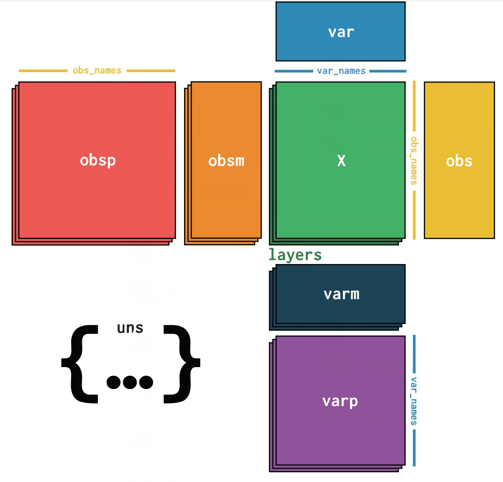
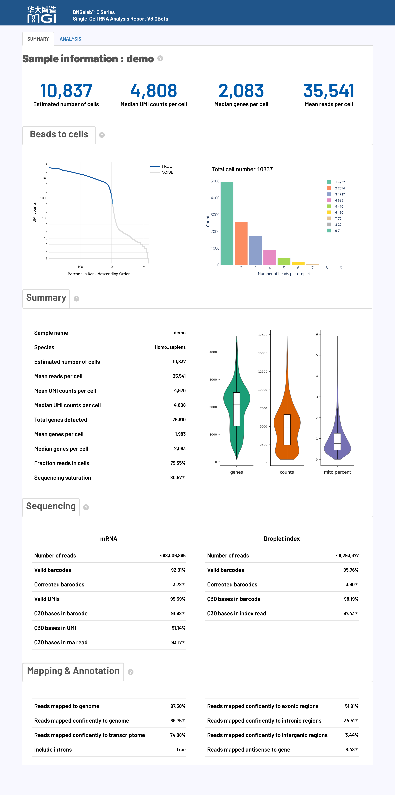
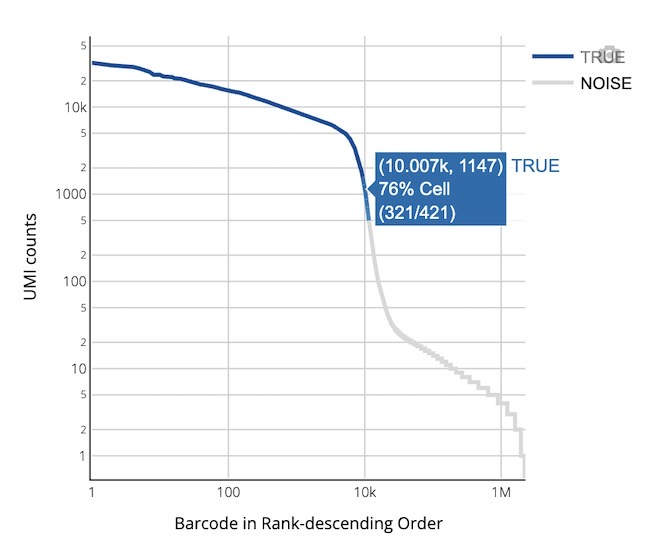
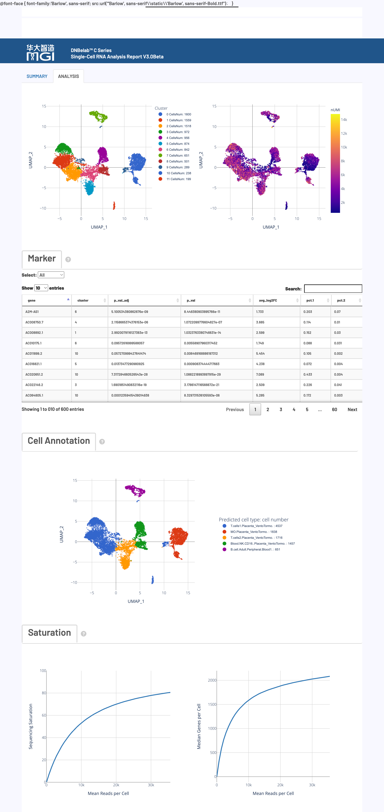

# DNBelab C Series HT scRNA 分析结果目录说明

单细胞RNA分析完成后，会在指定的输出目录中生成以下文件和子目录。本文档详细说明了每个输出文件的内容、格式和用途，帮助用户理解和利用分析结果。

---

## 📁 输出目录结构

```
.
├── analysis/                      # 下游分析结果目录
│   ├── cluster.csv                # 细胞聚类结果文件
│   ├── marker.csv                 # 差异表达基因标记文件
│   └── QC_Cluster.h5ad            # 质控和聚类后的AnnData对象
├── anno_decon_sorted.bam          # 比对注释并排序的BAM文件
├── anno_decon_sorted.bam.bai      # BAM索引文件
├── filter_feature.h5ad            # 过滤后的特征矩阵（AnnData格式）
├── filter_matrix/                 # 过滤后的基因表达矩阵目录
│   ├── barcodes.tsv.gz            # 细胞条形码文件
│   ├── features.tsv.gz            # 基因/特征信息文件
│   └── matrix.mtx.gz              # 稀疏矩阵文件（Market Matrix格式）
├── metrics_summary.xls            # 分析指标汇总表
├── raw_matrix/                    # 原始基因表达矩阵目录
│   ├── barcodes.tsv.gz            # 原始细胞条形码文件
│   ├── features.tsv.gz            # 原始基因/特征信息文件
│   └── matrix.mtx.gz              # 原始稀疏矩阵文件
├── singlecell.csv                 # 单细胞metadata信息表
└── *_scRNA_report.html            # HTML格式的分析报告
```

---

## 📑 目录

- [📁 输出目录结构](#-输出目录结构)
- [📋 文件详细说明](#-文件详细说明)
  - [📊 分析结果目录 (`analysis/`)](#-分析结果目录-analysis)
  - [🧬 比对和注释文件](#-比对和注释文件)
  - [📈 特征矩阵文件](#-特征矩阵文件)
  - [📝 分析指标汇总](#-分析指标汇总)
- [📄 文件格式说明](#-文件格式说明)
- [📊 网页报告释义](#-网页报告释义)

---

## 📋 文件详细说明

### 📊 分析结果目录 (`analysis/`)

#### `cluster.csv`
- **文件类型：** CSV格式
- **内容描述：** 细胞聚类分析结果文件，包含细胞ID、聚类注释和降维坐标信息。
- **用途：** 用于可视化细胞聚类和标识不同细胞类型。

#### `marker.csv`
- **文件类型：** CSV格式
- **内容描述：** 各聚类的差异表达基因（标记基因）文件，记录基因ID、所属聚类、统计显著性和表达量差异等信息。
- **用途：** 用于识别各细胞类型的特征基因。

#### `QC_Cluster.h5ad`
- **文件类型：** AnnData对象（HDF5格式）
- **内容描述：** 经过质控和聚类分析的单细胞数据，包含完整的分析数据和元数据。
- **用途：** 兼容Scanpy等分析工具进行下游分析。
- **参考：** 详细格式参考[AnnData格式说明](#-anndata格式-h5ad)。

---

### 🧬 比对和注释文件

#### `anno_decon_sorted.bam`
- **文件类型：** BAM格式
- **内容描述：** 按基因组坐标排序的比对文件，包含所有比对到参考基因组的reads信息。
- **参考：** 具体参考[BAM格式说明](#-bam格式-bam)。

#### `anno_decon_sorted.bam.bai`
- **文件类型：** BAM索引文件
- **内容描述：** BAM文件的索引文件。
- **用途：** 用于加速BAM文件的随机访问，提高可视化和数据提取效率。
- **索引格式说明：**
    - **BAI格式**：默认生成的索引格式，兼容性最佳，适用于大多数分析工具。
    - **CSI格式**：当BAM文件包含染色体长度超过2^29-1个碱基时自动使用，支持更大的基因组。

---

### 📈 特征矩阵文件

#### `filter_feature.h5ad`
- **文件类型：** AnnData对象（H5AD格式）
- **内容描述：** 经过过滤的特征矩阵，包含过滤后的基因表达数据和细胞注释信息。
- **用途：** 用于下游分析和可视化。
- **参考：** 详细格式参考[AnnData格式说明](#-anndata格式-h5ad)。

#### 过滤后的基因表达矩阵 (`filter_matrix/`)

- **目录内容：** 包含三个核心文件：
    - `barcodes.tsv.gz`：细胞条形码列表，标识通过质控的细胞。
    - `features.tsv.gz`：基因/特征信息，包含基因ID、名称和类型。
    - `matrix.mtx.gz`：基因表达计数矩阵，Market Matrix格式。
- **用途：** 兼容Seurat、Scanpy等分析工具。
- **参考：** 关于矩阵格式详见[Market Matrix格式说明](#-market-matrix格式-mtxgz)。

#### 原始基因表达矩阵 (`raw_matrix/`)

- **目录内容：** 包含三个核心文件：
    - `barcodes.tsv.gz`：原始细胞条形码列表，标识所有检测到的细胞。
    - `features.tsv.gz`：基因/特征信息，包含基因ID、名称和类型。
    - `matrix.mtx.gz`：原始基因表达计数矩阵，Market Matrix格式。
- **用途：** 存储未经过滤的表达数据。
- **参考：** 关于矩阵格式详见[Market Matrix格式说明](#-market-matrix格式-mtxgz)。

---

### 📝 分析指标汇总

#### `metrics_summary.xls`
- **文件类型：** Excel格式
- **内容描述：** 关键分析指标的汇总表，包含测序数据质量、比对率、细胞数量、基因检测数等统计信息。
- **用途：** 用于评估数据质量和分析效果。

#### `singlecell.csv`
- **文件类型：** CSV格式
- **内容描述：** 单细胞质量控制和统计信息表，包含细胞条形码、测序深度、检测基因数等质控指标，以及细胞合并状态和筛选结果。
- **用途：** 支持下游个性化分析和VDJ分析中的细胞筛选与合并操作。

#### `*_scRNA_report.html`
- **文件类型：** HTML网页格式
- **内容描述：** 完整的分析报告，包含质控指标、聚类结果、差异基因表达等交互式可视化图表。
- **用途：** 提供分析结果的综合概述。
- **参考：** 关于详细内容，请查看[网页报告释义](#-网页报告释义)。

---

## 📄 文件格式说明

### 📊 Market Matrix格式 (`.mtx.gz`)
Market Exchange Format (MEX) 是一种用于存储稀疏矩阵的标准文件格式。该格式包含三个核心文件：

#### 文件组成
- **`matrix.mtx.gz`**: 压缩的稀疏矩阵文件。
  - 文件头包含矩阵维度信息（行数、列数、非零元素数）。
  - 每行记录一个非零元素：行索引、列索引、数值。
- **`barcodes.tsv.gz`**: 压缩的细胞条形码文件。
  - 每行包含一个细胞条形码序列。
  - 行号对应矩阵的列索引（细胞）。
  - 条形码格式通常为：例如`CELL1_N2`，其中`CELL1`为细胞ID，`N2`为由两个条形码组成。
- **`features.tsv.gz`**: 压缩的特征信息文件。
  - 每行包含三列：基因ID、基因名称、特征类型。
  - 行号对应矩阵的行索引（基因/特征）。
  - 特征类型包括：`Gene Expression`。

#### 使用场景
- 单细胞RNA-seq数据的标准存储格式。
- 支持多种下游分析工具：Scanpy、Seurat等。
- 适用于大规模稀疏矩阵的高效存储和传输。

---

### 📈 AnnData格式 (`.h5ad`)

AnnData（"Annotated Data"）是专为矩阵型数据设计的数据结构，特别适用于单细胞RNA测序数据分析。它基于HDF5格式，提供了高效的数据存储和访问能力。可通过Python的`scanpy`或`anndata`包进行读取和操作。



#### 核心组件

- **`X`**: 主要数据矩阵，通常存储基因表达计数，支持稀疏矩阵格式以节省内存。
- **`obs`**: 观测（细胞）级别的元数据，Pandas DataFrame格式，包含细胞类型、实验条件等信息。
- **`var`**: 变量（基因）级别的元数据，Pandas DataFrame格式，包含基因符号、基因ID等信息。
- **`obsm`**: 观测级别的多维数组，如UMAP/t-SNE降维结果、主成分分析结果等。
- **`varm`**: 变量级别的多维数组，如基因集评分、基因模块信息等。
- **`layers`**: 不同处理版本的数据矩阵，如原始计数、标准化数据、对数转换数据等。
- **`uns`**: 非结构化元数据，存储分析参数、颜色配置、图表信息等。

---

### 🧬 BAM格式 (`.bam`)

BAM（Binary Alignment Map）文件是一种二进制格式，用于存储与参考基因组对齐的测序数据。

在单细胞RNA测序分析中，BAM文件包含了位置排序的读段，这些读段与基因组和转录组对齐，同时也包含未分配的读段。每个读段都附有细胞和分子条形码信息。

#### BAM读段标签

细胞和分子条形码信息存储在以下TAG字段中：

| 标签 | 类型 | 描述 |
| :--- | :--- | :--- |
| `CB` | Z | 经过错误校正和细胞合并处理后的细胞条形码标识符 |
| `CC` | Z | 经过错误校正细胞条形码序列 |
| `CR` | Z | 测序仪报告的细胞条形码序列 |
| `CY` | Z | 细胞条形码读取质量，由测序仪报告的Phred分数 |
| `UB` | Z | 在具有相同细胞条形码和基因对齐的UMI序列经过错误校正后的UMI序列 |
| `UR` | Z | 测序仪报告的UMI序列 |
| `UY` | Z | UMI序列读取质量，由测序仪报告的Phred分数 |

#### BAM对齐标签

以下标签也会出现在与基因组对齐并与外显子重叠至少一个碱基对的读段上：

| 标签 | 类型 | 描述 |
| :--- | :--- | :--- |
| `TX` | Z | 存在于与此对齐兼容的转录本列表中，与转录本相同链上对齐的读段中 |
| `AN` | Z | 存在于与注释转录本的反义链对齐的读段中 |
| `GX` | Z | 与此读段对齐重叠的基因ID |
| `GN` | Z | 与此读段对齐重叠的基因名称 |
| `RE` | A | 表示此对齐的区域类型的单个字符（E = 外显子区，N = 内含子区，I = 基因间区） |

生成的BAM文件具有多种用途：支持下游分析流程、便于诊断和排查未分配读段的问题、可通过`bam2fastq`工具转换回FASTQ格式以进行重新分析。

---

## 📊 网页报告释义

HTML网页报告提供了单细胞RNA测序分析结果的全面可视化展示和详细解读。该报告包含关键性能指标的评估，帮助用户快速了解实验质量和分析结果。

### 📊 报告主要内容



#### 🧬 细胞指标 (Cell Metrics)
- **Estimated number of cells**
  估计细胞数量：指的是在测序数据中被识别为真实细胞（而非背景噪音或空液滴）的细胞数量，计算过程为合并同液滴的细胞条形码后基于空滴模型（EmptyDrops）预测真实细胞。高于或低于预期值可能表明细胞计数不准确、细胞裂解或液滴生成过程中失败。

- **Species**
  物种信息：显示样本的物种来源或参考基因组信息，来源于构建数据库时提供的信息。

- **Mean reads per cell**
  平均reads数：每个细胞的平均测序reads数量，用于评估单细胞测序深度。计算方法为所有与有效细胞条形码(cell barcode)关联的reads总数除以检测到的细胞数量，该指标不依赖于reads的比对结果。建议≥15,000 reads/细胞，每个细胞所需的测序深度取决于细胞类型（高RNA或低RNA）和所需的分析目标。

- **Median/Mean UMI per cell**
  细胞中位/平均UMI数：每个细胞中检测到的唯一分子标识符(UMI)数量的中位数/平均值，用于评估单细胞测序的基因表达水平。取决于细胞类型和测序深度，低于预期可能是由于测序深度较浅或样本/文库质量问题。

- **Median/Mean genes per cell**
  细胞中位/平均基因数：每个细胞中检测到的基因数量的中位数/平均值。取决于细胞类型和测序深度，低于预期的每细胞中位基因数可能是生物学原因（低转录多样性）或可能表明测序深度低或文库复杂性低。

- **Total genes detected**
  检测到的总基因数：在整个样本中检测到的基因总数，每个基因至少在一个细胞中检测到一个UMI计数。取决于细胞类型和测序深度，低于预期可能是由于测序深度较浅或样本/文库质量问题。

- **Fraction reads in cells**
  细胞内reads比例：样本过滤处理后，细胞相关比对上转录本reads数占总比对上转录本reads数的百分比，表示与细胞相关的UMI可靠地比对到基因组。如果样品中游离的mRNA很多，该数值相对就会偏低。

- **Sequencing saturation**
  测序饱和度：是评估测序深度是否足够的指标，反映文库中分子（UMI）的重复检测率。当测序饱和度较高或曲线增长平缓时，说明继续增加测序深度也不会显著增加检测到的基因数量，表明当前测序深度已经充分。取决于文库复杂性、测序深度和实验分析目标。较低的测序饱和度表明文库复杂性的很大一部分尚未被测序捕获。


#### 🔬 测序指标 (Sequencing Metrics)
- **Number of reads**
  读段数量：指该文库分配获得的总共的测序读段对数。这一数值反映了测序的深度，读段越多，理论上对细胞转录组的覆盖就越全面。

- **Valid barcodes**
  有效条形码：指测序读段中，其条形码能在预设白名单中成功匹配的比例。高比例（通常期望值 >75%）说明细胞识别准确，样本污染较少，建库质量良好。

- **Corrected barcodes**
  纠错条形码：表示原始测序条形码通过纠错算法修正后，成功恢复到白名单中合法条形码的读段比例。这个过程有助于减少因测序错误导致的条形码丢失，提高条形码识别效率。

- **Valid UMIs**
  有效UMI：指从读段中提取的UMI序列中，不包含'N'碱基，且不为同聚物（如AAAAAA）的UMI所占的比例。一个高的有效UMI比例（通常期望值 >75%）意味着UMI质量良好，有利于后续准确区分PCR重复。

- **Q30 Base Quality**
  Q30碱基质量：代表碱基测序准确率高于99.9%（即错误率低于0.1%）的碱基所占比例，针对不同片段分别评估：
  - 条形码区（Barcode）
  - UMI区
  - RNA读段区

> **注：** 以上所有比例指标的计算均以原始测序读段总数（`Number of reads`）作为分母，这确保了各项指标之间的可比性和一致性。

#### 🗺️ 比对指标 (Mapping Metrics)
- **Reads mapped to genome**
  基因组比对读段：指所有测序读段中，成功比对到参考基因组任意位置的比例，包括唯一比对和多重比对。这个指标反映了整体比对的有效性。低于预期可能表明样本质量差、参考基因组不匹配或测序质量问题。

- **Reads mapped confidently to genome**
  基因组置信比对：指能够置信比对到参考基因组的读段比例，主要来源于唯一比对。对于同时比对到单个外显子位点和一个或多个非外显子位点的多比对reads，会选择外显子位点且这类reads也被保留并计入置信比对。该指标更能反映reads定位的可靠性和生物学相关性。低于预期可能表明测序质量差或参考基因组不匹配。

- **Reads mapped confidently to exonic regions**
  外显子区域比对：表示置信比对到注释的外显子区域的读段比例。当reads至少50%的序列与外显子重叠时，该reads被归类为外显子比对。

- **Reads mapped confidently to intronic regions**
  内含子区域比对：表示置信比对到注释内含子区域的读段比例。当reads不符合外显子分类标准但与内含子区域有交集时，被归类为内含子比对。这一部分通常出现在尚未完全剪接的mRNA中或核内RNA检测时。

- **Reads mapped confidently to intergenic regions**
  基因间区域比对：表示置信比对到不属于任何已注释基因的区域（即基因间区）的读段比例。当reads既不符合外显子也不符合内含子分类标准时，被归类为基因间区域比对。比例过高可能提示文库中存在非特异性扩增或参考注释不完整。

- **Reads mapped confidently to transcriptome**
  转录组置信比对：表示置信比对到转录本且能唯一归属于单个基因的读段比例。当reads比对位置存在多个基因重叠时，这些reads会被过滤排除，以确保基因表达定量的准确性。这是评估文库质量的重要指标，期望值一般大于30%，比例越高说明捕获到的mRNA越具有特异性和可靠性。低于预期可能表明转录组注释不完整或样本质量问题。

- **Reads mapped antisense to gene**
  反义基因比对：指成功比对到转录组但方向与注释基因相反的读段比例。这类读段可能来源于技术噪音、天然反义转录本或方向性文库制备不充分。正常情况下该比例应低于20%。当检测到异常高比例（>60%）时，通常提示分析过程中未正确区分3'端和5'端方向。

- **Include introns**
  包含内含子：该参数控制是否在基因表达计数中包含比对到内含子区域的reads。当设置为True时，内含子区域的reads会被计入相应基因的表达量；当设置为False时，只有外显子区域的reads被计入基因表达。

> **注：** 以上所有比例指标的计算均以原始测序读段总数（`Number of reads`）作为分母，这确保了各项指标之间的可比性和一致性。

---

#### 📈 可视化图表1
- **细胞排序图 (Barcode Rank Plot)**：
  可视化每个细胞的UMI（Unique Molecular Identifier）数量分布，直观展示细胞质量控制结果和背景噪音水平。该图表用于展示已识别的有效细胞与背景液滴的UMI分布差异。 蓝线对应的细胞为有效细胞，灰线为背景噪音，蓝色渐变区为细胞和背景噪音的混合区域（细胞通过空滴模型鉴定）。

  

  **(1) 横轴（X轴）**
  
  **Barcode Rank（细胞排序）**：所有检测到的细胞按UMI总数从高到低排序（降序排列，取对数刻度）。
  
  排名越靠左，UMI计数越高，代表可能是真实细胞；排名靠右的条形码UMI计数低，可能是空液滴或背景RNA。
  
  **(2) 纵轴（Y轴）**
  
  **UMI Counts（UMI计数）**：每个细胞对应的总UMI数量（对数刻度）。
  
  UMI越高，代表该液滴中捕获的RNA分子越多，越可能是真实细胞。

  **(3) 图表交互内容**
  
  鼠标悬停时可展示细胞的详细信息，括号内数据分别为细胞的排序位置和UMI数量。百分比cell表示该细胞所处区域中被识别为真实细胞的比例（该区域真实细胞数/该区域总细胞数）。百分比值越高颜色越深（蓝色），比例越低颜色越浅，直观反映细胞密度分布。

- **液滴磁珠分布图（真实细胞）**：
  展示真实细胞液滴中捕获到的细胞条形码数量分布。该图会根据细胞数量筛选参数的调整而动态变化。
  
  液滴中磁珠数量分布理论上符合泊松分布，但实际分布会受多种因素影响，如细胞UMI表达水平较低时可能导致部分磁珠无法有效合并等。
  
  **质量控制指标：** 当结果显示磁珠主要集中在1个时，建议检查：
  - oligo文库的测序深度是否充足（推荐 > 50M reads）
  - cDNA文库与oligo文库的匹配性

- **细胞数据分布图**：
  展示细胞基因数、UMI数、线粒体基因比例的分布情况。
  - **横轴（X轴）**：
    - **基因数（genes）**：每个细胞的基因表达数量。
    - **UMI数（counts）**：每个细胞的UMI数量。
    - **线粒体基因比例（mito percent）**：每个细胞中线粒体基因表达的比例（百分比）。
  
---


  
#### 📈 可视化图表2

- **细胞聚类分析图 (Cluster Analysis)**
  
  **左侧图表 - 细胞类型聚类图：**
  - **算法原理**：基于Louvain算法对单细胞进行无监督聚类分析。
  - **生物学意义**：具有相似基因表达谱的细胞被归为同一聚类，代表潜在的细胞类型或细胞状态。
  - **可视化方式**：通过UMAP降维算法将高维基因表达数据投影到二维空间。
  - **颜色编码**：每个点代表一个细胞，不同颜色对应不同的细胞聚类/类型。
  
  **右侧图表 - UMI表达强度分布图：**
  - **数据来源**：每个细胞检测到的总UMI（唯一分子标识符）数量。
  - **坐标系统**：采用与左图相同的UMAP二维坐标系统，确保细胞位置一致性。
  - **颜色梯度**：UMI数量越高，颜色越深（通常为蓝色到红色渐变）。
  - **质控意义**：帮助识别高质量细胞区域和潜在的技术噪音。

- **标记基因分析 (Marker Genes)**
  
  **功能描述：** 展示每个细胞聚类的特征性差异表达基因，用于识别和注释不同的细胞类型。
  
  **统计方法：** 对每个基因在目标聚类与其他所有聚类之间进行差异表达检验。
  
  **关键指标解释：**
  - **`P-val`**：差异表达的统计显著性p值，数值越小表示差异越显著。
  - **`p_val_adj`**：经Bonferroni多重检验校正后的调整p值，控制假阳性率。
  - **`avg_log2FC`**：平均对数倍数变化，表示目标聚类相对于其他聚类的表达倍数（log2尺度）。
  - **`pct.1`**：目标聚类中表达该基因的细胞比例。
  - **`pct.2`**：其他聚类中表达该基因的细胞比例。
  
  **交互功能：**
  - **聚类筛选**：通过下拉菜单选择特定聚类查看其标记基因。
  - **基因搜索**：通过搜索框快速定位特定基因的表达情况。

- **细胞类型自动注释 (Cell Type Annotation)**
  
  **注释原理：** 基于参考数据库进行细胞类型的自动识别和分类。
  
  **参考数据库：**
  - **scHCL**：人类单细胞景观数据库 (Single-cell Human Cell Landscape)
  - **scMCA**：小鼠细胞图谱数据库 (Single-cell Mouse Cell Atlas)
  
  **物种支持：**
  - **支持物种**：Human（人类）、Mouse（小鼠）
  - **限制说明**：其他物种暂不提供自动注释功能。
  
  **结果解读：**
  - **参考性质**：注释结果仅供参考，需结合生物学背景进行验证。
  - **准确性说明**：由于参考数据库的覆盖范围和样本差异，预测结果可能与实际细胞类型存在偏差。
  - **建议用法**：作为细胞类型鉴定的初步参考，建议结合标记基因分析进行综合判断。

- **测序饱和度分析 (Sequencing Saturation Analysis)**
  
  **左侧图表：测序饱和度曲线 (Sequencing Saturation Curve)**
  - **功能描述**：展示不同测序深度下的测序饱和度指标变化趋势。
  - **计算原理**：测序饱和度 = 1 - (唯一UMI数 / 总UMI数)。
  - **影响因素**：测序深度和文库复杂性。
  - **理想状态**：当所有mRNA转录本都已测序时，饱和度接近1.0 (100%)。
  - **曲线解读**：曲线末端趋于平滑表明测序达到饱和，继续增加测序量对转录本检测的边际效益递减。
  - **质控意义**：评估当前测序深度的充分性和成本效益。
  
  **右侧图表：细胞基因检测中位数曲线 (Median Genes per Cell)**
  - **功能描述**：展示不同测序深度下每个细胞检测到的基因数中位数。
  - **生物学意义**：反映细胞转录组复杂性和测序覆盖度。
  - **曲线解读**：曲线末端趋于平滑表明测序深度充足，继续增加测序量对基因检测数的提升有限。
  - **应用价值**：指导测序深度优化和实验设计改进。