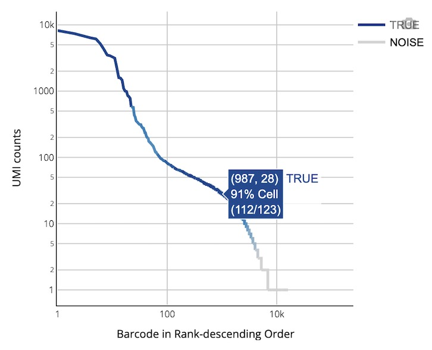

<div align="right">

[🏠 Home](../../README.md) • [中文](scVDJ.md)

</div>

# 🧬 DNBelab C Series HT scVDJ Analysis Output Documentation

<div align="center">

**A Complete Guide to Single-Cell V(D)J Sequencing Analysis Output Files**

[📁 Directory Structure](#output-directory-structure) • [📋 File Details](#detailed-file-description) • [📊 Analysis Metrics](#analysis-metrics-summary) • [📊 Report Interpretation](#web-report-interpretation)

</div>

---

## 📖 Overview <a id="overview"></a>

After single-cell V(D)J analysis is complete, a standardized set of files and subdirectories is generated in the specified output directory for immune receptor repertoire analysis. This document details the content, format, and purpose of each output file to help users efficiently interpret and use V(D)J analysis results.

> 💡 **Tip**: V(D)J analysis requires 5' end RNA sequencing data, and all output files adhere to the AIRR standard and are compatible with mainstream immunoinformatics tools.

> ⚠️ **Prerequisite**: 5' end single-cell RNA sequencing analysis must be completed first.

---

## 📁 Output Directory Structure <a id="output-directory-structure"></a>

```
.
├── airr_annotations.tsv                    # Annotation file in AIRR standard format
├── all_contig_annotations.csv              # Annotation information for all assembled sequences
├── all_contig.fasta                        # FASTA file of all assembled sequences
├── all_contig.fasta.fai                    # Index file for all assembled sequences
├── clonotypes.csv                          # Clonotype analysis results
├── consensus_annotations.csv               # Annotation information for consensus sequences
├── consensus.fasta                         # FASTA file of consensus sequences
├── consensus.fasta.fai                     # Index file for consensus sequences
├── filtered_contig_annotations.csv         # Annotation information for filtered assembled sequences
├── filtered_contig.fasta                   # FASTA file of filtered assembled sequences
├── filtered_contig.fasta.fai               # Index file for filtered assembled sequences
├── metrics_summary.xls                     # Summary of analysis quality metrics
└── *_scVDJ_TR(IG)_report.html              # Analysis report in HTML format
```

---

## 📋 Detailed File Description <a id="detailed-file-description"></a>

### 🧬 V(D)J Assembly and Annotation Files <a id="vdj-assembly-and-annotation-files"></a>

<div align="center">

**🎯 Core Content**: Results of V(D)J contig sequence assembly, precise annotation, and quality assessment, covering the complete information of TCR and BCR rearranged sequences.

</div>

---

#### 🧵 V(D)J Transcript Structure and Composition

**Diagram of a Typical V(D)J Transcript Structure:**

<div align="center">

</div>

<br>

**🔍 Explanation of Important Terms:**

<table style="width:100%; border-collapse: collapse; margin: 15px 0;">
<thead>
<tr>
<th width="20%" align="left"><strong>Region</strong></th>
<th width="30%" align="left"><strong>Abbreviation</strong></th>
<th width="50%" align="left"><strong>Biological Function</strong></th>
</tr>
</thead>
<tbody>
<tr>
<td align="left"><strong>Untranslated Region</strong></td>
<td align="left">UTR</td>
<td>Regulates mRNA stability and translation efficiency; does not encode protein.</td>
</tr>
<tr>
<td align="left"><strong>Framework Region</strong></td>
<td align="left">FWR</td>
<td>Maintains the conserved structural framework of the immunoglobulin fold.</td>
</tr>
<tr>
<td align="left"><strong>Complementarity Determining Region</strong></td>
<td align="left">CDR</td>
<td>The key variable region that directly contacts the antigen and determines binding specificity.</td>
</tr>
</tbody>
</table>

> 🧬 **Technical Advantage**: The V(D)J analysis pipeline can accurately identify and provide the amino acid and nucleotide sequences of the framework (FWR) and complementarity determining (CDR) regions. All V(D)J annotation information for assembled contigs and clonotype consensus sequences is output in various standard formats.

---


#### 🔍 Explanation of Important Annotation Standards

##### 📋 Full-Length Sequence Determination Criteria (Full Length)

<div style="padding: 15px; border-left: 4px solid #007bff; margin: 15px 0;">

A contig sequence is identified as a **full-length sequence** if it meets the following strict conditions simultaneously:

- ✅ The contig sequence perfectly matches the 5' start region of an annotated V gene.
- ✅ The contig sequence extends completely to the 3' end region of a J gene.

</div>

##### 🧬 Productive Sequence Determination Criteria (Productive)

<div style="padding: 15px; border-left: 4px solid #0ea5e9; margin: 15px 0;">

A contig sequence is identified as a **productive sequence** (i.e., functionally active) if it meets all of the following conditions simultaneously:

- ✅ Meets all the requirements for a full-length sequence as described above.
- ✅ Contains a valid start codon (ATG) at the correct position.
- ✅ No premature stop codons are present within the V-J spanning region.
- ✅ The start codon of the V gene and the stop codon of the J gene are in the same reading frame.
- ✅ A complete CDR3 variable region is successfully identified.
- ✅ The length of the V-J spanning region is within the biologically plausible range for the respective gene.

</div>

##### 🎯 High-Confidence Sequence Determination (High Confidence)

**🔬 Expected Receptor Configurations for Different Cell Types:**

<table style="width:100%; border-collapse: collapse; margin: 15px 0;">
<thead>
<tr>
<th width="25%" align="left"><strong>Cell Type</strong></th>
<th width="45%" align="left"><strong>Standard Receptor Configuration</strong></th>
<th width="30%" align="left"><strong>Biological Significance</strong></th>
</tr>
</thead>
<tbody>
<tr>
<td align="left"><strong>T Cell</strong></td>
<td align="left">1 productive TRA chain + 1 productive TRB chain</td>
<td align="left">Normal TCR α/β heterodimer</td>
</tr>
<tr>
<td align="left"><strong>B Cell</strong></td>
<td align="left">1 productive heavy chain + 1 productive light chain (κ or λ)</td>
<td align="left">Normal BCR heavy/light chain pairing</td>
</tr>
</tbody>
</table>

**🤔 Principles for Marking Low-Confidence Sequences:**

<div style="padding: 15px; border-left: 4px solid #ffc107; margin: 15px 0;">

> ⚠️ **Important Note**: The presence of extra productive contigs beyond the normal configuration is typically an anomaly and may arise from:

<table style="width:100%; border-collapse: collapse; margin: 10px 0;">
<thead>
<tr>
<th width="20%" align="left"><strong>Anomaly Type</strong></th>
<th width="80%" align="left"><strong>Cause Analysis</strong></th>
</tr>
</thead>
<tbody>
<tr>
<td align="left"><strong>Ambient Contamination</strong></td>
<td>Non-specific capture of free-floating mRNA, possibly from external sources or nucleic acids released by apoptotic cells.</td>
</tr>
<tr>
<td align="left"><strong>Doublet Events</strong></td>
<td>Droplets containing multiple cells (doublets), making it impossible to distinguish receptor signals from different cells.</td>
</tr>
<tr>
<td align="left"><strong>Technical Artifacts</strong></td>
<td>Artificial sequences generated during PCR amplification or sequencing, including chimeric sequences or incorrect primer binding.</td>
</tr>
</tbody>
</table>

</div>

**📉 Basis for Determining Low-Confidence Sequences:**

<div style="padding: 15px; border-left: 4px solid #ef4444; margin: 15px 0;">

- Abnormal receptor configuration patterns that are biologically highly improbable.
- Suspicious sequences with significantly low UMI support.
- A number of extra productive chains that clearly exceeds expectations.

</div>

---

#### 📄 airr_annotations.tsv

Contains annotated and consensus sequences of V(D)J rearrangements in the AIRR standard format.

*   **Purpose**:
    *   **Standardized Data Exchange**: Serves as an exchange format compliant with AIRR community standards, facilitating integration with other immune repertoire analysis tools.
    *   **In-depth Annotation**: Provides detailed V, D, J gene call information, CIGAR strings, sequence alignment results, and the nucleotide and amino acid sequences of the CDR3 region.

*   **Content and Format**:
    *   The file is in the AIRR standard TSV format.
    *   The fields included in the file are shown in the table below:

    <table style="width:100%; border-collapse: collapse; margin: 15px 0;">
    <thead>
    <tr>
    <th width="25%" align="left"><strong>Field Name</strong></th>
    <th width="75%" align="left"><strong>Detailed Description</strong></th>
    </tr>
    </thead>
    <tbody>
    <tr>
    <td align="left"><code>cell_id</code></td>
    <td>A unique identifier for the cell to which this rearrangement belongs, used for linking single-cell data.</td>
    </tr>
    <tr>
    <td align="left"><code>clone_id</code></td>
    <td>A clonotype ID that identifies the specific clonal group to which this rearrangement belongs, used for clonotype analysis.</td>
    </tr>
    <tr>
    <td align="left"><code>sequence_id</code></td>
    <td>The unique name or identifier of the contig (rearranged sequence).</td>
    </tr>
    <tr>
    <td align="left"><code>sequence</code></td>
    <td>The complete nucleotide sequence of the V(D)J rearrangement, including all variable, diversity, and joining regions.</td>
    </tr>
    <tr>
    <td align="left"><code>sequence_aa</code></td>
    <td>The amino acid sequence translated from the rearranged region, reflecting the functional protein product.</td>
    </tr>
    <tr>
    <td align="left"><code>productive</code></td>
    <td>Indicates whether the rearrangement is productive (biologically functional), requiring conditions like in-frame translation and no stop codons.</td>
    </tr>
    <tr>
    <td align="left"><code>rev_comp</code></td>
    <td>Indicates if the sequence is a reverse complement (default: false), used for sequence orientation marking.</td>
    </tr>
    <tr>
    <td align="left"><code>v_call</code></td>
    <td>The name of the identified V (variable) gene segment.</td>
    </tr>
    <tr>
    <td align="left"><code>v_cigar</code></td>
    <td>The CIGAR string for the V gene alignment, recording detailed alignment information (matches, insertions, deletions, etc.).</td>
    </tr>
    <tr>
    <td align="left"><code>d_call</code></td>
    <td>The name of the identified D (diversity) gene segment (only for heavy and beta chains).</td>
    </tr>
    <tr>
    <td align="left"><code>d_cigar</code></td>
    <td>The CIGAR string for the D gene alignment, detailing the alignment results of the diversity region.</td>
    </tr>
    <tr>
    <td align="left"><code>j_call</code></td>
    <td>The name of the identified J (joining) gene segment, a key element for completing V(D)J recombination.</td>
    </tr>
    <tr>
    <td align="left"><code>j_cigar</code></td>
    <td>The CIGAR string for the J gene alignment, recording precise alignment information of the joining region.</td>
    </tr>
    <tr>
    <td align="left"><code>c_call</code></td>
    <td>The name of the identified C (constant) gene segment, which determines the functional type of the antibody/receptor.</td>
    </tr>
    <tr>
    <td align="left"><code>c_cigar</code></td>
    <td>The CIGAR string for the C gene alignment, recording the alignment details of the constant region.</td>
    </tr>
    <tr>
    <td align="left"><code>sequence_alignment</code></td>
    <td>Detailed alignment result of the V(D)J rearranged region against the reference germline sequence, showing mutations and variations.</td>
    </tr>
    <tr>
    <td align="left"><code>germline_alignment</code></td>
    <td>Inferred full-length germline sequence alignment result, used for somatic hypermutation analysis.</td>
    </tr>
    <tr>
    <td align="left"><code>junction</code></td>
    <td>The nucleotide sequence of the V(D)J rearrangement's junction (CDR3 region), which determines antigen-binding specificity.</td>
    </tr>
    <tr>
    <td align="left"><code>junction_aa</code></td>
    <td>The amino acid sequence of the junction (CDR3 amino acids), the key domain for antigen recognition.</td>
    </tr>
    <tr>
    <td align="left"><code>junction_length</code></td>
    <td>The length of the CDR3 nucleotide sequence (in bp), which affects antigen-binding affinity and specificity.</td>
    </tr>
    <tr>
    <td align="left"><code>junction_aa_length</code></td>
    <td>The length of the CDR3 amino acid sequence (in aa), which determines the spatial structure of the antigen-binding loop.</td>
    </tr>
    <tr>
    <td align="left"><code>v_sequence_start</code></td>
    <td>The start position of the V region in the rearranged sequence (1-based coordinate system).</td>
    </tr>
    <tr>
    <td align="left"><code>v_sequence_end</code></td>
    <td>The end position of the V region in the rearranged sequence (1-based coordinate system).</td>
    </tr>
    <tr>
    <td align="left"><code>d_sequence_start</code></td>
    <td>The start position of the D region in the rearranged sequence (1-based coordinate system).</td>
    </tr>
    <tr>
    <td align="left"><code>d_sequence_end</code></td>
    <td>The end position of the D region in the rearranged sequence (1-based coordinate system).</td>
    </tr>
    <tr>
    <td align="left"><code>j_sequence_start</code></td>
    <td>The start position of the J region in the rearranged sequence (1-based coordinate system).</td>
    </tr>
    <tr>
    <td align="left"><code>j_sequence_end</code></td>
    <td>The end position of the J region in the rearranged sequence (1-based coordinate system).</td>
    </tr>
    <tr>
    <td align="left"><code>c_sequence_start</code></td>
    <td>The start position of the C region in the rearranged sequence (1-based coordinate system).</td>
    </tr>
    <tr>
    <td align="left"><code>c_sequence_end</code></td>
    <td>The end position of the C region in the rearranged sequence (1-based coordinate system).</td>
    </tr>
    <tr>
    <td align="left"><code>consensus_count</code></td>
    <td>The total number of reads supporting this rearrangement, reflecting sequencing depth and sequence reliability.</td>
    </tr>
    <tr>
    <td align="left"><code>duplicate_count</code></td>
    <td>The number of unique UMI molecules supporting this rearrangement, used for deduplication and quantitative analysis.</td>
    </tr>
    <tr>
    <td align="left"><code>is_cell</code></td>
    <td>Indicates whether this rearrangement originates from a real cell (TRUE: cell; FALSE: background/empty droplet).</td>
    </tr>
    </tbody>
    </table>

---

#### 📄 all_contig_annotations.csv

Contains detailed annotation information for all contig sequences (from both cellular and background barcodes).

*   **Purpose**:
    *   **Comprehensive Data Review**: Provides all assembled contig data, including low-quality or background signals, for in-depth quality control analysis.
    *   **Complete Annotation**: Offers full annotation of V(D)J gene segments and CDR/FWR regions.

*   **Content and Format**:
    *   The file is in CSV text format.
    *   The fields included in the file are shown in the table below:

    <table style="width:100%; border-collapse: collapse; margin: 15px 0;">
    <thead>
    <tr>
    <th width="25%" align="left"><strong>Field Name</strong></th>
    <th width="75%" align="left"><strong>Description</strong></th>
    </tr>
    </thead>
    <tbody>
    <tr>
    <td align="left"><code>sample</code></td>
    <td>Sample name of the V(D)J library.</td>
    </tr>
    <tr>
    <td align="left"><code>barcode</code></td>
    <td>The cell ID (or barcode) corresponding to this contig.</td>
    </tr>
    <tr>
    <td align="left"><code>is_cell</code></td>
    <td>A boolean value indicating if this cell ID was identified as a cell (TRUE for cell, FALSE for background).</td>
    </tr>
    <tr>
    <td align="left"><code>contig_id</code></td>
    <td>A unique identifier for this contig.</td>
    </tr>
    <tr>
    <td align="left"><code>high_confidence</code></td>
    <td>A boolean value indicating if this contig was marked as high confidence (not likely to be a chimera or other artifact).</td>
    </tr>
    <tr>
    <td align="left"><code>length</code></td>
    <td>The nucleotide length of the contig sequence (bp).</td>
    </tr>
    <tr>
    <td align="left"><code>chain</code></td>
    <td>The chain type associated with this contig: TRA, TRB, IGK, IGL, or IGH.</td>
    </tr>
    <tr>
    <td align="left"><code>v_gene</code></td>
    <td>The highest-scoring V gene segment, e.g., TRAV1-1.</td>
    </tr>
    <tr>
    <td align="left"><code>d_gene</code></td>
    <td>The highest-scoring D gene segment, e.g., TRBD1.</td>
    </tr>
    <tr>
    <td align="left"><code>j_gene</code></td>
    <td>The highest-scoring J gene segment, e.g., TRAJ1-1.</td>
    </tr>
    <tr>
    <td align="left"><code>full_length</code></td>
    <td>A boolean value indicating if this contig was declared as full-length.</td>
    </tr>
    <tr>
    <td align="left"><code>productive</code></td>
    <td>A boolean value indicating if this contig was declared as productive.</td>
    </tr>
    <tr>
    <td align="left"><code>fwr1</code></td>
    <td>The predicted FWR1 amino acid sequence.</td>
    </tr>
    <tr>
    <td align="left"><code>fwr1_nt</code></td>
    <td>The predicted FWR1 nucleotide sequence.</td>
    </tr>
    <tr>
    <td align="left"><code>cdr1</code></td>
    <td>The predicted CDR1 amino acid sequence.</td>
    </tr>
    <tr>
    <td align="left"><code>cdr1_nt</code></td>
    <td>The predicted CDR1 nucleotide sequence.</td>
    </tr>
    <tr>
    <td align="left"><code>fwr2</code></td>
    <td>The predicted FWR2 amino acid sequence.</td>
    </tr>
    <tr>
    <td align="left"><code>fwr2_nt</code></td>
    <td>The predicted FWR2 nucleotide sequence.</td>
    </tr>
    <tr>
    <td align="left"><code>cdr2</code></td>
    <td>The predicted CDR2 amino acid sequence.</td>
    </tr>
    <tr>
    <td align="left"><code>cdr2_nt</code></td>
    <td>The predicted CDR2 nucleotide sequence.</td>
    </tr>
    <tr>
    <td align="left"><code>fwr3</code></td>
    <td>The predicted FWR3 amino acid sequence.</td>
    </tr>
    <tr>
    <td align="left"><code>fwr3_nt</code></td>
    <td>The predicted FWR3 nucleotide sequence.</td>
    </tr>
    <tr>
    <td align="left"><code>cdr3</code></td>
    <td>The predicted CDR3 amino acid sequence.</td>
    </tr>
    <tr>
    <td align="left"><code>cdr3_nt</code></td>
    <td>The predicted CDR3 nucleotide sequence.</td>
    </tr>
    <tr>
    <td align="left"><code>fwr4</code></td>
    <td>The predicted FWR4 amino acid sequence.</td>
    </tr>
    <tr>
    <td align="left"><code>fwr4_nt</code></td>
    <td>The predicted FWR4 nucleotide sequence.</td>
    </tr>
    <tr>
    <td align="left"><code>reads</code></td>
    <td>The number of reads mapped to this contig.</td>
    </tr>
    <tr>
    <td align="left"><code>umis</code></td>
    <td>The number of distinct UMIs mapped to this contig.</td>
    </tr>
    <tr>
    <td align="left"><code>raw_clonotype_id</code></td>
    <td>The clonotype ID assigned to this cell barcode.</td>
    </tr>
    <tr>
    <td align="left"><code>raw_consensus_id</code></td>
    <td>The consensus sequence ID to which this contig was assigned.</td>
    </tr>
    <tr>
    <td align="left"><code>exact_subclonotype_id</code></td>
    <td>The exact subclonotype ID to which this cell barcode was assigned.</td>
    </tr>
    </tbody>
    </table>

---

#### 📄 all_contig.fasta

Contains the nucleotide sequences of all assembled contigs.

*   **Purpose**:
    *   **Sequence Database**: Serves as a sequence database for all contigs, which can be used for igBLAST alignment or other sequence analyses.
    *   **Data Integrity**: Provides the most original assembly results.
*   **Content and Format**:
    *   Standard FASTA format, where each sequence corresponds to a contig, and the sequence identifier is the unique name of the contig.

---

#### 📄 filtered_contig_annotations.csv

A high-quality subset of `all_contig_annotations.csv`, containing only the annotation results for high-confidence contigs derived from cells.

*   **Purpose**:
    *   **Core Downstream Analysis**: This is the **recommended input file** for defining clonotypes and for most downstream analyses.
    *   **High-Quality Data**: Contains only contigs identified as from real cells and with high confidence, ensuring the accuracy of the analysis results.
*   **Content and Format**:
    *   The file format is identical to `all_contig_annotations.csv`.

---

#### 📄 filtered_contig.fasta

A high-quality subset of `all_contig.fasta`, containing only high-quality contig sequences that have passed quality filtering and cell calling.

*   **Purpose**:
    *   **Trusted Sequence Set**: Provides a high-confidence set of rearranged sequences for subsequent functional analysis or experimental validation.
*   **Content and Format**:
    *   Standard FASTA format, with the sequence identifier being the contig ID.

---

### 📊 Clonotype Analysis Files <a id="clonotype-analysis-files"></a>

<div align="center">

**🎯 Core Content**: Precise identification, frequency statistics, and CDR3-sequence diversity analysis of TCR and BCR clonotypes.

</div>

---

#### 📄 clonotypes.csv

A statistical analysis file for clonotypes, providing detailed descriptive information for each unique clonotype.

*   **Purpose**:
    *   **Clonotype Abundance Analysis**: Statistics on the cell count (frequency) and proportion of each clonotype, used to assess the degree of clonal expansion.
    *   **Immune Diversity Assessment**: Analysis of clonotype distribution to study the diversity of the immune repertoire.
    *   **CDR3 Sequence Analysis**: Provides the precise amino acid and nucleotide sequences of the CDR3 for each clonotype.

*   **Content and Format**:
    *   The file is in CSV format.
    *   The fields included in the file are shown in the table below:

    <table style="width:100%; border-collapse: collapse; margin: 15px 0;">
    <thead>
    <tr>
    <th width="25%" align="left"><strong>Field Name</strong></th>
    <th width="75%" align="left"><strong>Detailed Description</strong></th>
    </tr>
    </thead>
    <tbody>
    <tr>
    <td align="left"><code>clonotype_id</code></td>
    <td>A unique identifier for the clonotype assigned to this consensus sequence, used to link and track all related cells of a specific clonal group.</td>
    </tr>
    <tr>
    <td align="left"><code>frequency</code></td>
    <td>The absolute number of cells observed with this clonotype, reflecting the degree of clonal expansion and the strength of the immune response.</td>
    </tr>
    <tr>
    <td align="left"><code>proportion</code></td>
    <td>The relative proportion of cells of this clonotype within the total cell population, used to assess clonal dominance and diversity distribution.</td>
    </tr>
    <tr>
    <td align="left"><code>cdr3s_aa</code></td>
    <td>A semicolon-separated list of chain:sequence pairs, formatted as "chain_name:CDR3_amino_acid_sequence". Chain names include TRA, TRB, TRG, TRD (for T-cell receptors) and IGK, IGL, IGH (for B-cell receptors). The CDR3 amino acid sequence determines antigen-binding specificity and functional activity.</td>
    </tr>
    <tr>
    <td align="left"><code>cdr3s_nt</code></td>
    <td>A semicolon-separated list of chain:sequence pairs, formatted as "chain_name:CDR3_nucleotide_sequence". Provides the DNA sequence of the CDR3 region, used for somatic hypermutation analysis, clonal evolution tracking, and molecular marker design.</td>
    </tr>
    </tbody>
    </table>

---

#### 📄 consensus_annotations.csv

Provides detailed annotation information for each clonotype's consensus sequence.

*   **Purpose**:
    *   **Representative Sequence Annotation**: Provides complete V(D)J gene and CDR/FWR region annotations for a representative sequence of each clonotype.
    *   **Clonotype-Level Analysis**: Supports sequence feature analysis at the clonotype level.

*   **Content and Format**:
    *   The file is in CSV format.
    *   The fields included in the file are shown in the table below:

    <table style="width:100%; border-collapse: collapse; margin: 15px 0;">
    <thead>
    <tr>
    <th width="25%" align="left"><strong>Field Name</strong></th>
    <th width="75%" align="left"><strong>Description</strong></th>
    </tr>
    </thead>
    <tbody>
    <tr>
    <td align="left"><code>clonotype_id</code></td>
    <td>The clonotype ID assigned to this consensus sequence, corresponding to the clonotype identifier in clonotypes.csv.</td>
    </tr>
    <tr>
    <td align="left"><code>consensus_id</code></td>
    <td>A unique identifier for this consensus sequence, used to link to the sequence in the FASTA file.</td>
    </tr>
    <tr>
    <td align="left"><code>sample</code></td>
    <td>Sample name of the V(D)J library.</td>
    </tr>
    <tr>
    <td align="left"><code>length</code></td>
    <td>The nucleotide length of the consensus sequence.</td>
    </tr>
    <tr>
    <td align="left"><code>chain</code></td>
    <td>The chain type associated with this consensus sequence: TRA, TRB, IGK, IGL, or IGH.</td>
    </tr>
    <tr>
    <td align="left"><code>v_gene</code></td>
    <td>The highest-scoring V gene segment call.</td>
    </tr>
    <tr>
    <td align="left"><code>d_gene</code></td>
    <td>The highest-scoring D gene segment call (if applicable).</td>
    </tr>
    <tr>
    <td align="left"><code>j_gene</code></td>
    <td>The highest-scoring J gene segment call.</td>
    </tr>
    <tr>
    <td align="left"><code>c_gene</code></td>
    <td>The highest-scoring C gene segment call.</td>
    </tr>
    <tr>
    <td align="left"><code>full_length</code></td>
    <td>A boolean value indicating if this consensus sequence was declared as full-length.</td>
    </tr>
    <tr>
    <td align="left"><code>productive</code></td>
    <td>A boolean value indicating if this consensus sequence was declared as productive.</td>
    </tr>
    <tr>
    <td align="left"><code>cdr3</code></td>
    <td>The predicted CDR3 amino acid sequence.</td>
    </tr>
    <tr>
    <td align="left"><code>cdr3_nt</code></td>
    <td>The predicted CDR3 nucleotide sequence.</td>
    </tr>
    <tr>
    <td align="left"><code>reads</code></td>
    <td>The total number of reads supporting this consensus sequence.</td>
    </tr>
    <tr>
    <td align="left"><code>umis</code></td>
    <td>The number of distinct UMIs supporting this consensus sequence.</td>
    </tr>
    </tbody>
    </table>

---

#### 📄 consensus.fasta

A FASTA file containing the consensus sequence for each clonotype.

*   **Purpose**:
    *   **Representative Sequence Library**: Provides a representative sequence for each clonotype, which can be used for functional prediction or comparison with other datasets.
    *   **High-Quality Sequence**: The consensus sequence is generated by a clonotype grouping algorithm and is ideally a full-length sequence (from the 5’ UTR start to the C-gene primer binding site).
*   **Content and Format**:
    *   Standard FASTA format, with the sequence identifier being the `consensus_id`.

---

### 📝 Analysis Metrics Summary <a id="analysis-metrics-summary"></a>

<div align="center">

**🎯 Core Content**: A comprehensive evaluation and summary of statistical metrics for V(D)J assembly quality, providing complete data quality control information.

</div>

---

#### 📄 metrics_summary.xls

A summary table of key analysis metrics in Excel format, providing a comprehensive assessment of the overall experiment quality.

*   **Purpose**:
    *   **Quality Assessment**: Quickly evaluate core metrics such as sequencing quality, cell identification, gene mapping, and assembly effectiveness.
    *   **Results Overview**: Get a comprehensive understanding of the analysis results without having to view all the files.

*   **Content and Format**:
    *   Includes five main categories of key metrics:

        <table style="width:100%; border-collapse: collapse; margin: 15px 0;">
        <thead>
        <tr>
        <th width="20%" align="left"><strong>Metric Category</strong></th>
        <th width="80%" align="left"><strong>Content Included</strong></th>
        </tr>
        </thead>
        <tbody>
        <tr>
        <td align="left"><strong>Basic Statistics</strong></td>
        <td>Basic sequencing metrics such as total reads, valid barcode ratio, UMI quality, Q30 base quality, etc.</td>
        </tr>
        <tr>
        <td align="left"><strong>Cell Identification</strong></td>
        <td>Cell calling results such as estimated number of cells, fraction of reads in cells, mean reads per cell, etc.</td>
        </tr>
        <tr>
        <td align="left"><strong>Gene Mapping</strong></td>
        <td>V(D)J gene mapping ratio, chain-specific mapping statistics, gene usage analysis.</td>
        </tr>
        <tr>
        <td align="left"><strong>Assembly Quality</strong></td>
        <td>Assembly effectiveness evaluation such as full-length sequence ratio, productive sequence ratio, CDR3 identification success rate, etc.</td>
        </tr>
        <tr>
        <td align="left"><strong>Clonotype Analysis</strong></td>
        <td>Immune repertoire features such as clonotype diversity, pairing success rate, major clonotype frequencies, etc.</td>
        </tr>
        </tbody>
        </table>

    *   Built-in recommended quality control standards for user convenience:
        <details open>
        <summary><strong>Recommended Quality Thresholds:</strong></summary>
        <ul>
        <li>✅ <strong>Valid Barcode Rate</strong>: >70%</li>
        <li>✅ <strong>Q30 Base Quality</strong>: >75% (for barcodes and UMIs)</li>
        <li>✅ <strong>V(D)J Gene Mapping Rate</strong>: >30%</li>
        <li>✅ <strong>Productive Pairing Rate</strong>: >20%</li>
        <li>✅ <strong>Mean Reads per Cell</strong>: >5,000</li>
        </ul>
        </details>

---

#### 📄 *_scVDJ_TR(IG)_report.html

An interactive comprehensive analysis report in HTML web format.

*   **Purpose**:
    *   **Results Visualization**: Intuitively displays key results such as QC, rearrangement analysis, and clonotype analysis in the form of interactive charts.
    *   **Results Interpretation**: Provides the biological significance and technical explanation of each metric to help users interpret the data in depth.
    *   **Easy Sharing**: A single HTML file that is easy to circulate and share.

*   **Content and Format**:
    *   Can be opened in any modern browser without an internet connection.
    *   For a detailed interpretation of the report, please refer to the [Web Report Interpretation](#web-report-interpretation) section below.

---

## 📊 Web Report Interpretation <a id="web-report-interpretation"></a>

<div align="center">

**🎯 Overview**: The HTML web report provides a comprehensive visual display and detailed interpretation of single-cell V(D)J sequencing analysis results, including an evaluation of key performance indicators to help users quickly understand the experimental quality and analysis outcomes.

</div>

The HTML web report is a comprehensive platform for displaying single-cell V(D)J sequencing analysis, integrating complete results from data quality control to downstream immune repertoire analysis. The report uses an interactive visual design to help users quickly assess experimental quality, understand analysis results, and guide future research directions.

> 💡 **Usage Suggestion**: It is recommended to review the metrics in the order they are presented in the report.

> **Note**: The following standards are for reference only. Actual quality assessment should consider multiple factors such as tissue type, cell state, and experimental objectives. Significant differences may exist between samples, so judgment should be based on the specific experimental context.

### 📊 Main Report Content and Structure

<div align="center">

</div>

<br>

### 🧬 Detailed Explanation of Core Analysis Metrics

#### 🧬 V(D)J Analysis Metrics <a id="vdj-analysis-metrics"></a>

<div align="center">

**🎯 Core Function**: Cell identification, quality assessment, and immune receptor assembly statistics, providing key indicators of overall experimental effectiveness.

</div>

**📊 Quality Control Standards:**
> **Note**: The following standards are for reference only. Actual quality assessment should consider multiple factors such as tissue type, cell state, and experimental objectives. Significant differences may exist between samples, so judgment should be based on the specific experimental context.

<table style="width:100%; border-collapse: collapse; margin: 15px 0;">
<thead>
<tr>
<th width="25%" align="left"><strong>Metric Name</strong></th>
<th width="30%" align="left"><strong>Recommended</strong></th>
<th width="30%" align="left"><strong>Acceptable</strong></th>
<th width="15%" align="left"><strong>Needs Improvement</strong></th>
</tr>
</thead>
<tbody>
<tr>
<td align="left"><strong>Mean reads per cell</strong></td>
<td align="left">≥ 10,000</td>
<td align="left">5,000–10,000</td>
<td align="left">< 5,000</td>
</tr>
<tr>
<td align="left"><strong>Fraction of Reads in Cells</strong></td>
<td align="left">≥ 50%</td>
<td align="left">20–50%</td>
<td align="left">< 20%</td>
</tr>
</tbody>
</table>

**🔍 Detailed Metric Explanations:**

<table style="width:100%; border-collapse: collapse; margin: 15px 0;">
<thead>
<tr>
<th width="30%" align="left"><strong>Metric Name</strong></th>
<th width="70%" align="left"><strong>Detailed Explanation and Technical Requirements</strong></th>
</tr>
</thead>
<tbody>
<tr>
<td align="left">
<strong>Estimated number of cells</strong>
</td>
<td>
<ul>
<li><strong>Definition</strong>: An estimate of the number of barcodes associated with cells that express the target V(D)J transcripts.</li>
<li><strong>Influencing Factors</strong>: The number of cells loaded and the proportion of cells expressing V(D)J transcripts.</li>
<li><strong>Quality Interpretation</strong>:
<ul><li><strong>Abnormal Causes</strong>: Inaccurate cell counting, poor T/B cell enrichment, poor sample or library quality, low sequencing depth.</li></ul>
</li>
</ul>
</td>
</tr>
<tr>
<td align="left">
<strong>Mean reads per cell</strong>
</td>
<td>
<ul>
<li><strong>Definition</strong>: The ratio of the total number of input sequencing read pairs to the estimated number of valid cells.</li>
<li><strong>Technical Requirements</strong>:
<ul>
<li>Minimum sequencing depth: 5,000 read pairs per cell (for paired-end sequencing).</li>
<li>For single-end sequencing, it is recommended to double the depth to 10,000 reads per cell.</li>
</ul>
</li>
<li><strong>Quality Interpretation</strong>: Insufficient sequencing depth can lead to reduced accuracy in V(D)J cell identification and lower assembly quality.</li>
</ul>
</td>
</tr>
<tr>
<td align="left">
<strong>Fraction of Reads in Cells</strong>
</td>
<td>
<ul>
<li><strong>Definition</strong>: The ratio of the number of reads with cell-associated barcodes to the total number of reads with valid barcodes.</li>
<li><strong>Quality Interpretation</strong>:
<ul>
<li><strong>High-Quality Sample Trait</strong>: A high ratio indicates good cell capture efficiency and effective control of background noise.</li>
<li><strong>Indicator of Quality Issues</strong>: A low ratio may indicate problems with the biological sample, improper cell concentration, issues with library construction quality control, or technical errors.</li>
</ul>
</li>
</ul>
</td>
</tr>
<tr>
<td align="left">
<strong>Median TRA/TRB or IGH/IGK/IGL UMIs per cell</strong>
</td>
<td>
<ul>
<li><strong>Definition</strong>: The median number of UMI molecules assigned to transcripts of a specific immune receptor chain (e.g., IGH, TRA, TRB, IGK, IGL).</li>
<li><strong>Biological Significance</strong>: This metric directly reflects the TCR/BCR expression level and transcriptional activity of each cell.</li>
</ul>
</td>
</tr>
<tr>
<td align="left">
<strong>Number of cells with TRA/TRB or IGH/IGK/IGL contig</strong>
</td>
<td>
<ul>
<li><strong>Definition</strong>: Cells in which at least one T-cell receptor (TRA/TRB) or B-cell receptor (IGH/IGK/IGL) gene rearrangement was detected via single-cell sequencing.</li>
<li><strong>Note</strong>: This includes both complete and incomplete V(D)J rearrangement events. It only requires the presence of a contig for the relevant gene and does not require it to be functional. It may include fragmented contigs that do not span the V-J region or non-productive rearrangements.</li>
</ul>
</td>
</tr>
<tr>
<td align="left">
<strong>Cells with V-J spanning TRA/TRB or IGH/IGK/IGL contig</strong>
</td>
<td>
<ul>
<li><strong>Definition</strong>: Requires the contig to span the recombination junction between the V and J genes. This is stricter than the first category but still includes cells with non-productive rearrangements.</li>
<li><strong>Note</strong>: Excludes invalid contigs where V-J recombination is incomplete.</li>
</ul>
</td>
</tr>
<tr>
<td align="left">
<strong>Cells with productive TRA/TRB or IGH/IGK/IGL contig</strong>
</td>
<td>
<ul>
<li><strong>Definition</strong>: Must simultaneously meet strict criteria: V-J spanning (for TRA/IGK/IGL) or V-D-J spanning (for TRB/IGH), <code>productive</code> is true (no frameshift mutations and a complete CDR3), and is in-frame.</li>
</ul>
</td>
</tr>
<tr>
<td align="left">
<strong>Paired clonotype diversity</strong>
</td>
<td>
<ul>
<li><strong>Definition</strong>: The effective diversity of paired clonotypes, calculated as the inverse Simpson's index of the clonotype frequencies. A value of 1 indicates a sample with minimal diversity—only one distinct clonotype was detected. A value equal to the estimated number of cells indicates a sample with maximum diversity.</li>
<li><strong>Quality Interpretation</strong>:
<ul>
<li>This is a sample-type-dependent metric. Clonotype diversity reflects the complexity and functional state of the immune system.</li>
<li>A lower-than-expected value may be due to a low proportion of B or T cells in the sample, poor sample quality, poor library quality, or low sequencing depth.</li>
</ul>
</li>
</ul>
</td>
</tr>
</tbody>
</table>

---

#### 🔬 Sequencing Metrics <a id="sequencing-metrics"></a>

<div align="center">

**🎯 Core Function**: Basic quality assessment of sequencing data, including barcode recognition rate, alignment quality, and sequencing accuracy.

</div>

**📊 Quality Control Standards:**

> **Note**: The following standards are for reference only. Actual quality assessment should consider multiple factors such as tissue type, cell state, and experimental objectives. Significant differences may exist between samples, so judgment should be based on the specific experimental context.

<table style="width:100%; border-collapse: collapse; margin: 15px 0;">
<thead>
<tr>
<th width="25%" align="left"><strong>Metric Name</strong></th>
<th width="30%" align="left"><strong>Recommended</strong></th>
<th width="30%" align="left"><strong>Acceptable</strong></th>
<th width="15%" align="left"><strong>Needs Improvement</strong></th>
</tr>
</thead>
<tbody>
<tr>
<td align="left"><strong>Valid barcodes</strong></td>
<td align="left">≥ 80%</td>
<td align="left">70–80%</td>
<td align="left">< 70%</td>
</tr>
<tr>
<td align="left"><strong>Valid UMIs</strong></td>
<td align="left">≥ 80%</td>
<td align="left">70–80%</td>
<td align="left">< 70%</td>
</tr>
<tr>
<td align="left"><strong>Q30 Base Quality</strong></td>
<td align="left">≥ 85%</td>
<td align="left">75–85%</td>
<td align="left">< 75%</td>
</tr>
</tbody>
</table>

**🔍 Detailed Metric Explanations:**

<table style="width:100%; border-collapse: collapse; margin: 15px 0;">
<thead>
<tr>
<th width="30%" align="left"><strong>Metric Name</strong></th>
<th width="70%" align="left"><strong>Detailed Explanation and Technical Requirements</strong></th>
</tr>
</thead>
<tbody>
<tr>
<td align="left">
<strong>Valid barcodes</strong>
</td>
<td>
<ul>
<li><strong>Definition</strong>: The proportion of all reads whose Cell Barcode can be matched to the predefined whitelist (with error correction).</li>
<li><strong>Biological Significance</strong>: Reflects the effectiveness of cell labeling.</li>
<li><strong>Quality Interpretation</strong>: A low rate usually suggests sample quality issues leading to barcode degradation and adapter contamination, or a high error rate during the sequencing process.</li>
</ul>
</td>
</tr>
<tr>
<td align="left">
<strong>Valid UMIs</strong>
</td>
<td>
<ul>
<li><strong>Definition</strong>: The proportion of all reads whose Unique Molecular Identifier (UMI) sequence does not contain <code>N</code> bases and is not a homopolymer (e.g., AAAAAA).</li>
<li><strong>Biological Significance</strong>: Reflects the sequencing quality of the UMI sequence, which is key to accurate molecular counting.</li>
</ul>
</td>
</tr>
<tr>
<td align="left">
<strong>Q30 Base Quality</strong>
</td>
<td>
<ul>
<li><strong>Definition</strong>: The proportion of bases with a sequencing quality score of Q30 or higher in cell barcode, UMI, and RNA read sequences.</li>
<li><strong>Significance</strong>: Q30 represents a base sequencing error rate of less than 0.1%. This metric directly affects the accuracy of cell identity, molecular counting, and gene alignment.</li>
</ul>
</td>
</tr>
</tbody>
</table>

---

#### 🧬 Enrichment Metrics <a id="enrichment-metrics"></a>

<div align="center">

**🎯 Core Function**: Evaluation of V(D)J gene enrichment efficiency, reflecting the capture effectiveness of immune receptor sequences.

</div>

**📊 Quality Control Standards:**

> **Note**: The following standards are for reference only. Actual quality assessment should consider multiple factors such as tissue type, cell state, and experimental objectives. Significant differences may exist between samples, so judgment should be based on the specific experimental context.

<table style="width:100%; border-collapse: collapse; margin: 15px 0;">
<thead>
<tr>
<th width="25%" align="left"><strong>Metric Category</strong></th>
<th width="25%" align="left"><strong>Recommended</strong></th>
<th width="25%" align="left"><strong>Acceptable</strong></th>
<th width="25%" align="left"><strong>Needs Improvement</strong></th>
</tr>
</thead>
<tbody>
<tr>
<td align="left"><strong>Reads mapped to any V(D)J gene</strong></td>
<td align="left">≥ 50%</td>
<td align="left">30–50%</td>
<td align="left">< 30%</td>
</tr>
</tbody>
</table>

**🔍 Detailed Metric Explanations:**

<table style="width:100%; border-collapse: collapse; margin: 15px 0;">
<thead>
<tr>
<th width="30%" align="left"><strong>Metric Name</strong></th>
<th width="70%" align="left"><strong>Detailed Explanation and Technical Requirements</strong></th>
</tr>
</thead>
<tbody>
<tr>
<td align="left">
<strong>Reads mapped to any V(D)J gene</strong>
</td>
<td>
<ul>
<li><strong>Definition</strong>: The fraction of reads with valid barcodes that map partially or fully to any germline V(D)J gene segment.</li>
<li><strong>Quality Interpretation</strong>:
<ul>
<li><strong>Quality Warning Threshold (<30%)</strong>: May be caused by a low proportion of B or T cells in the sample, poor sample quality, inefficient library enrichment, or a mismatched reference genome.</li>
</ul>
</li>
</ul>
</td>
</tr>
<tr>
<td align="left">
<strong>Reads mapped to TRA/TRB/IGH/IGK/IGL</strong>
</td>
<td>
<ul>
<li><strong>Type Definition</strong>:</li>
<ul>
<li><strong>TRA vs TRB</strong>: TRA (α chain) expression is typically lower than TRB (β chain), reflecting the normal expression pattern of T-cell receptors.</li>
<li><strong>IGH vs IGK/IGL</strong>: Heavy and light chains show paired expression characteristics, and their mapping ratios reflect the relative expression abundance of each immune receptor chain.</li>
</ul>
<li><strong>Calculation Basis Note</strong>: The above enrichment metrics are all calculated with the total number of valid barcode reads as the denominator.</li>
</ul>
</td>
</tr>
</tbody>
</table>

---

#### 🧬 V(D)J Annotation Analysis (V(D)J Annotation) <a id="vdj-annotation-analysis"></a>

<div align="center">

**🎯 Core Function**: Analysis of productive rearrangement pairing to assess the functional expression level of immune receptors.

</div>

**📊 Quality Control Standards:**

> **Note**: The following standards are for reference only. Actual quality assessment should consider multiple factors such as tissue type, cell state, and experimental objectives. Significant differences may exist between samples, so judgment should be based on the specific experimental context.

<table style="width:100%; border-collapse: collapse; margin: 15px 0;">
<thead>
<tr>
<th width="25%" align="left"><strong>Metric Name</strong></th>
<th width="25%" align="left"><strong>Recommended</strong></th>
<th width="25%" align="left"><strong>Acceptable</strong></th>
<th width="25%" align="left"><strong>Needs Improvement</strong></th>
</tr>
</thead>
<tbody>
<tr>
<td align="left"><strong>Cells with productive V-J spanning pair</strong></td>
<td align="left">≥ 40%</td>
<td align="left">20–40%</td>
<td align="left">< 20%</td>
</tr>
</tbody>
</table>

**🔍 Detailed Metric Explanations:**

<table style="width:100%; border-collapse: collapse; margin: 15px 0;">
<thead>
<tr>
<th width="30%" align="left"><strong>Metric Name</strong></th>
<th width="70%" align="left"><strong>Detailed Explanation and Technical Requirements</strong></th>
</tr>
</thead>
<tbody>
<tr>
<td align="left">
<strong>Number of Cells with Productive V-J Spanning Pair</strong>
</td>
<td>
<ul>
<li><strong>Definition</strong>: The total number of cells with at least one productive contig for a TRA/TRB pair or an immunoglobulin heavy/light chain pair.</li>
</ul>
</td>
</tr>
<tr>
<td align="left">
<strong>Cells with productive V-J spanning pair</strong>
</td>
<td>
<ul>
<li><strong>Definition</strong>: The fraction of cell-associated barcodes that have at least one complete receptor pair (with a productive contig for each chain).</li>
<li><strong>Criteria for a Productive Contig</strong>:
    <ul>
    <li><strong>Spanning Integrity</strong>: The contig annotation completely spans from the 5' end of the V region to the 3' end of the corresponding chain's J region.</li>
    <li><strong>Start Codon</strong>: A valid start codon (ATG) is successfully identified at the expected position in the V sequence.</li>
    <li><strong>CDR3 Integrity</strong>: A complete, in-frame CDR3 amino acid motif is found.</li>
    <li><strong>Correct Reading Frame</strong>: No premature stop codons are present in the aligned V-J region (no frameshift mutations).</li>
    </ul>
</li>
</ul>
</td>
</tr>
<tr>
<td align="left">
<strong>Cells with productive V-J spanning (IGK, IGH) pair</strong>
</td>
<td>
<ul>
<li><strong>Definition</strong>: The fraction of cell-associated barcodes with an (IGK, IGH) immunoglobulin receptor pair where each chain has at least one productive contig.</li>
<li><strong>Note</strong>:
    <ul>
    <li>A specific metric for B-cell datasets.</li>
    <li>Depends on the proportion of B-cell subpopulations expressing the κ light chain (IGK) in the sample.</li>
    <li>The usage ratio of κ/λ light chains varies by species and individual.</li>
    </ul>
</li>
</ul>
</td>
</tr>
<tr>
<td align="left">
<strong>Cells with productive V-J spanning (IGL, IGH) pair</strong>
</td>
<td>
<ul>
<li><strong>Definition</strong>: The fraction of cell-associated barcodes with an (IGL, IGH) immunoglobulin receptor pair where each chain has at least one productive contig.</li>
<li><strong>Note</strong>:
    <ul>
    <li>A specific metric for B-cell datasets.</li>
    <li>Depends on the proportion of B-cell subpopulations expressing the λ light chain (IGL) in the sample.</li>
    <li>Complements the IGK pairing to collectively reflect the B-cell light chain usage pattern.</li>
    </ul>
</li>
</ul>
</td>
</tr>
<tr>
<td align="left">
<strong>Cells with productive V-J spanning (TRA, TRB) pair</strong>
</td>
<td>
<ul>
<li><strong>Definition</strong>: The fraction of cell-associated barcodes with a (TRA, TRB) T-cell receptor pair where each chain has at least one productive contig.</li>
<li><strong>Note</strong>:
    <ul>
    <li>A core metric for T-cell datasets.</li>
    <li>Reflects the successful pairing of TCR α and β chains.</li>
    <li>Indicates the functional receptor expression status of αβ T-cells.</li>
    </ul>
</li>
</ul>
</td>
</tr>
</tbody>
</table>

#### 📈 Visualization Chart 1 <a id="visualization-chart-1"></a>

<div align="center">

**🎯 Core Function**: A multi-dimensional visual display for V(D)J cell quality control, UMI analysis, and immune receptor expression assessment.

</div>

##### 📊 V(D)J Barcode Rank Plot

**Chart Function:** Visualizes the UMI count distribution for each cell (counting only UMIs from productive contigs), providing an intuitive view of cell quality control results and background noise levels.

<div align="center">

</div>

**How to Interpret**:
*   **Axes**:
    *   **X-axis (Barcode Rank)**: All cell barcodes are ranked in descending order of total UMI counts (log scale).
    *   **Y-axis (UMI Counts)**: The total UMI count for each cell (log scale).
*   **Visual Encoding**:
    *   🔵 **Blue Line**: Identified valid cells.
    *   ⚫ **Gray Line**: Background noise cells.
    *   🔷 **Blue Gradient Area**: The mixed transition zone between cells and background noise.
*   **Quality Assessment**:
    *   An ideal sample should show good separation between cell-associated barcodes and the background, indicated by a steep drop in the curve.
    *   BCR V(D)J data may show a group of cells with high UMI counts, which are typically high-expressing plasma cells.

---

#### 📈 Visualization Chart 2 <a id="visualization-chart-2"></a>

<div align="center">

**🎯 Core Function**: A visual display for clonotype abundance analysis and immune receptor diversity assessment.

</div>

##### 📊 Clonotype Abundance Analysis

**Chart Function:** Shows the relative abundance distribution of clonotypes in the sample and the degree of concentration of the immune response.

<div align="center">

</div>

**How to Interpret**:
*   **Top Chart (Top 10 Clonotypes)**: A bar chart showing the percentage of cells occupied by the 10 most abundant clonotypes in the sample. It intuitively reflects the relative abundance distribution of clonotypes and the concentration of the immune response.
*   **Bottom Table (Detailed Information)**: Provides complete descriptive information for the top 10 most abundant clonotypes, including their clonotype ID, CDR3 amino acid/nucleotide sequences, absolute frequency, and relative proportion.

---

## 🎯 More Resources <a id="more-resources"></a>

### 📚 Related Documentation

- [scVDJ pipeline doc](../pipeline/scVDJ_en.md)
- [scVDJ parameter doc](../parameter/scVDJ_en.md)

---

<div align="center">

> 💡 <strong>Tip</strong>
> 
> This document is continuously updated. If you find any errors or need additional information, please provide feedback.
> 
> 📝 <strong>Document Version:</strong> 3.1 | <strong>Last Updated:</strong> April 2026

---

<strong>🔬 DNBelab C Series HT scVDJ Analysis Software</strong>  
<em>High-Performance Single-Cell V(D)J Sequencing Data Analysis Pipeline</em>

</div>
