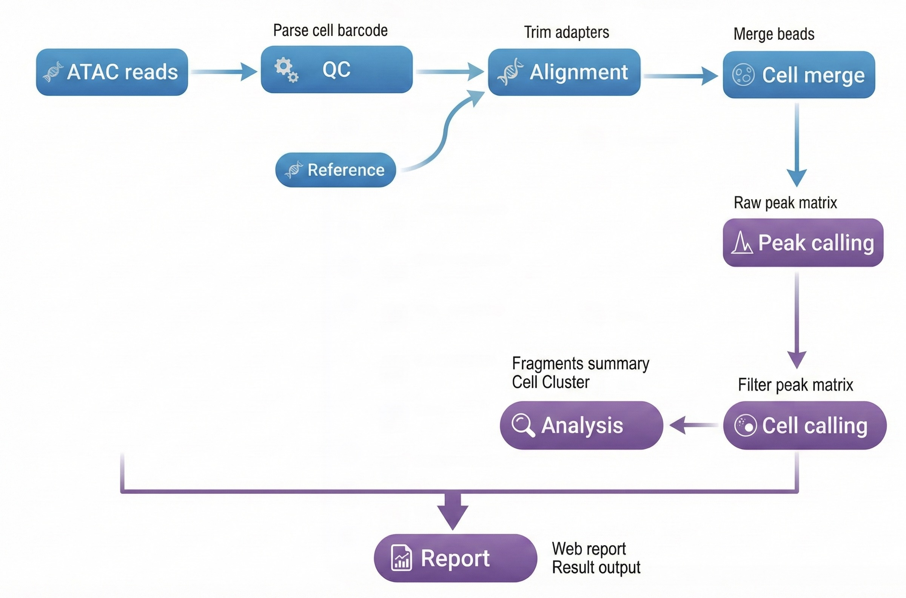

<div align="right" style="margin-bottom: 20px; max-width: 1200px; margin-left: auto; margin-right: auto;">

[首页](../../README.md)

</div>

<div align="center" style="padding: 40px 20px; background: linear-gradient(135deg, #f5f5f7 0%, #ffffff 100%); border-radius: 12px; margin-bottom: 30px; max-width: 1200px; margin-left: auto; margin-right: auto;">

<h1 style="font-size: 48px; font-weight: 600; color: #1d1d1f; margin: 0 0 16px 0; letter-spacing: -0.02em;">DNBelab C Series HT scATAC 分析流程</h1>

<p style="font-size: 21px; color: #86868b; margin: 0 0 30px 0; font-weight: 400;">单细胞 ATAC 测序数据分析完整指南</p>

<div style="display: flex; gap: 12px; justify-content: center; flex-wrap: wrap;">
<a href="#概述" style="background: #0071e3; color: white; padding: 8px 16px; border-radius: 980px; text-decoration: none; font-size: 14px;">概述</a>
<a href="#文件准备" style="background: transparent; color: #0071e3; padding: 8px 16px; border-radius: 980px; text-decoration: none; font-size: 14px; border: 1px solid #0071e3;">文件准备</a>
<a href="#参考数据库" style="background: transparent; color: #0071e3; padding: 8px 16px; border-radius: 980px; text-decoration: none; font-size: 14px; border: 1px solid #0071e3;">参考数据库</a>
<a href="#主分析流程" style="background: transparent; color: #0071e3; padding: 8px 16px; border-radius: 980px; text-decoration: none; font-size: 14px; border: 1px solid #0071e3;">主分析流程</a>
<a href="#结果解析" style="background: transparent; color: #0071e3; padding: 8px 16px; border-radius: 980px; text-decoration: none; font-size: 14px; border: 1px solid #0071e3;">结果解析</a>
</div>

</div>

<div style="max-width: 1200px; margin: 0 auto;"><hr style="border: none; border-top: 1px solid #d2d2d7; margin: 24px 0;"></div>

<div style="background: #f5f5f7; border-radius: 12px; padding: 24px; margin: 24px auto; max-width: 1200px;">

## 概述 <a id="概述"></a>

</div>

<div style="background: #ffffff; border-radius: 12px; padding: 24px; margin: 20px auto; max-width: 1200px; border: 1px solid #e5e5e5; box-shadow: 0 1px 3px rgba(0,0,0,0.1);">

本文档详细介绍了使用 dnbc4tools 进行单细胞 ATAC 测序数据分析的完整流程。

**工作流程**：原始数据 → 质量控制 → 比对 → 磁珠合并 → Peak调用 → 细胞识别 → 降维聚类 → 分析报告

<div align="center">
  
</div>

<div style="background-color: #e7f3fe; border-left: 6px solid #2196F3; padding: 15px; margin: 1.5em 0; border-radius: 4px;">
 <strong>使用说明</strong>：<code>$dnbc4tools</code> 代表可执行程序路径，需替换为您的实际安装路径。本文示例使用换行符 `\` 分隔命令以提高可读性，实际分析时可写为单行。
</div>


</div>

<div style="max-width: 1200px; margin: 0 auto;"><hr style="border: none; border-top: 1px solid #d2d2d7; margin: 24px 0;"></div>

<div style="background: #f5f5f7; border-radius: 12px; padding: 24px; margin: 24px auto; max-width: 1200px;">

## 文件准备 <a id="文件准备"></a>

</div>

<div style="background: #ffffff; border-radius: 12px; padding: 24px; margin: 20px auto; max-width: 1200px; border: 1px solid #e5e5e5; box-shadow: 0 1px 3px rgba(0,0,0,0.1);">

分析需要 FASTQ 文件：

<table style="width:100%; border-collapse: collapse; margin: 1.5em 0; box-shadow: 0 2px 3px rgba(0,0,0,0.1);">
  <thead style="background-color: #f2f2f2; border-bottom: 2px solid #ddd;">
    <tr>
      <th style="padding: 12px 15px; border: 1px solid #ddd; text-align: left;">文件类型</th>
      <th style="padding: 12px 15px; border: 1px solid #ddd; text-align: left;">说明</th>
    </tr>
  </thead>
  <tbody>
    <tr>
      <td style="padding: 12px 15px; border: 1px solid #ddd;"><b>ATAC 文库</b></td>
      <td style="padding: 12px 15px; border: 1px solid #ddd;">包含 Cell Barcode 和染色质开放区域信息的测序数据</td>
    </tr>
  </tbody>
</table>

<div style="background-color: #fffbe6; border-left: 6px solid #ffc107; padding: 15px; margin: 1.5em 0; border-radius: 4px;">
 <strong>注意</strong>：确保 FASTQ 文件质量良好，并记录好文件路径用于后续分析。
</div>


</div>

<div style="max-width: 1200px; margin: 0 auto;"><hr style="border: none; border-top: 1px solid #d2d2d7; margin: 24px 0;"></div>

<div style="background: #f5f5f7; border-radius: 12px; padding: 24px; margin: 24px auto; max-width: 1200px;">

## 参考数据库 <a id="参考数据库"></a>

</div>

<div style="background: #ffffff; border-radius: 12px; padding: 24px; margin: 20px auto; max-width: 1200px; border: 1px solid #e5e5e5; box-shadow: 0 1px 3px rgba(0,0,0,0.1);">

### 文件要求

<table style="width:100%; border-collapse: collapse; margin: 1.5em 0; box-shadow: 0 2px 3px rgba(0,0,0,0.1);">
  <thead style="background-color: #f2f2f2; border-bottom: 2px solid #ddd;">
    <tr>
      <th style="padding: 12px 15px; border: 1px solid #ddd; text-align: left;">文件类型</th>
      <th style="padding: 12px 15px; border: 1px solid #ddd; text-align: left;">格式</th>
      <th style="padding: 12px 15px; border: 1px solid #ddd; text-align: left;">说明</th>
    </tr>
  </thead>
  <tbody>
    <tr>
      <td style="padding: 12px 15px; border: 1px solid #ddd;"><b>基因组文件</b></td>
      <td style="padding: 12px 15px; border: 1px solid #ddd;">FASTA</td>
      <td style="padding: 12px 15px; border: 1px solid #ddd;">包含特定物种的完整基因组序列，包括染色体、线粒体及其他遗传信息，通常为主装配版本。这些文件为基因组分析和比对提供基础数据。</td>
    </tr>
    <tr>
      <td style="padding: 12px 15px; border: 1px solid #ddd;"><b>注释文件</b></td>
      <td style="padding: 12px 15px; border: 1px solid #ddd;">GTF</td>
      <td style="padding: 12px 15px; border: 1px solid #ddd;">包含基因组中基因、转录本、外显子及其他功能区域的详细信息。该文件标识基因的位置、类型及其相关属性。</td>
    </tr>
  </tbody>
</table>

<div style="background-color: #e7f3fe; border-left: 6px solid #2196F3; padding: 15px; margin: 1.5em 0; border-radius: 4px;">
 <strong>推荐数据来源</strong>：优先使用 <a href="https://www.ensembl.org/index.html">Ensembl 数据库</a> 提供的文件。Ensembl 的 GTF 文件包含可选标签，便于通过 <code>dnbc4tools tools mkgtf</code> 进行过滤。
</div>

**GTF 文件要求：**
<ul>
  <li>必须包含 <code>gene</code> 或 <code>transcript</code> 类型以及 <code>exon</code> 类型的注释。</li>
  <li>属性中必须包含 <code>gene_id</code> 或 <code>gene_name</code> 以及 <code>transcript_id</code> 或 <code>transcript_name</code>。</li>
  <li>不支持 GFF 文件格式。</li>
  <li>基因组文件与注释文件需版本对应。</li>
</ul>

### GTF 文件处理（可选）

有关 GTF 文件过滤的详细信息，请[参考 scRNA 分析流程](./scRNA.md#gtf-file-processing-optional-zh)。


### 构建参考数据库

在运行 `dnbc4tools atac run` 分析之前，需要先构建参考数据库。此步骤使用注释文件（GTF）和参考基因组（FASTA）构建索引文件，用于测序 reads 的比对和统计分析。

```shell
$dnbc4tools atac mkref \
  --fasta genome.fa \
  --ingtf genes.gtf \
  --species Mus_musculus 
```

**输出结果**：

成功运行后，将在指定位置创建参考数据库目录，包含以下文件结构：

```
/database/scATAC/Mus_musculus
├── fasta
│   ├── genome.fa
│   ├── genome.fa.fai
│   ├── genome.index
│   └── genome.index.log
├── genes
│   └── genes.gtf
├── ref.json
└── regions
    ├── chrom.sizes
    ├── promoter.bed
    └── tss.bed
```

其中 `ref.json` 文件记录数据库的主要信息：

```json
{
    "species": "Mus_musculus",
    "input_fasta_files": [
        "genome.fa"
    ],
    "input_gtf_files": [
        "genes.gtf"
    ],
    "genome": "fasta/genome.fa",
    "index": "fasta/genome.index",
    "gtf": "genes/genes.gtf",
    "chrmt": "chrM",
    "chloroplast": "None",
    "chromeSize": "regions/chrom.sizes",
    "tss": "regions/tss.bed",
    "promoter": "regions/promoter.bed",
    "version": "3.1",
    "blacklist": "None",
    "genomesize": "mm"
}
```

<div style="background-color: #fffbe6; border-left: 6px solid #ffc107; padding: 15px; margin: 1.5em 0; border-radius: 4px;">
 <strong>注意</strong>：构建参考数据库可能需要较长时间，取决于基因组大小和计算机性能。软件主分析流程兼容旧版本数据库。
</div>

运行时打印信息，以下是一个示例：

```shell
 2026-04-03 16:32:43 Creating new reference folder at /database/scATAC/Homo_sapiens                            
...done

 2026-04-03 16:32:43 Writing genome FASTA file into reference folder...                             
...done

 2026-04-03 16:33:33 Indexing genome FASTA file...                                                  
...done

 2026-04-03 16:33:44 Writing genes GTF file into reference folder...                                
...done

 2026-04-03 16:33:59 Extracting TSS and promoter regions from GTF file...                           
...done

 2026-04-03 16:34:03 Generating Chromap genome index...                                             
...done

 2026-04-03 16:42:28 Writing reference JSON file...                                                 
...done

 2026-04-03 16:42:28 ATAC reference building finished.
```


</div>

<div style="max-width: 1200px; margin: 0 auto;"><hr style="border: none; border-top: 1px solid #d2d2d7; margin: 24px 0;"></div>

<div style="background: #f5f5f7; border-radius: 12px; padding: 24px; margin: 24px auto; max-width: 1200px;">

## 主分析流程 <a id="主分析流程"></a>

</div>

<div style="background: #ffffff; border-radius: 12px; padding: 24px; margin: 20px auto; max-width: 1200px; border: 1px solid #e5e5e5; box-shadow: 0 1px 3px rgba(0,0,0,0.1);">

### 多样本批处理（可选）

为了简化每个样本单独生成主分析流程，可以使用配置文件来生成一个包含多个样本的主流程 shell 脚本。以下是一个示例步骤或脚本模板：

```shell
$dnbc4tools atac multi \
  --list sample.tsv \
  --genomeDir /database/scATAC/Mus_musculus \
  --threads 10
```

其中 `sample.tsv` 文件使用制表符 (`\t`) 分隔，包含两列：

<table style="width:100%; border-collapse: collapse; margin: 1.5em 0; box-shadow: 0 2px 3px rgba(0,0,0,0.1);">
  <thead style="background-color: #f2f2f2; border-bottom: 2px solid #ddd;">
    <tr>
      <th style="padding: 12px 15px; border: 1px solid #ddd; text-align: left;">列</th>
      <th style="padding: 12px 15px; border: 1px solid #ddd; text-align: left;">内容</th>
    </tr>
  </thead>
  <tbody>
    <tr>
      <td style="padding: 12px 15px; border: 1px solid #ddd;">1</td>
      <td style="padding: 12px 15px; border: 1px solid #ddd;">样本名称</td>
    </tr>
    <tr>
      <td style="padding: 12px 15px; border: 1px solid #ddd;">2</td>
      <td style="padding: 12px 15px; border: 1px solid #ddd;">文库测序数据</td>
    </tr>
  </tbody>
</table>

<div style="background-color: #fffbe6; border-left: 6px solid #ffc107; padding: 15px; margin: 1.5em 0; border-radius: 4px;">
 <strong>注意</strong>：
多个fastq文件以逗号（`,`）分隔，
R1和R2文件以分号（`;`）分隔
</div>

```tsv
sample1	/data/sample1_R1.fq.gz;/data/sample1_R2.fq.gz
sample2	/data/sample2_R1.fq.gz;/data/sample2_R2.fq.gz
sample3	/data/sample3_1_R1.fq.gz,/data/sample3_2_R1.fq.gz;/data/sample3_1_R2.fq.gz,/data/sample3_2_R2.fq.gz
```

运行完成后输出：

```shell
sample1.sh
sample2.sh
sample3.sh
```

其中文件 sample1.sh 如下：

```shell
$cat sample1.sh
/opt/software/dnbc4tools3.1/dnbc4tools atac run --name sample1 --fastq1 /data/sample1_R1.fq.gz --fastq2 /data/sample1_R2.fq.gz --genomeDir /database/scATAC/Mus_musculus --threads 10 
```

执行第四步进行主流程分析。


### 单样本分析

ATAC 主分析流程使用单个样本单细胞 ATAC 文库测序数据。该流程的核心步骤包括：
<ol>
  <li><strong>数据处理</strong>：执行质控与比对，生成所有磁珠的 <code>fragments</code> 文件。</li>
  <li><strong>Peak 调用</strong>：基于聚合数据进行 peak calling，识别开放染色质区域。</li>
  <li><strong>细胞识别</strong>：利用 peaks 区域的片段信息识别有效细胞。</li>
  <li><strong>高级分析</strong>：对细胞进行过滤、降维与聚类。</li>
  <li><strong>报告生成</strong>：整合各步骤结果，输出 HTML 网页报告和其他分析结果文件。</li>
</ol>

支持两种输入方式：

**方式1：目录方式（推荐）**

```shell
$dnbc4tools atac run \
  --name sample \
  --fastqs /data \
  --genomeDir /database/scATAC/Mus_musculus \
  --threads 10
```
目录结构示例：
```
/data/

├── sample_R1.fastq.gz
└── sample_R2.fastq.gz

```

**方式2：单独参数方式**

```shell
$dnbc4tools atac run \
  --name sample \
  --fastq1 /data/sample_R1.fastq.gz \
  --fastq2 /data/sample_R2.fastq.gz \
  --genomeDir /database/scATAC/Mus_musculus \
  --threads 10
```

在对试剂版本和暗反应自动检测后，软件开始运行分析，以下是一个示例：
```shell

──────────────────────────── Parsed FASTQ Inputs — 2025-11-12 15:05:39 ─────────────────────────────
┌───────┬──────────────────────────────────────────────────────────────────────────────────────────┐
│ Type  │ Path                                                                                     │
├───────┼──────────────────────────────────────────────────────────────────────────────────────────┤
│ Read1 │ /data/sample_R1.fastq.gz                                                                 │
│ Read2 │ /data/sample_R2.fastq.gz                                                                 │
└───────┴──────────────────────────────────────────────────────────────────────────────────────────┘
────────────────────────────────────────────────────────────────────────────────────────────────────

──────────────────────────── Chemistry Detection — 2025-11-12 15:05:49 ─────────────────────────────
┌─────────────────────────────────┬────────────────────────────────────────────────────────────────┐
│ Type                            │ Result                                                         │
├─────────────────────────────────┼────────────────────────────────────────────────────────────────┤
│ Read1                           │ darkreaction                                                   │
│ Read2                           │ darkreaction                                                   │
└─────────────────────────────────┴────────────────────────────────────────────────────────────────┘
────────────────────────────────────────────────────────────────────────────────────────────────────

 2025-11-12 15:05:49 Performing raw data quality control and alignment...                           
...done

 2025-11-12 15:24:56 Calculating bead similarity and merging beads within droplets...               
...done

 2025-11-12 15:28:00 Processing fragments for peak calling...                                       
...done

 2025-11-12 15:31:22 Generating raw peak count matrix...                                            
...done

 2025-11-12 15:38:18 Generating cell-filtered peak count matrix...                                  
...done

 2025-11-12 15:43:23 Performing dimensionality reduction and clustering...                          
...done

 2025-11-12 15:50:03 Generating analysis report and summary statistics...                           
...done

 2025-11-12 15:50:19 Analysis Finished. Elapsed Time: 0:44:30
```

当出现 `Analysis Finished` 消息时，表示分析已成功完成。


</div>

<div style="max-width: 1200px; margin: 0 auto;"><hr style="border: none; border-top: 1px solid #d2d2d7; margin: 24px 0;"></div>

<div style="background: #f5f5f7; border-radius: 12px; padding: 24px; margin: 24px auto; max-width: 1200px;">

## 结果解析 <a id="结果解析"></a>

</div>

<div style="background: #ffffff; border-radius: 12px; padding: 24px; margin: 20px auto; max-width: 1200px; border: 1px solid #e5e5e5; box-shadow: 0 1px 3px rgba(0,0,0,0.1);">

分析完成后，将生成结果输出目录outs，logs日志目录。

```
. 
├── *_scATAC_report.html
├── filter_peak_matrix/
│   ├── barcodes.tsv.gz
│   ├── matrix.mtx.gz
│   └── peaks.bed.gz
├── fragments.tsv.gz
├── fragments.tsv.gz.tbi
├── metrics_summary.xls
├── raw_peak_matrix/
│   ├── barcodes.tsv.gz
│   ├── matrix.mtx.gz
│   └── peaks.bed.gz
└── singlecell.csv
```


</div>

<div style="max-width: 1200px; margin: 0 auto;"><hr style="border: none; border-top: 1px solid #d2d2d7; margin: 24px 0;"></div>

<div style="background: #f5f5f7; border-radius: 12px; padding: 24px; margin: 24px auto; max-width: 1200px;">

## 相关文档

</div>

<div style="background: #ffffff; border-radius: 12px; padding: 24px; margin: 20px auto; max-width: 1200px; border: 1px solid #e5e5e5; box-shadow: 0 1px 3px rgba(0,0,0,0.1);" markdown="1">

| 资源 | 描述 |
| :--- | :--- |
| [输出文件使用方法](../io.md) | 了解输出文件结构和格式 |
| [分析参数设置](../parameter/scATAC.md) | 查看完整参数选项和说明 |
| [输出文件解释](../outs/scATAC.md) | 详细解读分析结果文件 |


</div>

<div style="max-width: 1200px; margin: 0 auto;"><hr style="border: none; border-top: 1px solid #d2d2d7; margin: 24px 0;"></div>

<div style="background: #f5f5f7; border-radius: 12px; padding: 24px; margin: 24px auto; max-width: 1200px;">

## 常见问题

</div>

<div style="background: #ffffff; border-radius: 12px; padding: 24px; margin: 20px auto; max-width: 1200px; border: 1px solid #e5e5e5; box-shadow: 0 1px 3px rgba(0,0,0,0.1);">

本节正在更新中。

</div>

<div style="max-width: 1200px; margin: 0 auto;"><hr style="border: none; border-top: 1px solid #d2d2d7; margin: 24px 0;"></div>

<div style="background: #f5f5f7; border-radius: 12px; padding: 24px; margin: 24px auto; max-width: 1200px;">

<div align="center">

> <strong>反馈与支持</strong>
>
> 本文档持续更新中，如发现内容错误或需要补充的信息，欢迎反馈。
>
> <strong>文档版本：</strong> 3.1 | <strong>最后更新：</strong> 2026年4月

</div>

</div>
