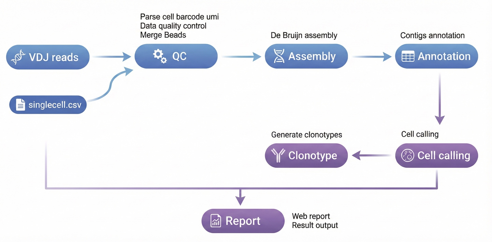

<div align="right">

[🏠 主页](../../README.md) • [English](scVDJ_en.md)

</div>

# 🧬 DNBelab C Series HT scVDJ 分析流程

<div align="center">

**单细胞 VDJ 测序数据分析完整指南**

[📋 概述](#概述) • [📁 文件准备](#文件准备) • [🚀 主分析流程](#主分析流程) • [📊 结果解析](#结果解析)

</div>

---

## 📋 概述 <a id="概述"></a>

本文档详细介绍了使用 dnbc4tools 进行单细胞 VDJ 测序数据分析的完整流程。

**工作流程**：5端转录组分析 → VDJ文库处理 → 序列组装注释 → 细胞过滤 → 克隆型分析 → 分析报告

<div align="center">
  
</div>

<div style="background-color: #e7f3fe; border-left: 6px solid #2196F3; padding: 15px; margin: 1.5em 0; border-radius: 4px;">
💡 <strong>使用说明</strong>：<code>$dnbc4tools</code> 代表可执行程序路径，需替换为您的实际安装路径。本文示例使用换行符 `\` 分隔命令以提高可读性，实际分析时可写为单行。
</div>

---

<br>

## 📁 文件准备 <a id="文件准备"></a>

### 5端转录组分析

转录组分析请参考 `dnbc4tools rna run`。5'端转录组分析主流程需在单细胞RNA主流程分析基础上添加参数 `--end5`。

为单个样本生成表达矩阵，以下是一个示例步骤或脚本模板：

```shell
$dnbc4tools rna run \
	--name sample_5rna \
	--cDNAfastq1 /data/sample_cDNA_R1.fastq.gz \
	--cDNAfastq2 /data/sample_cDNA_R2.fastq.gz \
	--oligofastq1 /data/sample_oligo1_1.fq.gz,/data/sample_oligo2_1.fq.gz \
	--oligofastq2 /data/sample_oligo1_2.fq.gz,/data/sample_oligo2_2.fq.gz \
	--genomeDir /opt/database/Homo_sapiens \
	--threads 30 \
	--end5
```

<div style="background-color: #fffbe6; border-left: 6px solid #ffc107; padding: 15px; margin: 1.5em 0; border-radius: 4px;">
⚠️ <strong>注意</strong>：5端转录组分析是VDJ分析的前提，需要先完成此步骤才能进行后续分析。
</div>

### VDJ分析所需文件

分析需要以下文件：

<table style="width:100%; border-collapse: collapse; margin: 1.5em 0; box-shadow: 0 2px 3px rgba(0,0,0,0.1);">
  <thead style="background-color: #f2f2f2; border-bottom: 2px solid #ddd;">
    <tr>
      <th style="padding: 12px 15px; border: 1px solid #ddd; text-align: left;">文件类型</th>
      <th style="padding: 12px 15px; border: 1px solid #ddd; text-align: left;">说明</th>
    </tr>
  </thead>
  <tbody>
    <tr>
      <td style="padding: 12px 15px; border: 1px solid #ddd;"><b>FASTQ文件</b></td>
      <td style="padding: 12px 15px; border: 1px solid #ddd;">VDJ文库测序数据，包含TCR或BCR序列信息</td>
    </tr>
    <tr>
      <td style="padding: 12px 15px; border: 1px solid #ddd;"><b>singlecell.csv文件</b></td>
      <td style="padding: 12px 15px; border: 1px solid #ddd;">5端转录组分析结果中的细胞信息文件</td>
    </tr>
  </tbody>
</table>

分析需要5'端转录组分析结果目录中的 `singlecell.csv` 文件。该文件包含 `cell` 和 `barcode` 列的合并信息，以及 `is_cell_barcode` 列（1表示细胞，0表示非细胞），用于鉴定有效的细胞。

<div style="background-color: #fffbe6; border-left: 6px solid #ffc107; padding: 15px; margin: 1.5em 0; border-radius: 4px;">
⚠️ <strong>注意</strong>：确保singlecell.csv文件路径正确，该文件是连接转录组和VDJ分析的关键。
</div>

参考示例文件内容：

```csv
cell,reads,gene,umi,is_cell_barcode,barcode
CELL1118_N3,1485813,5693,57580,1,AGATCGCCTACGATCACGAT;GGTGGAAGGTGAGAGAAGCG;GTAGTTCTAGGCTAAGTACT
CELL1651_N3,805447,4881,32131,1,ATCTCAAGCCCACCGTGTGT;CATCAATTAAGTGATCGCAT;CCTAACTGAGGAACGCTTAG
CELL4_N3,820269,5649,30326,1,AACACCTGATCGTTCAATAA;AATTCGAAGGTAGTCGGAAT;CACATGTTACATGTTCTATA
CELL906_N3,656624,4853,28142,1,ACGTCCGCGTGACCATGTGC;AGGAGCTCCATTGATCTTAA;CAATCCGGAGAACGTATCTG
CELL1577_N2,672637,4610,24822,1,ATATTCTCACGTAACGGATG;TAGGAACTCGGCTTAGATCT
CELL2064_N2,542608,2355,23324,1,CATAAGCACTCACCGCTAGT;GTCTCACAGTTGTTCACTAG
CELL1332_N6,580950,4702,22953,1,AGGTGTAAGCCTACCGGACC;CGCACTCACCTAACATTGTG;CTTGCCGCGCTATCAATGCA;GCCACTAGTCGACGCGGTTG;GTCAGCATGCTCTTCCACAG;TCGATATCCTCACTCTTAAC
CELL726_N4,585934,4617,22660,1,ACCTACGGCGTTACTATGTG;CGACGCTCTCGACAGTTAGG;CGGCAGAGTCTTGGCGCTTA;TCCGACCGTATCTTCATCTC
CELL4010_N1,555308,4268,22554,1,AGAGAGTCGCAGCAAGCGAC
```

---

<br>

## 🚀 主分析流程 <a id="主分析流程"></a>

VDJ主分析流程结合了单细胞VDJ文库测序数据和对应样本的5'转录组分析结果，包含以下关键步骤：

1. 对数据进行过滤，利用 5' 转录组结果合并磁珠
2. 比对 VDJ 基因区域并提取对应的 reads
3. 进行从头组装并注释
4. 根据组装注释结果和 5' 转录组的细胞获取情况进行细胞过滤
5. 整合各步骤结果生成 HTML 网页报告并输出分析结果

### TCR分析

为单个样本运行TCR分析，支持两种输入方式：

**方式1：目录方式（推荐）**

```shell
$dnbc4tools vdj run \
  --name sample_tcr \
  --fastqs /data/vdjt \
  --ref human \
  --chain TR \
  --beadstrans /sample_5rna/outs/singlecell.csv \
  --threads 10
```

**方式2：单独参数方式**

```shell
$dnbc4tools vdj run \
  --name sample_tcr \
  --fastq1 /data/vdjt/sample_tcr_R1.fastq.gz \
  --fastq2 /data/vdjt/sample_tcr_R2.fastq.gz \
  --ref human \
  --chain TR \
  --beadstrans /sample_5rna/outs/singlecell.csv \
  --threads 10
```

<br>

### BCR分析

为单个样本运行BCR分析，支持两种输入方式：

**方式1：目录方式（推荐）**

```shell
$dnbc4tools vdj run \
  --name sample_bcr \
  --fastqs /data/vdjb \
  --ref human \
  --chain IG \
  --beadstrans /sample_5rna/outs/singlecell.csv \
  --threads 10
```

**方式2：单独参数方式**

```shell
$dnbc4tools vdj run \
  --name sample_bcr \
  --fastq1 /data/vdjb/sample_bcr_R1.fastq.gz \
  --fastq2 /data/vdjb/sample_bcr_R2.fastq.gz \
  --ref human \
  --chain IG \
  --beadstrans /sample_5rna/outs/singlecell.csv \
  --threads 10
```

<br>

### 运行过程

在对暗反应自动检测后，软件开始运行分析，以下是一个示例：

```shell
──────────────────────────── Parsed FASTQ Inputs — 2025-11-12 15:13:16 ─────────────────────────────
┌───────┬──────────────────────────────────────────────────────────────────────────────────────────┐
│ Type  │ Path                                                                                     │
├───────┼──────────────────────────────────────────────────────────────────────────────────────────┤
│ Read1 │ /data/vdjt/sample_tcr_R1.fastq.gz                                                        │
│ Read2 │ /data/vdjt/sample_tcr_R2.fastq.gz                                                        │
└───────┴──────────────────────────────────────────────────────────────────────────────────────────┘
────────────────────────────────────────────────────────────────────────────────────────────────────


──────────────────────────── Chemistry Detection — 2025-11-12 15:13:20 ─────────────────────────────
┌─────────────────────────────────┬────────────────────────────────────────────────────────────────┐
│ Type                            │ Result                                                         │
├─────────────────────────────────┼────────────────────────────────────────────────────────────────┤
│ Read1                           │ darkreaction                                                   │
└─────────────────────────────────┴────────────────────────────────────────────────────────────────┘
────────────────────────────────────────────────────────────────────────────────────────────────────

 2025-11-12 15:13:20 Starting VDJ library filtering...                                              
...done

 2025-11-12 15:15:46 Preparing input data for VDJ assembly...                                       
...done

 2025-11-12 15:18:14 Performing VDJ sequence assembly and gene segment annotation...                
...done

 2025-11-12 16:03:18 Performing cell calling for VDJ data...                                        
...done

 2025-11-12 16:04:02 Generating VDJ clonotype analysis...                                           
...done

 2025-11-12 16:05:02 Converting VDJ results from cellbarcode to cell ID...                          
...done

 2025-11-12 16:05:15 Generating analysis report and summary statistics...                           
...done

 2025-11-12 16:05:44 Analysis Finished. Elapsed Time: 0:52:24
```

成功的运行会以 `Analysis Finished` 结束。

---

<br>

## 📊 结果解析 <a id="结果解析"></a>

分析完成后，将生成结果输出目录outs，logs日志目录，其中outs目录包括：

```
. 
├── airr_annotations.tsv
├── all_contig_annotations.csv
├── all_contig.fasta
├── all_contig.fasta.fai
├── *_scVDJ_IG_report.html
├── clonotypes.csv
├── consensus_annotations.csv
├── consensus.fasta
├── consensus.fasta.fai
├── filtered_contig_annotations.csv
├── filtered_contig.fasta
├── filtered_contig.fasta.fai
└── metrics_summary.xls
```

### 📚 相关文档

- [📋 分析参数设置](../parameter/scVDJ.md)
- [📝 输出文件解释](../outs/scVDJ.md)

---

## ❓ 常见问题

> <em>Content coming soon...</em>
